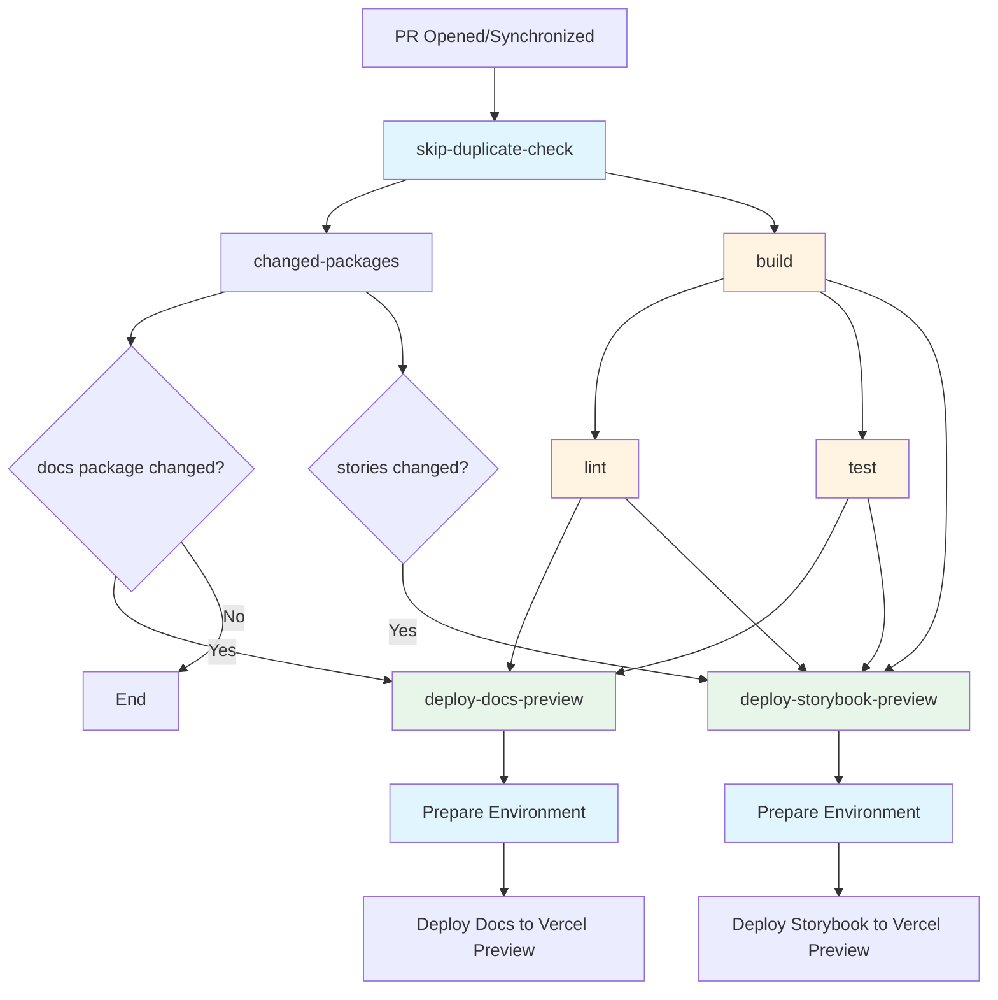
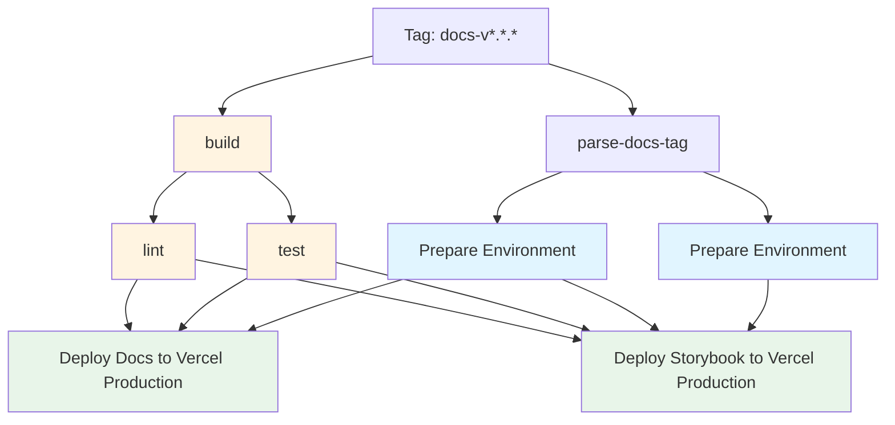
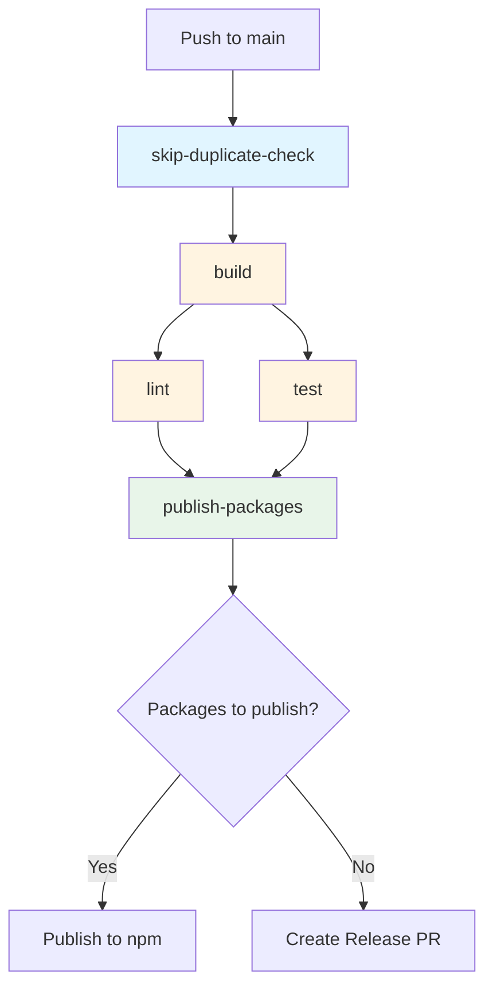
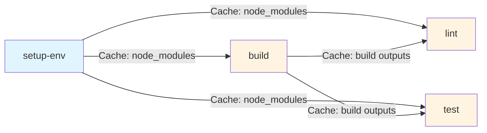

# GitHub Actions CI/CD Documentation

This directory contains GitHub Actions workflows and composite actions for the Open Self Service (O2S) project.

## Workflow Diagrams

### Pull Request Workflow

### Deploy Docs Workflow

### Release Workflow

### Job Dependencies and Caching Flow

## Workflows

### `deploy-docs.yaml`

Deploys the docs app and Storybook to Vercel production.

**Trigger:** Push tag matching `docs-v*.*.*` pattern (e.g., `docs-v1.2.3`)

**Jobs:**

- `parse-docs-tag`: Extracts version from tag
- `build`: Builds the project and caches build outputs
- `lint`: Lints the code
- `test`: Runs tests
- `deploy-docs`: Deploys docs app to Vercel (environment: `docs-production`)
- `deploy-storybook`: Deploys storybook to Vercel (environment: `storybook-production`)

**Required Secrets:**

- `VERCEL_ACCESS_TOKEN`: Vercel API token
- `VERCEL_ORG_ID`: Vercel organization ID
- `VERCEL_DOCS_PROJECT_ID`: Vercel project ID for docs app
- `VERCEL_STORYBOOK_PROJECT_ID`: Vercel project ID for storybook

### `release.yaml`

Publishes npm packages to the registry using Changesets.

**Trigger:** Push to `main` branch

**Jobs:**

- `skip-duplicate-check`: Prevents duplicate workflow runs
- `build`: Builds the project and caches build outputs
- `lint`: Lints the code
- `test`: Runs tests
- `publish-packages`: Publishes packages via Changesets

**Required Secrets:**

- `NPM_TOKEN`: npm authentication token
- `GITHUB_TOKEN`: GitHub token (automatically provided)
- `TURBO_TOKEN`: Turborepo token (optional)

**Required Variables:**

- `TURBO_TEAM`: Turborepo team name

### `pull-request.yaml`

Runs code quality checks on PRs and deploys preview environments.

**Trigger:** Pull request events (`opened`, `synchronize`)

**Jobs:**

- `skip-duplicate-check`: Prevents duplicate workflow runs
- `changed-packages`: Determines which packages/stories changed
- `build`: Builds the project
- `lint`: Lints the code
- `test`: Runs tests
- `deploy-docs-preview`: Deploys docs preview if docs package changed (environment: `docs-preview`)
- `deploy-storybook-preview`: Deploys storybook preview if stories changed (environment: `storybook-preview`)

**Required Secrets:**

- `VERCEL_ACCESS_TOKEN`: Vercel API token
- `VERCEL_ORG_ID`: Vercel organization ID
- `VERCEL_DOCS_PROJECT_ID`: Vercel project ID for docs app
- `VERCEL_STORYBOOK_PROJECT_ID`: Vercel project ID for storybook

## Composite Actions

### `setup-env`

Sets up Node.js environment and installs dependencies with caching.

**Inputs:**

- `repo-token` (required): GitHub token for repository access

### `build`

Runs the build process: checkout, setup environment, build project, and cache build outputs.

### `lint`

Runs lint checks: checkout, setup environment, restore build outputs, and lint.

### `test`

Runs tests: checkout, setup environment, install Playwright, restore build outputs, and test.

### `changed-packages`

Determines which packages have changed using Turborepo and detects Storybook changes.

**Outputs:**

- `package_changed`: JSON string containing changed packages information
- `stories_changed`: `true` if any `*.stories.tsx` or `.storybook/` files changed

### `deploy-vercel`

Unified action for deploying to Vercel (supports both production and preview environments).

**Inputs:**

- `vercel-token` (required): Vercel API token
- `environment` (required): Vercel environment (`production` or `preview`)
- `build-args` (optional): Additional arguments for `vercel build` command (e.g., `--prod`)
- `deploy-args` (optional): Additional arguments for `vercel deploy` command (e.g., `--prod`)

**Steps:**

- Installs Vercel CLI
- Pulls environment variables from Vercel (based on environment)
- Builds project locally
- Deploys prebuilt project to Vercel
- Captures and outputs the deployment URL

**Outputs:**

- `deployment-url`: The URL of the deployed project

## Best Practices

### Caching

- **npm dependencies**: Cached via `actions/setup-node@v6` and explicit `actions/cache` for `node_modules` and `generated` directories
    - Cache key: `{os}-install-{commit-sha}`
    - Only installs if cache miss occurs
- **Build outputs**: Cached explicitly using `actions/cache` for `dist`, `build`, `.next` directories, and `next-env.d.ts`
    - Cache key: `{os}-build-{commit-sha}`
    - Restored by `lint` and `test` jobs
- **Turbo cache**: Handled automatically by Turborepo
- **Playwright browsers**: Cached by the Playwright installer

### Concurrency

- All workflows use concurrency groups to prevent duplicate runs
- Production deployments (`deploy-docs.yaml`) use `cancel-in-progress: false`
- Preview and package publishing workflows use `cancel-in-progress: true`

### Permissions

- All workflows follow the principle of least privilege
- Permissions are explicitly defined per workflow
- Only necessary permissions are granted

### Error Handling

- Timeouts are set for long-running steps
- Quality checks must pass before deployments

## Troubleshooting

### Workflow not triggering

- Check that the trigger conditions are met (branch name, tag pattern, etc.)
- Verify that the workflow file is in `.github/workflows/` directory
- Check GitHub Actions tab for any error messages

### Deployment failures

- Verify all required secrets are set in repository settings
- Check Vercel project configuration matches the project ID in secrets
- Review workflow logs for specific error messages

### Package publishing issues

- Ensure Changesets are properly configured in the repository
- Verify `NPM_TOKEN` has publish permissions
- Check that package versions follow semantic versioning

## Related Documentation

- [GitHub Actions Documentation](https://docs.github.com/en/actions)
- [Turborepo Documentation](https://turbo.build/repo/docs)
- [Changesets Documentation](https://github.com/changesets/changesets)
- [Vercel CLI Documentation](https://vercel.com/docs/cli)
