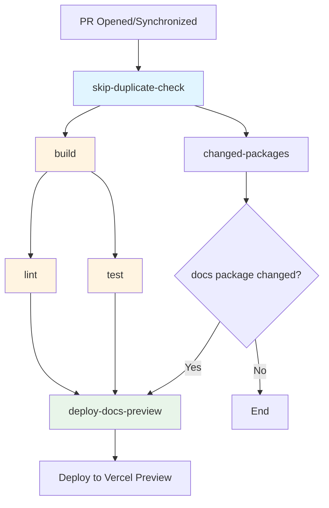
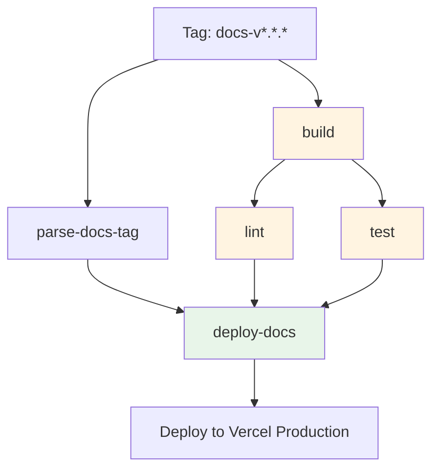
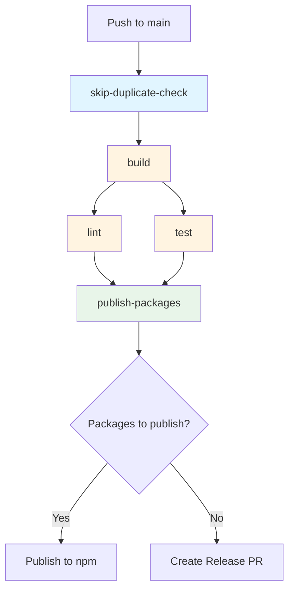
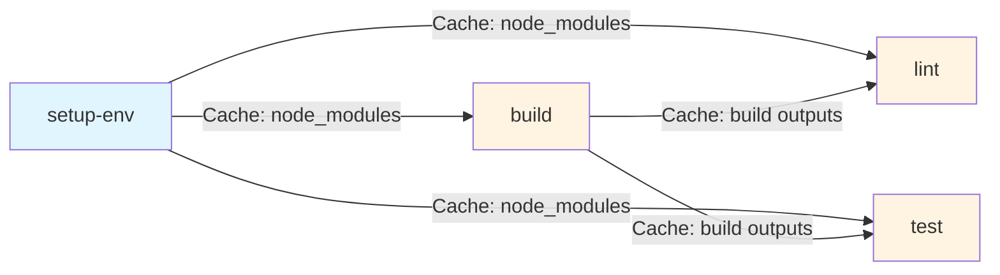

# GitHub Actions CI/CD Documentation

This directory contains GitHub Actions workflows and composite actions for the Open Self Service (O2S) project.

## Workflow Diagrams

### Pull Request Workflow

### Deploy Docs Workflow

### Release Workflow

### Job Dependencies and Caching Flow

## Workflows

### `deploy-docs.yaml`
Deploys the docs app to Vercel production environment.

**Trigger:** Push tag matching `docs-v*.*.*` pattern (e.g., `docs-v1.2.3`)

**Jobs:**
- `parse-docs-tag`: Extracts version from tag
- `build`: Builds the project and caches build outputs (dist, build, .next directories, next-env.d.ts)
- `lint`: Lints the code - depends on `build` job and restores build outputs from cache
- `test`: Runs tests - depends on `build` job and restores build outputs from cache
- `deploy-docs`: Builds and deploys docs app to Vercel production (only runs after all quality checks pass)

**Required Secrets:**
- `VERCEL_ACCESS_TOKEN`: Vercel API token
- `VERCEL_ORG_ID`: Vercel organization ID
- `VERCEL_DOCS_PROJECT_ID`: Vercel project ID for docs app

### `release.yaml`
Publishes npm packages to the registry using Changesets.

**Trigger:** Push to `main` branch

**Jobs:**
- `skip-duplicate-check`: Prevents duplicate workflow runs
- `build`: Builds the project and caches build outputs (dist, build, .next directories, next-env.d.ts)
- `lint`: Lints the code - depends on `build` job and restores build outputs from cache
- `test`: Runs tests - depends on `build` job and restores build outputs from cache
- `publish-packages`: Publishes packages via Changesets (only runs after all quality checks pass)

**Required Secrets:**
- `NPM_TOKEN`: npm authentication token
- `GITHUB_TOKEN`: GitHub token (automatically provided)
- `TURBO_TOKEN`: Turborepo token (optional, for remote caching)

**Required Variables:**
- `TURBO_TEAM`: Turborepo team name (if using remote caching)

### `pull-request.yaml`
Runs code quality checks (build, lint, test) on pull requests and optionally deploys docs preview.

**Trigger:** Pull request events (`opened`, `synchronize`)

**Jobs:**
- `skip-duplicate-check`: Prevents duplicate workflow runs
- `changed-packages`: Determines which packages changed (composite action)
- `build`: Builds the project and caches build outputs (dist, build, .next directories, next-env.d.ts) - always runs on PRs
- `lint`: Lints the code - depends on `build` job and restores build outputs from cache - always runs on PRs
- `test`: Runs tests - depends on `build` job and restores build outputs from cache - always runs on PRs
- `deploy-docs-preview`: Deploys docs preview to Vercel if docs package changed (only runs after all quality checks pass)

**Required Secrets:**
- `VERCEL_ACCESS_TOKEN`: Vercel API token
- `VERCEL_ORG_ID`: Vercel organization ID
- `VERCEL_DOCS_PROJECT_ID`: Vercel project ID for docs app

### `changed-packages` (Action)
Composite action that determines which packages have changed using Turborepo.

**Inputs:**
- `event-name` (required): GitHub event name (`pull_request` or `push`)
- `base-sha` (optional): Base SHA for pull requests (default: empty)
- `fetch-depth` (optional): Git fetch depth for checkout (default: `0`)

**Outputs:**
- `package_changed`: JSON string containing changed packages information from turbo dry-run

**Usage:** Used as a step in workflows to determine which packages changed

## Composite Actions

### `setup-env`
Sets up Node.js environment and installs dependencies with caching.

**Inputs:**
- `repo-token` (required): GitHub token for repository access

**Features:**
- Node.js 24 setup with npm caching via `actions/setup-node@v6`
- Caches `node_modules` and `generated` directories (cache key based on commit SHA)
- Only installs dependencies via `npm ci` if cache miss occurs
- Saves cache only if installation was performed

### `build`
Runs the build process: checkout, setup environment, build project, and cache build outputs.

**Inputs:**
- `repo-token` (required): GitHub token for repository access
- `fetch-depth` (optional): Git fetch depth for checkout (default: `0`)

**Steps:**
- Checks out code
- Prepares environment (Node.js, dependencies) - restores `node_modules` from cache if available
- Builds project: `npm run build` (Turborepo handles its own caching)
- Saves build outputs to cache: `dist`, `build`, `.next` directories, and `next-env.d.ts` (cache key based on commit SHA)

### `lint`
Runs lint checks: checkout, setup environment, restore build outputs from cache, and lint.

**Inputs:**
- `repo-token` (required): GitHub token for repository access
- `fetch-depth` (optional): Git fetch depth for checkout (default: `0`)

**Steps:**
- Checks out code
- Prepares environment (Node.js, dependencies) - restores `node_modules` from cache if available
- Restores build outputs from cache: `dist`, `build`, `.next` directories, and `next-env.d.ts` (cache key based on commit SHA)
- Lints code: `npm run lint`

### `test`
Runs tests: checkout, setup environment, install Playwright browsers, restore build outputs from cache, and test.

**Inputs:**
- `repo-token` (required): GitHub token for repository access
- `fetch-depth` (optional): Git fetch depth for checkout (default: `0`)

**Steps:**
- Checks out code
- Prepares environment (Node.js, dependencies) - restores `node_modules` from cache if available
- Restores build outputs from cache: `dist`, `build`, `.next` directories, and `next-env.d.ts` (cache key based on commit SHA)
- Installs Playwright browsers (required for Storybook tests)
- Runs tests: `npm run test`

### `changed-packages`
Determines which packages have changed using Turborepo.

**Inputs:**
- `event-name` (required): GitHub event name (`pull_request` or `push`)
- `base-sha` (optional): Base SHA for pull requests (default: empty)
- `fetch-depth` (optional): Git fetch depth for checkout (default: `0`)

**Outputs:**
- `package_changed`: JSON string containing changed packages information from turbo dry-run

**Steps:**
- Checks out code with full history
- Runs `turbo build --dry-run=json` to determine changed packages
- Outputs JSON result for use in workflow conditions

### `deploy-vercel`
Unified action for deploying to Vercel (supports both production and preview environments).

**Inputs:**
- `vercel-token` (required): Vercel API token
- `environment` (required): Vercel environment (`production` or `preview`)
- `build-args` (optional): Additional arguments for `vercel build` command (e.g., `--prod`)
- `deploy-args` (optional): Additional arguments for `vercel deploy` command (e.g., `--prod`)

**Steps:**
- Installs Vercel CLI
- Pulls environment variables from Vercel (based on environment)
- Builds project locally
- Deploys prebuilt project to Vercel

### `deploy-docs`
Complete workflow for deploying docs app: checkout, setup environment, and deploy to Vercel.

**Inputs:**
- `repo-token` (required): GitHub token for repository access
- `vercel-token` (required): Vercel API token
- `vercel-project-id` (required): Vercel project ID for docs app
- `environment` (required): Vercel environment (`production` or `preview`)
- `fetch-depth` (optional): Git fetch depth for checkout (`0` for full history, `1` for shallow, default: `1`)
- `build-args` (optional): Additional arguments for Vercel build command
- `deploy-args` (optional): Additional arguments for Vercel deploy command

**Steps:**
- Checks out code
- Prepares environment (Node.js, dependencies) - restores `node_modules` from cache if available
- Deploys to Vercel using `deploy-vercel` action

**Note:** This action consolidates the common deployment workflow used by both production and preview deployments. Quality checks are run separately as dedicated jobs before deployment.

## Best Practices

### Caching
- **npm dependencies**: Cached via `actions/setup-node@v6` and explicit `actions/cache` for `node_modules` and `generated` directories
  - Cache key: `{os}-install-{commit-sha}`
  - Only installs if cache miss occurs
- **Build outputs**: Cached explicitly using `actions/cache` for `dist`, `build`, `.next` directories, and `next-env.d.ts`
  - Cache key: `{os}-build-{commit-sha}`
  - Restored by `lint` and `test` jobs
- **Turbo cache**: Handled automatically by Turborepo
- **Playwright browsers**: Cached by the Playwright installer

### Concurrency
- All workflows use concurrency groups to prevent duplicate runs
- Production deployments (`deploy-docs.yaml`) use `cancel-in-progress: false`
- Preview and package publishing workflows use `cancel-in-progress: true`

### Permissions
- All workflows follow the principle of least privilege
- Permissions are explicitly defined per workflow
- Only necessary permissions are granted

### Error Handling
- Timeouts are set for long-running steps
- Quality checks must pass before deployments

## Troubleshooting

### Workflow not triggering
- Check that the trigger conditions are met (branch name, tag pattern, etc.)
- Verify that the workflow file is in `.github/workflows/` directory
- Check GitHub Actions tab for any error messages

### Deployment failures
- Verify all required secrets are set in repository settings
- Check Vercel project configuration matches the project ID in secrets
- Review workflow logs for specific error messages

### Package publishing issues
- Ensure Changesets are properly configured in the repository
- Verify `NPM_TOKEN` has publish permissions
- Check that package versions follow semantic versioning

## Related Documentation

- [GitHub Actions Documentation](https://docs.github.com/en/actions)
- [Turborepo Documentation](https://turbo.build/repo/docs)
- [Changesets Documentation](https://github.com/changesets/changesets)
- [Vercel CLI Documentation](https://vercel.com/docs/cli)
