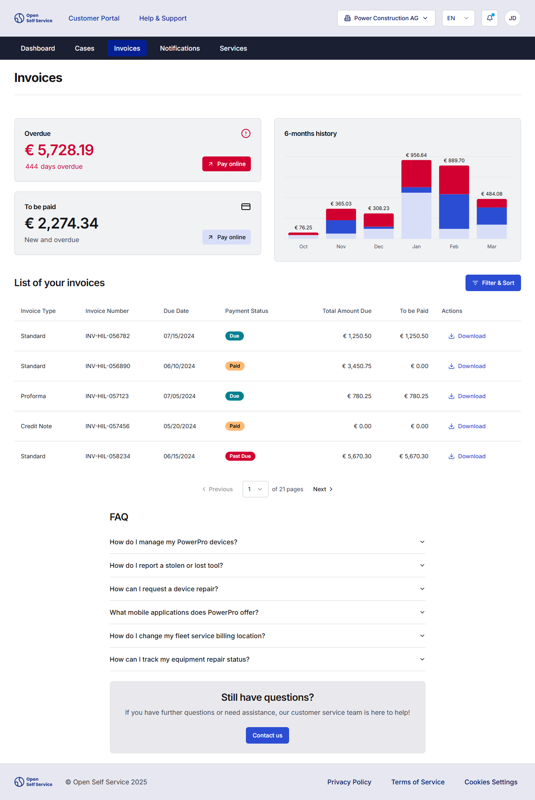
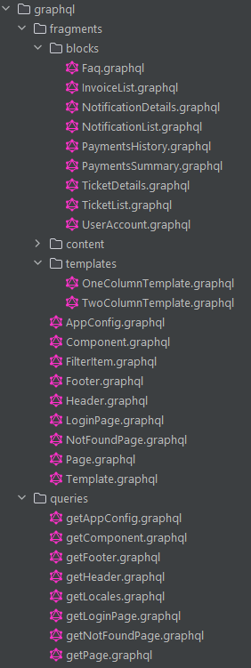
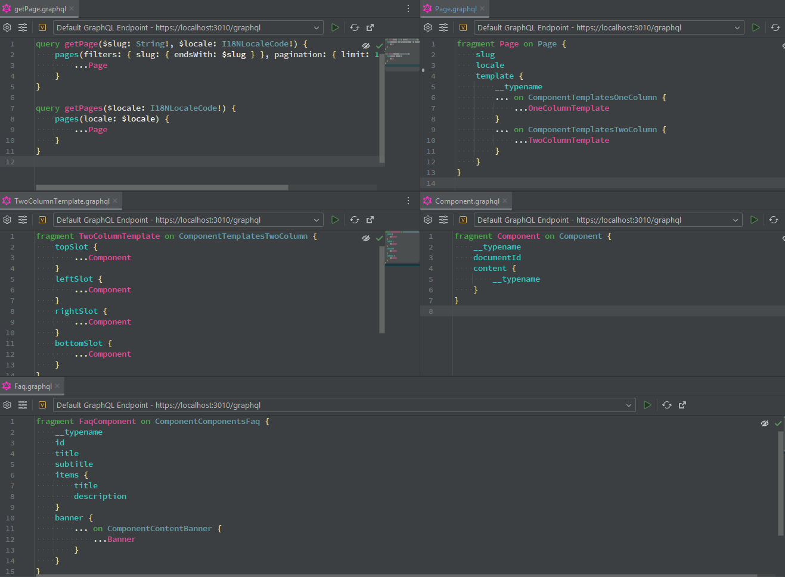
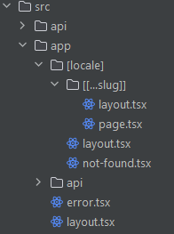

# Composable frontends with Strapi and Next.js - modeling complex frontend apps in a headless CMS

We’re building a frontend-first framework for composable customer portals – Open Self Service.
To support dynamic content, reusable UI blocks, and flexible layouts, we needed a CMS that gives developers control over structure while staying accessible to business users.

That’s where **[Strapi](https://strapi.io/)** comes in. In O2S, we use it not just for managing page content, but also for defining layout templates, page structures, and component configurations. This approach helps us find the right balance between flexibility for editors and consistency in the frontend.
<!--truncate-->

In this article, we’ll show how Strapi powers the content architecture behind our composable frontend, and how it integrates with Next.js to deliver dynamic pages, structured layouts, and scalable UI patterns.


## Web content management in modern front-end apps

One of the challenges that often comes with large-scale frontend applications is managing the content in a way that on one hand gives the content editors
a large degree of flexibility, and on the other still keeps the app within the bounds of UI/UX rules, standards and branding.

The solution we are describing in this article follows these principles - it allows composing the pages out of a set of reusable components and templates, while at the same time
keeping it under control, without giving complete freedom (which could potentially go against the thought-out UX).

Of course, our approach may not fully align with the latest trends around visual editors and giving total design freedom, but in our experience, it’s a solid compromise that works well for many real-world use cases.

To illustrate our approach, throughout the article we will use an exemplary page from our application  - the list of invoices. It displays user's invoices, together with a quick summary of payment balance and history:



For this page and its components we wanted to give content editors the ability to:

1. Decide which components to add to the page.
2. Decide how those components should be arranged in the layout.
3. And additionally, as our app is constructed of many pages, we also needed to give possibility of managing all pages within the app

Addressing the requirements needed to be handled in two steps: content modeling and implementation.

We first focused on appropriate content modeling in Strapi as it seemed to be crucial to further, implementation related, steps.

If everything was implemented according to the plan, in the CMS we should have control over: page creation, page configuration using templates (like one- or two-column layouts, or some even more complex ones) and page composition using components.

## Step 1: Content modeling in Strapi

In order to make this kind of content management possible, we tried to reflect the initial ideas and modeled our content based on three types:

- **Page** that represents any route within the frontend app; we do not model specific pages within the CMS, and instead allow editors to compose the pages they need out of generic types,
- **Template** that defines the layout of the page and can include simple one- or two-column layouts or more complex ones, and allows the editors to decide where each component should be rendered,
- **Block** that represents some (smaller or larger) piece of UI that can be placed anywhere in the page layout by the editors.

### Pages

A model for the page is the most important one, as it defines:

- the slug for the page, which is matched against the URL in the browser, and which is a simple localized text field (which means that the page can have different slugs in each language),
- the template for the page that stores the components’ definitions for that page, and which is a dynamic zone where any of the available templates can be picked.


### Templates

The content type for the templates is quite basic – it is based on a simple system of slots that define some predefined location within the frontend app. The available templates are highly configurable and tailored to UI needs. For simpler pages, a basic two-column layout can be sufficient, consisting of:

- a top slot (that can store e.g. some promotional banners or messages),
- left and right slots for the main content,
- and a bottom slot for some additional content (like FAQs or contact information).


Each slot is a relation field to a Component content type, where multiple instances can be placed (so, in other words, a single slot can accept multiple components):


### Blocks

Before we started modeling the content, we established a few additional requirements that would allow the content editors to work efficiently.

One of those was to have the possibility to reuse the same components on different pages, without having to maintain duplicates. Having to keep track of, for example, the same generic FAQ for the app that appears on most pages,
without having a single instance of it, would be a nightmare – especially as the app grows and expands.

To solve this issue, we’ve introduced a Block type that represents a single instance of some piece of content. It consists of:

- a name mostly for internal use by the editors to identify each instance, e.g. “FAQ about the tickets” and “FAQ about the invoices”,
- content that’s a dynamic zone into which any of the components can be placed.


For example, the FAQ component (that uses Strapi’s component type) consists of several text fields, that represent a UI component with title, subtitle, and an accordion with answers to common questions:


While the FAQ component is quite simple and on the frontend renders only the static content from the CMS, it doesn’t mean that only such components can be defined within Strapi.
Another component example is the Invoice List, which on the frontend renders a table with the user’s invoices:


This one is a bit more complex - aside from the title, it also handles:

- fields that use a generic component that allowed us to map fields in the API data model to more user-friendly labels, e.g.:

    

    where the keys exactly match the union types in the Invoice model:

    ```typescript
    export class Invoice {
        id!: string;
        type!: 'PAYMENT_COMPLETE' | 'PAYMENT_DUE' | 'PAYMENT_PAST_DUE';
        paymentStatus!: 'STANDARD' | 'PROFORMA' | 'CREDIT_NOTE' | 'DEBIT_NOTE';
        ...
    }
    ```

- a table that defines which columns should be displayed on the frontend for the invoice table:

    


## App architecture

Of course, modeling the content is only part of the solution. We also needed to design the frontend architecture appropriately so that it would allow this type of content management in Strapi,
while at the same time being flexible enough.

We wanted to achieve a fully modular, flexible and highly maintainable solution, so that e.g. the data fetching capability
could be used in different frontends/apps or each backend component could be replaced with only small effort.

This steered us into the composable architecture approach, where different parts can work in a detached way, in a some sort of plug-and-play mode.

To implement that, we have divided the application into two main components:

- `frontend` - the **frontend app**, which is an application that provides the interactive UIs to the customers, composed of reusable UI components and built with [Next.js](https://nextjs.org/),
- `api-harmonization` - the **API Harmonization server**, which acts as a backend-for-frontend, where we fetch and aggregate the data from multiple API integrations to fully separate the presentation layer from backend services, built with [Nest.js](https://nestjs.com/).


Each of these applications is semi-independent, therefore they are also built and deployed separately. This also means that the API Harmonization server can even be used without the provided frontend app – using our SDK you can leverage the normalized data model in your own applications.

It's also important to understand the overall data flow between each part of the application. On the high level, the frontend app always queries the API harmonization server for content, which in turn fetches data from other external sources:


In a bit more details, this flow can be described like this:

1. When the user enters a page, a call to the API Harmonization server occurs.
2. Firstly, a dedicated Nest.js module handles the request, and other internal services call different APIs, which can range from simple parallel requests to more complex orchestration.
3. Received data is normalized and then aggregated into a single response, which usually combines static data from a CMS with dynamic data from different APIs.
4. Based on this response, shared parts of the UI are rendered (like navigation or footer), but **no other components** are rendered yet.
5. The page response includes the template that should be used to render the page, together with the IDs of components that should be fetched.
6. During rendering, each component queries the API Harmonization server for its own data. This mechanism leverages the [streaming of server components](https://nextjs.org/docs/app/building-your-application/routing/loading-ui-and-streaming#what-is-streaming) to make component loading asynchronous while still keeping API requests server-side.

## Step 2: Implementation

Since our application is based on composable architecture, the part responsible for the CMS is built in a way that it can be easily replaced with some other integration
(with another headless CMS, like Contentful, Storyblok or any other API-based source). Each integration is prepared in the form of npm package, which can be easily swapped with another.

In this article we will describe only our integration with Strapi, but basically a similar approach could be used when connecting to a different GraphQL-based backend.

### Getting Strapi content types

Our first priority was to limit as much as possible the risk of discrepancies between the content model in Strapi and the model in the codebase. The most obvious solution was to always rely on an automatically generated (from GraphQL schema) TypeScript model, that would be then used directly in our code for type safety.

We achieved this using the [graphql-codegen](https://the-guild.dev/graphql/codegen/docs/getting-started). After installing the
main packages:

```shell
npm install -D graphql @graphql-codegen/cli
```

we have also added a few plugins to make the code generation better suited for our needs (mainly, transforming in into TypeScript):

```shell
npm install -D  @graphql-codegen/add @graphql-codegen/introspection @graphql-codegen/typescript @graphql-codegen/typescript-graphql-request @graphql-codegen/typescript-operations @graphql-codegen/typescript-resolvers
```

and, lastly, we have also installed [graphql-request](https://www.npmjs.com/package/graphql-request) as our GraphQL client:

```shell
npm i graphql-request
```

With that done, we have prepared a relatively simple config for the codegen that takes care of code generation:

```typescript
import { CodegenConfig } from '@graphql-codegen/cli';

const config: CodegenConfig = {
    overwrite: true,
    schema: `${process.env.CMS_STRAPI_BASE_URL}/graphql`,
    documents: './src/**/*.graphql',
    verbose: true,
    generates: {
        'generated/strapi.ts': {
            plugins: [
                'typescript',
                'typescript-resolvers',
                'typescript-operations',
                'typescript-graphql-request',
                {
                    add: {
                        content: '/* eslint-disable */',
                    },
                },
            ],
            config: {
                skipTypename: true,
                rawRequest: true,
                maybeValue: 'T',
                avoidOptionals: false,
            },
        },
        './graphql.schema.json': {
            plugins: ['introspection'],
        },
    },
};

export default config;
```

which relies on:

- `CMS_STRAPI_BASE_URL` env variable pointing to Strapi server,
- the [typescript-graphql-request plugin](https://the-guild.dev/graphql/codegen/plugins/typescript/typescript-graphql-request) that translates GraphQL queries into methods for the [graphql-request client](https://www.npmjs.com/package/graphql-request) that is both simple and lightweight, and at the same time powerful enough to fulfill all our requirements (mostly configuring middlewares for logging):
    ```typescript
    this.client = new GraphQLClient(url, {
        errorPolicy: 'all',
        requestMiddleware: (request) => {
            logger.cmsRequest(request);
            return request;
        },
        responseMiddleware: (response) => {
            if (!(response instanceof Error)) {
                logger.cmsResponse(response);
            } else {
                logger.cmsError(response);
            }
            return response;
        },
    });
    ```

Actual requests are kept in separate `.graphql` files, allowing us to easily leverage all GraphQL features like [fragments](https://graphql.org/learn/queries/#fragments), for example:

```graphql title="Page.graphql"
fragment Page on Page {
    slug
    locale
    template {
        __typename
        ... on ComponentTemplatesOneColumn {
            ...OneColumnTemplate
        }
        ... on ComponentTemplatesTwoColumn {
            ...TwoColumnTemplate
        }
    }
}
```

and

```graphql title="TwoColumnTemplate.graphql"
fragment TwoColumnTemplate on ComponentTemplatesTwoColumn {
    topSlot {
        ...Component
    }
    leftSlot {
        ...Component
    }
    rightSlot {
        ...Component
    }
    bottomSlot {
        ...Component
    }
}
```

which also integrates nicely with some IDEs (like Webstorm) for additional developer experience (navigating between the files, or even testing the queries directly in the editor).

Now, running the command `graphql-codegen` will cause a few things to happen:

1. GraphQL schema will be downloaded and stored locally (this file is _gitignored_).
2. Codegen will analyze all `.graphql` files within the `./src` folder, and `./generated/strapi.ts` file will be generated with:
    - all typings that are used within the queries, like:
        ```typescript
        type ComponentTemplatesTwoColumn {
            bottomSlot(filters: ComponentFiltersInput, pagination: PaginationArg = {}, sort: [String] = []): [Component]!
            ...
        }
        ```
    - and the SDK with methods that reflect each query that was found, like:
        ```
        getPage(
            variables: GetPageQueryVariables,
            requestHeaders?: GraphQLClientRequestHeaders,
        ): Promise<{
            data: GetPageQuery;
            errors?: GraphQLError[];
            extensions?: any;
            headers: Headers;
            status: number;
        }> {
            ...
        },
        ```

### Creating GraphQL queries

For each of the content types mentioned earlier we have prepared appropriate GraphQL code - divided into fragments (blocks, templates and other models) and queries (for fetching pages and other non-block items like header or footer):



The requests themselves are quite straightforward, and simply focus on getting the content from the CMS (while using fragments to make the queries reusable):



There are too many queries to list here, but you can always take a look at [our open-source repository](https://github.com/o2sdev/openselfservice/tree/main/packages/integrations/strapi-cms/src/modules/cms/graphql) for more examples.

Data fetching happens through NestJS, where we've introduced a dedicated service for CMS content that exposes methods for each CMS block:

```typescript
export class CmsService implements CMS.Service {
    constructor(private readonly graphqlService: GraphqlService) {}

    private getBlock = (options: CMS.Request.GetCmsEntryParams) => {
        const component = this.graphqlService.getComponent({
            id: options.id,
            locale: options.locale,
        });

        return forkJoin([component]).pipe(
            map(([component]) => {
                if (!component?.data.component) {
                    throw new NotFoundException();
                }
                return component.data;
            }),
        );
    };

    getFaqBlock(options: CMS.Request.GetCmsEntryParams) {
        return this.getBlock(options).pipe(map(mapFaqBlock));
    }

    getInvoiceListBlock(options: CMS.Request.GetCmsEntryParams) {
        return this.getBlock(options).pipe(map(mapInvoiceListBlock));
    }
}
```

where `graphqlService.getComponent` is a generated method that makes a GraphQL query for the _Component_ content type:

```graphql
fragment Component on Component {
    __typename
    documentId
    content {
        __typename
    }
}
```

### Data aggregation

One of our core principles is to minimize the amount of data logic (like orchestration) on the frontend. It should focus mostly on rendering the content and handling user interactions, not on deciding which backend API to use to display pages.

We achieve that using a separate set of modules within the NestJS app that handle exactly that: data orchestration and aggregation. This is the place where we call the methods to:

- fetch the content from the CMS,
- get or post backed data (like user invoices or tickets).

```typescript
export class InvoiceListService {
    constructor(
        private readonly cmsService: CMS.Service,
        private readonly invoiceService: Invoices.Service,
    ) {}

    getInvoiceListBlock(query: GetInvoiceListBlockQuery, headers: AppHeaders): Observable<InvoiceListBlock> {
        const cms = this.cmsService.getInvoiceListBlock({ ...query, locale: headers['x-locale'] });

        return forkJoin([cms]).pipe(
            concatMap(([cms]) => {
                return this.invoiceService
                    .getInvoiceList({
                        ...query,
                        limit: cms.pagination?.limit || query.limit,
                    })
                    .pipe(map((invoices) => mapInvoiceList(invoices, cms, headers['x-locale'])));
            }),
        );
    }
}
```

This allows us to easily orchestrate operations - like in the example above, use CMS configuration to fetch the initial number of user invoices. Of course, that's one of the simplest cases, and often this may require calling several different APIs in order to compose a single response.

Once all necessary data is fetched, we aggregate and transform it into a format that will be easy to use on the frontend, like combining enum values with user-friendly labels:

```typescript
export const mapInvoice = (
    invoice: Invoices.Model.Invoice,
    cms: CMS.Model.InvoiceListBlock.InvoiceListBlock,
    locale: string,
): Invoice => {
    return {
        id: invoice.id,
        currency: invoice.currency,
        type: {
            displayValue: cms.fieldMapping.type?.[invoice.type],
        },
        paymentStatus: {
            displayValue: cms.fieldMapping.paymentStatus?.[invoice.paymentStatus],
            value: invoice.paymentStatus,
        },
        totalAmountDue: checkNegativeValue(invoice.totalAmountDue),
        amountToPay: checkNegativeValue(invoice.totalToBePaid),
        paymentDueDate: {
            displayValue: Date.formatDateRelative(
                invoice.paymentDueDate,
                locale,
                cms.labels.today,
                cms.labels.yesterday,
            ),
            value: invoice.paymentDueDate,
        },
    };
};
```

where e.g. `paymentStatus` field contains both the text that is rendered (fetched from Strapi), and original enum value (fetched from backend API), and can look like this:

```json
"paymentStatus": {
    "displayValue": "Past Due",
    "value": "PAYMENT_PAST_DUE"
}
```

This kind of aggregation makes rendering the content on the frontend often trivial, as all the necessary data is right there, without having to worry about accessing the labels and values separately, from different APIs or different objects.

### Rendering the content

Finally, on the frontend we use Next.js with App Router to render the pages.

Since in Strapi we modeled our pages as a generic _Page_ type, then in the frontend app we also do not have any pre-configured routes and instead rely on the catch-all route that intercepts all incoming traffic:



Within that route we firstly fetch the general page data (like title, SEO metadata), together with the information about which template that page uses and a list of components within that template:

```typescript jsx
export default async function Page({ params }: Props) {
    const session = await auth();

    if (!session?.user) return signIn();

    const { locale, slug } = await params;

    try {
        const { data, meta } = await sdk.modules.getPage(
            slug,
            locale,
            session.accessToken
        );

        if (!data || !meta) {
            notFound();
        }

        return (
            <main>
                <PageTemplate slug={slug} data={data} session={session} />
            </main>
        );
    } catch (error) {
        notFound();
    }
}
```

Then, after we check which template needs to be used, we render the blocks in each of its slots, while at the same time configuring the layout:

```typescript jsx
export const TwoColumnTemplate: React.FC<TwoColumnTemplateProps> = async ({ slug, data, session }) => {
    return (
        <div className="flex flex-col gap-8">
            <div className="flex flex-col gap-8">
                {renderBlocks(data.slots.top, slug, session.accessToken)}
            </div>

            <div className="grid grid-cols-1 lg:grid-cols-2">
                <div className="flex flex-col gap-8">
                    {renderBlocks(data.slots.left, slug, session.accessToken)}
                </div>

                <div className="flex flex-col gap-8">
                    {renderBlocks(data.slots.right, slug, session.accessToken)}
                </div>
            </div>

            <div className="flex flex-col gap-8">
                {renderBlocks(data.slots.bottom, slug, session.accessToken)}
            </div>
        </div>
    );
};
```

We also need to figure out what to actually render, as each slot contains a simple array of blocks' definitions:

```json
"bottom": [
    { "__typename": "InvoiceListBlock", "id": "invoice-list-1" },
    { "__typename": "FaqBlock", "id": "faq-1" }
]
```

We do that with a simple `switch` that looks at the block name and then just return the appropriate component:

```typescript jsx
export const renderBlocks = (blocks: CMS.Model.Page.SlotBlock[], slug: string[], accessToken: string) => {
    return blocks.map((block) => {
        switch (block.__typename as Modules.Page.Model.Blocks) {
            case 'FaqBlock':
                return <Faq key={block.id} id={block.id} accessToken={accessToken} />;
            case 'InvoiceListBlock':
                return <InvoiceList key={block.id} id={block.id} accessToken={accessToken} />;
            ...
        }
    });
};
```

Finally, the actual rendering of blocks happens using the React Server Components. Each block fetches its own data:

```typescript jsx
export const InvoiceList: React.FC<InvoiceListProps> = async ({ id, accessToken, locale }) => {
    const data = await sdk.blocks.getInvoiceList(
        { id },
        { 'x-locale': locale },
        accessToken,
    );

    return (
        <Suspense key={id} fallback={<Loading bars={20} />}>
            <InvoiceListClient {...data} id={id} accessToken={accessToken} locale={locale} />
        </Suspense>
    );
};
```

This approach has several advantages:

- it makes blocks more independent and decouples them from the Page model,
- utilizes server-side capabilities of Next.js for server components, with HTML streaming and loading states using Suspense,
- makes it possible, in the future, to extract those blocks out of the frontend app itself, and transform them into standalone micro-frontend applications.

The biggest drawback, however, is that each block produces its own HTTP request for its data. Although this happens server-side, so we are not limited by the browsers (and their limits on simultaneous requests) this can still potentially cause overfetching in some cases - if there would be several blocks on one page that fetch exactly the same data from some backend API, this also results in several API calls, even if they are exactly the same.

Thankfully, this can be mitigated by using cache on two levels:

1. Leveraging [request memoization](https://nextjs.org/docs/app/building-your-application/caching#request-memoization) provided by Next.js, which ensures that the same fetching function is called only once during rendering, preventing multiple calls to Nest.js for the same data.
2. Introducing cache to the Nest.js application (e.g. via [Redis](https://redis.io/)) for:
    - user data, which should be cached only for a very short time (to cover a single page render) as in most cases it can be very dynamic,
    - CMS content, which can be cached for longer as usually it does not change that often.

In our application we have introduced both ways, using memoization on the frontend and caching the content fetched from Strapi in Redis, and have plans for improving performance even further by also caching user data in the future.

Lastly, we do actual rendering within the client component, where we render JSX, keep local component state if necessary, and handle all user interactions:

```typescript jsx
'use client';

export const InvoiceListClient: React.FC<InvoiceListClientProps> = ({ ...component }) => {
    const initialFilters = {};

    const [data, setData] = useState(component);
    const [filters, setFilters] = useState(initialFilters);

    const handleFilter = async (newFilters) => {
        const newData = await sdk.components.getInvoiceList(newFilters);
        setData(newData);
    };

    const handleReset = async () => {
        const newData = await sdk.components.getInvoiceList(initialFilters);
        setFilters(initialFilters);
        setData(newData);
    };

    return (
        <div>
            <div>
                <Filters onSubmit={handleFilter} onReset={handleReset} />

                <Table>{data}</Table>
            </div>
        </div>
    );
};
```

## Result

While it may seem complex, this kind of approach successfully integrates Strapi with frontend to power dynamic, API-driven applications.
This enables an effective collaboration platform between developers and content editors by providing flexibility and empowering non-technical users to manage data
without having to change the source code each time there is a need to create or modify a page composed of UI blocks.

Our solution includes:

- Modular and decoupled page templates with reusable components, making it easy to define layouts and populate content dynamically.
- Server-side rendering of blocks using Next.js server components, enabling better performance with HTML streaming and Suspense for loading states.
- A scalable approach to data fetching by encapsulating fetch logic within individual components, making them independent and reusable.
- Frontend request memoization paired with backend Redis caching to optimize API calls, reduce overfetching, and improve overall performance.

This architecture not only supports content-driven apps but also other heavily API-powered frontend solutions.
It combines ease of maintenance with scalability and extensibility, ensuring both developers and content editors can work effectively.

## Conclusion

The integration of Strapi with Open Self Service shows that content management with a headless CMS doesn't have to stop at landing pages or blog posts.
With the right content model structure and implementation in the frontend app, it can support complex cases.

In our case Strapi was used to:

- Model page templates and components
- Manage dynamic data presentation
- Reuse content blocks across the app
- Empower non-technical users to make changes without code

Combined with the composable architecture of O2S, this gives us a powerful foundation to build modern customer-facing portals that are scalable, flexible, and easy to maintain.

Want to see it in action?

- [Open Self Service website](https://www.openselfservice.com)
- [Documentation](https://www.openselfservice.com/docs)
- [GitHub repo](https://github.com/o2sdev/openselfservice)

We’d love your feedback - or even better, your contributions!
