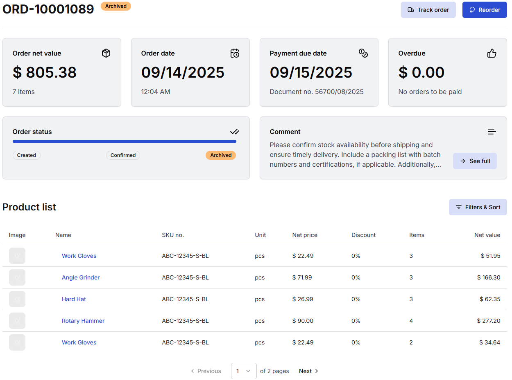
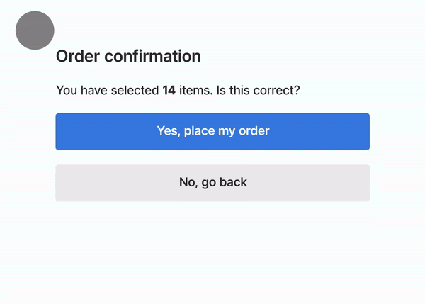

# Ensuring high Frontend performance in composable apps

In today's web development landscape, composable architectures are gaining popularity for their flexibility and scalability. However, this approach introduces unique performance challenges. This article explores strategies and best practices for ensuring high frontend performance in composable applications, using Open Self Service as a practical example.

## Understanding composable architecture

### What is a composable architecture?

Composable architecture is an approach to building applications by assembling modular, independent components that work together to create a complete solution. In the context of Open Self Service, it's a framework that enables the integration of multiple API-based services to provide a seamless user experience.

At its core, composable architecture is characterized by:

- **Modularity**: Applications are built from discrete, interchangeable components that can be developed, deployed, and scaled independently.
- **API-first approach**: Components communicate through well-defined APIs, allowing for flexibility in implementation details.
- **Decoupled systems**: Frontend and backend systems are separated, enabling each to evolve independently without affecting the other.

Composable frontends provide significant advantages: flexibility to replace components without disruption, scalability of specific parts based on demand, adaptability to changing requirements, and freedom from vendor lock-in through multi-backend integration.

### The separation of concerns

In building Open Self Service, we chose to implement a clear separation of concerns between different layers of the application. While there are multiple ways to achieve composable architecture, our approach focuses on:

- We completely **separated the presentation layer from the data and business logic layers**. This allows each to evolve independently and enables the frontend to work seamlessly with multiple backend services.

- Our implementation introduces an intermediate **API composition layer** that acts as a bridge between the frontend and various backend APIs. This layer aggregates data from multiple sources and orchestrates data flows between systems. It efficiently combines static content with dynamic data while handling complex logic server-side, reducing browser processing overhead.


This approach ensures backend service changes don't require frontend code modifications, reducing maintenance overhead and increasing flexibility.

### Component-based design

Our implementation uses a "blocks" system of independent, reusable components that encapsulate specific functionality and connect to the API composition layer. This approach enables parallel data fetching, HTML streaming, and component-specific optimizations through Next.js server components.

The result is improved maintainability and performance with granular optimizations for responsive user experiences. What is more, it allows fully composing the page content via configuration (e.g. through a headless CMS like Strapi or Contentful) without having to implement new page types directly in the source code.

## Performance strategies

### Leveraging server components

Probably one of the easiest "wins" is to take full advantage of [Next.js server components](https://nextjs.org/docs/app/getting-started/server-and-client-components) to perform data fetching and initial rendering on the server. Each block in our system follows a clear separation between server and client components:

```typescript
export const OrderDetailsServer = async ({ id, orderId }) => {
    // Fetch block data from API composition layer
    const data = await sdk.blocks.getOrderDetails({ id: orderId });

    // Pass data to the client component
    return <OrderDetailsClient id={id} {...data} />;
};
```

```typescript
'use client';

export const OrderDetailsClient = (props) => {
    // Render the actual component
    return (<div>...</div>);
};
```

This pattern ensures that data fetching occurs on the server, reducing client-side JavaScript bundle size and eliminating client-server waterfalls. The server component fetches the necessary data and passes it to a client component that handles interactivity.

### Streaming with Suspense

By using server components, we can also easily implement component-level streaming using React's Suspense, allowing parts of the page to load progressively rather than waiting for all data to be available. This approach ensures that slow-loading blocks (e.g. due to a slow or complex backend API calls) don't block the rendering of faster ones, and users can start interacting with parts of the page while others are still loading.

Strategic placement of Suspense boundaries is crucial for optimal streaming performance. In our implementation, we place these boundaries at the block level rather than at the page level, allowing for more granular control over the loading experience:

- each block has its own Suspense boundary, allowing it to stream independently
- more complex blocks can prepare the loading state to more or less represent how the component may actually look when it's ready

Let's look at the `OrderDetails` block that is responsible for showing the users the details of one of their orders. It consists of a title, some tiles arranged in a grid, and a list of products that were purchased.



For optimal user experience - and to minimize layout shift that could occur during the page load - we prepare a similar layout in a "renderer" component that wraps the server component, using [shadcn/ui's Skeleton components](https://ui.shadcn.com/docs/components/skeleton):

```typescript
export const OrderDetailsRenderer: React.FC<OrderDetailsRendererProps> = ({ id }) => {
    return (
        <Suspense fallback={
            // skeleton grid that represents the layout of the component
            <div className="w-full flex flex-col gap-6">
                <Loading bars={0} />
                <div className="w-full flex flex-col md:flex-row gap-6">
                    <div className="w-full flex flex-col gap-6">
                        <div className="w-full flex flex-col md:flex-row gap-6">
                            <Loading bars={2} />
                            <Loading bars={2} />
                        </div>
                        <Loading bars={2} />
                    </div>
                    <div className="w-full flex flex-col gap-6">
                        <div className="w-full flex flex-col md:flex-row gap-6">
                            <Loading bars={2} />
                            <Loading bars={2} />
                        </div>
                        <Loading bars={2} />
                    </div>
                </div>
                <Loading bars={8} />
            </div>
        }>
            // The component itself that is rendered when it's fully ready
            <OrderDetailsServer id={id} />
        </Suspense>
    );
};
```

When users enter this page, they will be able to:

- see meaningful loading states while data is being fetched
- partly interact with the app (e.g. use the main navigation) even before the main content is fully ready

And once the initial HTML is prepared server-side, it is immediately streamed to the browser, which can be seen on the following (artificially slowed-down so that loading states are actually visible) video:


### Parallel data loading

By using server components, we can enable parallel data loading, where multiple blocks on a page can fetch their data simultaneously rather than sequentially. Each block is responsible for its own data fetching, and the Suspense boundaries around each block allow them to load independently:

```typescript
export default function KnowledgeBasePage() {
    return (
        <div>
            <SearchBlock />
            <QuickLinksBlock />
            <ArticleListBlock />
        </div>
    );
}
```

This effect is more interesting on pages that include more than one component, where each can take a different time to load (due to more complex backend logic, database access, network delays, or other causes).

Let's take a look at [another example](https://demo-dxp.openselfservice.com/en/personal/help-and-support), this time a digital experience portal with a knowledge base area. Once more, each component is streamed to the browser as soon as it's ready and is then available to interact with:


While the fallback components are not sized to perfectly match their full counterparts, they don't have to be. It's enough for them to be "close enough", just so that they can be visually similar to the final rendered components, especially considering that some content will be very dynamic when it e.g. depends on a CMS configuration.

As already mentioned, using Suspense has the additional benefit of reducing [Cumulative Layout Shift](https://web.dev/articles/cls). Let's see what this process would look like if only one block did not provide any fallback states and notice how the article tiles "jump down" when the tiles above them appear:


While this is a mostly harmless example, just take a look at another, more dangerous example from [web.dev](https://web.dev/articles/cls):



It's obvious that providing appropriate placeholders is critical not only to increase the overall performance (a high CLS will lower your Lighthouse score) but also to safeguard against potentially harmful actions.

So to sum up - this pattern eliminates the "waterfall" effect where one component must finish loading before the next one begins, significantly reducing the overall page load time. As a side effect, it can also provide a better user experience. Instead of using a single loader for the whole page or even delaying the page rendering until every single piece of data is fetched and ready for rendering, you can actually show the page loading progress.

### Component-level dynamic imports

Beyond block-level code splitting, we implement finer-grained dynamic imports for heavy components within blocks. This is particularly beneficial, e.g., for data visualization components that rely on large third-party libraries:

```typescript
'use client';

import dynamic from 'next/dynamic';

// Dynamically import the chart component to reduce initial bundle size
const StackedBarChart = dynamic(
    () => import('@o2s/ui/components/Chart/StackedBarChart').then((module) => module.StackedBarChart),
);

export const PaymentsHistoryClient = ({ title, chartData }) => {
    return (
        <div>
            <Typography>{title}</Typography>
            ...
            <StackedBarChart chartData={chartData} />
        </div>
    );
};
```

In this example, the chart component (which depends on the [recharts library](https://recharts.org/)) is dynamically imported only when needed (in other words, when that block is rendered on the Frontend). Chart libraries are typically large and would significantly increase the initial bundle size, and typically not every page in the app will contain a chart component - so there's no point in preloading a resource-heavy library before it's actually necessary.

### API composition layer

The API composition layer serves as a critical intermediary between frontend blocks and backend services. It can be implemented in a variety of different ways, but we chose to use [Nest.js](https://nestjs.com/) as a framework which fits in nicely in the whole TypeScript-based tech stack.

As an example for what we can achieve using such architecture, let's look at the service that is responsible for the endpoint for fetching data for the `OrderDetails` block:

```typescript
// Data aggregation from multiple sources
export class OrderDetailsService {
    constructor(
        // Service for fetching static content e.g. from some CMS
        private readonly cmsService: CMS.Service,
        // Service that returns dynamic data for the user from some backend API
        private readonly orderService: Orders.Service,
    ) {}

    getOrderDetailsBlock(params, query, headers) {
        const cms = this.cmsService.getOrderDetailsBlock({ ...query, locale: headers['x-locale'] });
        const order = this.orderService.getOrder({ id: params.id });

        // Fetch data from both sources simultaneously
        return forkJoin([cms, order]).pipe(
            map((order) => {
                // Transform and combine data for the Frontend app
                return mapOrderDetails(cms, order);
            }),
        );
    }
}
```

This approach provides several benefits for the overall Frontend performance:

- The composition layer combines data from multiple backend services into a single, optimized response that is specifically tailored for each block - returning anly the information that block needs and nothing else, which eliminates overfetching.
- Raw data from various backends is transformed into a consistent format, which does not necessarily improve performance itself but allows the Frontend to be implemented in an API-agnostic way.
- Instead of making multiple API calls directly from the browser, the composition layer handles the communication with backend services, which reduces latency and bandwidth usage.
- The composition layer can fetch data from multiple sources in parallel using e.g. RxJS observables, optimizing the overall response time.

### API-level caching

However, in a composable architecture where each block independently fetches its own data, there's a risk of redundant API calls to the same backend services. Therefore, it's important to also provide a caching mechanism that can help to reduce the load on backend services.

We chose to address this issue by leveraging [Redis](https://redis.io/) that can e.g. cache static CMS responses for use in other blocks. While, of course, some static content is still very block-dependant, other is shared - like general config or reusable generic translations - and can be safely cached.

In our framework, blocks don't need to implement caching logic themselves; they benefit automatically from the centralized caching system. When multiple blocks on a page require the same underlying data, the first request populates the cache, and subsequent requests are served from the cache without hitting the backend services.

### Request memoization

Next.js 13 and later versions introduced an important performance optimization feature: automatic request memoization. This feature ensures that duplicate data fetching requests within the same render pass are automatically deduplicated, significantly reducing unnecessary network calls and improving performance.

By default, the native `fetch` API in Next.js is automatically memoized. This means that if multiple components on the same page make identical fetch requests, Next.js will only execute the actual network request once and reuse the result for all components. This is particularly valuable in our composable architecture, where different blocks might need the same underlying data.

```typescript
// In multiple server components across the page
const data = await fetch('https://api.example.com/data');
const result = await data.json();
```

In the example above, even if this code appears in multiple server components on the same page, the actual network request will only be made once.

However, it's important to note that while the native `fetch` API is supported out of the box, other HTTP client libraries may require additional configuration or adaptations to benefit from Next.js's memoization capabilities.

In our implementation, we initially used [axios](https://axios-http.com/) for API requests but later switched to [ofetch](https://github.com/unjs/ofetch), which provided a more seamless integration with Next.js's memoization system while still offering advanced features like interceptors for request/response handling. The transition was quite straightforward and didn't require too many additional adjustments:

```typescript
// Our SDK implementation using ofetch
const ofetchInstance = ofetch.create({
    baseURL: apiUrl,
    onRequest,
    onRequestError,
    onResponse,
    onResponseError,
});

const makeRequest = <T>(config: CompatRequestConfig): Promise<T> => {
    // Configuration mapping from our standard format to ofetch format
    const fetchOptions = {
        method: config.method,
        query: config.params,
        body: config.data,
        headers: config.headers,
    };

    return ofetchInstance(config.url, fetchOptions) as Promise<T>;
};
```

This approach ensures that API requests are automatically memoized when used in server components, preventing redundant network calls and improving overall application performance without requiring block developers to implement any special logic.


## Conclusion

Building high-performance composable frontends requires addressing challenges across multiple architectural levels. The approach described in this article combines modular architecture with Next.js server components for efficient rendering, strategic Suspense boundaries for progressive loading, and an API composition layer that optimizes data flow. We enhance performance through Redis-based caching, request memoization, and component-level dynamic imports for resource optimization.

These strategies deliver real benefits: faster page loads, smoother interactions, and responsive applications even under challenging network conditions. For developers, the composable approach improves maintainability, simplifies testing, and allows independent evolution of different application parts.

The Open Self Service framework demonstrates these principles in practice, providing a foundation for building performant composable applications that scale with business needs while delivering exceptional user experiences.

Want to see it in action?

- [**Open Self Service website**](https://www.openselfservice.com)
- [**Documentation**](https://www.openselfservice.com/docs)
