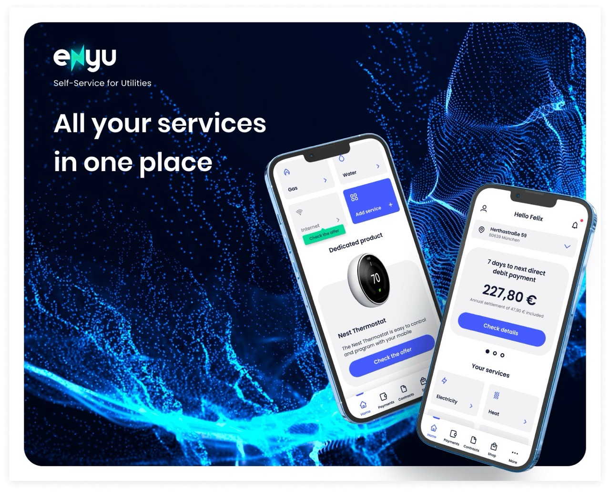
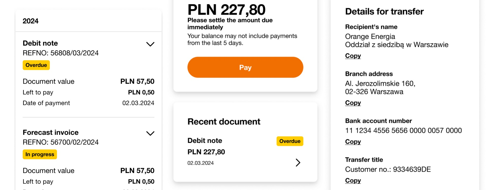
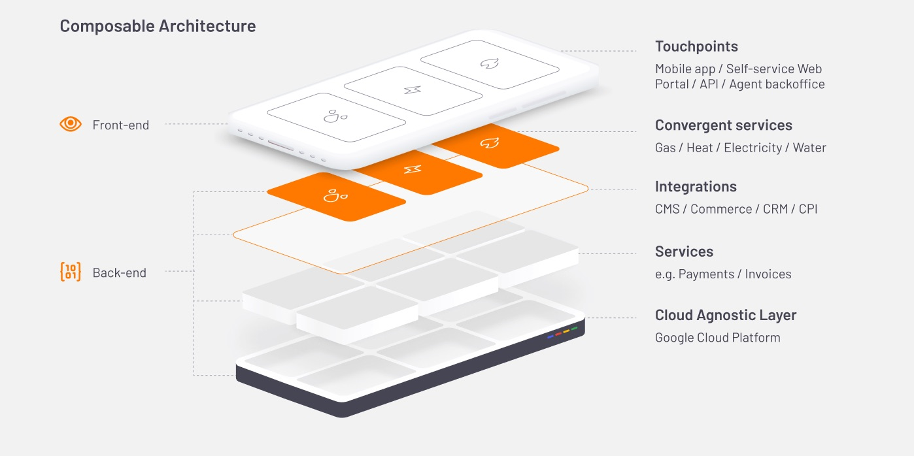
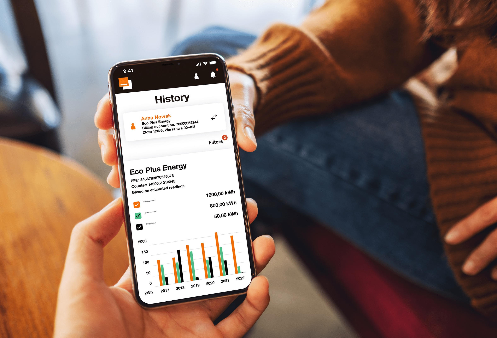

# How Hycom built a composable client portal for Orange Energia and how it sparked Open Self Service

Digital self-service is no longer a "nice to have" in energy and utilities. Customers expect instant access to data, transparent communication, and the ability to take action without waiting for support. For providers, this means one thing: the traditional model of service delivery must evolve into a flexible, digital-first environment.

Orange Energia — one of the most innovative energy providers in Poland — took this challenge seriously. Their goal was clear: build a modern, unified client portal that would simplify customer communication, reduce operational load, and create a scalable foundation for future services. The portal was known as "Moja Orange Energia" and was delivered for Orange Energia - then a company within the Orange Group and now part of the Fortum Group.

The project became one of the first large-scale composable portal implementations in the Polish energy sector. **It also played a crucial role in shaping the components and architectural assumptions that later evolved into Open Self Service** — our ready-to-deploy, modular frontend for digital self-service.


<!--truncate-->

## Why Orange Energia needed a composable digital portal

As a fast-growing energy provider supporting both consumers and businesses, Orange Energia faced challenges common in the sector. Growing customer expectations demanded full visibility into contracts, usage, invoices, and service requests. There was increasing pressure to reduce cost-to-serve through automation and self-service. Without an existing digital self-service portal, most interactions still flowed through call centers and manual back-office workflows, and the volume of requests and manual work performed by service teams continued to grow.

Orange Energia wanted a portal that would:

- give customers real-time access to their energy data and documents,
- unify multiple service processes in one experience,
- support future expansion without risky rebuilds,
- and enable quick delivery cycles instead of long monolithic releases.

To achieve this, we built the solution on Hycom's internal accelerator, **Enyu**.

## What is Enyu and why it mattered



Enyu, our composable, cloud-ready accelerator, was created for building self-service portals across regulated industries like energy, utilities, and telco. It offered a headless, API-first architecture with ready-made UI components for self-service, reusable business modules such as billing, contracts, and notifications. The framework enabled decoupling frontends from backend systems and provided a strong integration layer for different APIs.

It was designed for organizations that needed fast delivery without compromising scalability or future-proof design. For Orange Energia, this meant we could build a highly customized client portal — while reusing modular components and delivering in shorter cycles than classic enterprise projects. Many of the capabilities required in the project — including billing, contracts, notifications, and identity management — came directly from Enyu's standard module set, which we configured and extended instead of designing a completely new architecture from scratch.

## How Enyu's capabilities translated into the Orange Energia client portal

Leveraging Enyu's modules, the new portal was designed as a **single point of access** for customers — combining billing, usage data, contracts, customer communication, and self-service knowledge.

### Customer data & account overview


The portal provides comprehensive profile and contract information, including agreements, tariff plans, and meter details. Customers can view and manage up-to-date contact and billing preferences in one place, as well as configure selected personalized services available for their contracts.

### Billing & payments



Customers have full access to invoices and settlements with downloadable documents in multiple formats. The system displays payment statuses and reminders, along with a clear history of charges and adjustments.

### Energy usage & analytics


The portal includes consumption charts with historical comparison, supporting multi-meter and multi-location scenarios. Integration with metering systems enables near-real-time updates, giving customers immediate insight into their energy consumption patterns.

### Applications & service requests

Digital forms replace phone and email workflows, with automated routing to appropriate internal systems. Each request has clear status tracking, significantly reducing the need for manual processing by service teams.

### Notifications, communication, and knowledge base

The system delivers personalized alerts for billing, consumption, and contract-related events. A timeline of activities and system messages improves transparency and reduces call center load by keeping customers informed proactively. The portal also includes a knowledge base with search powered by Elasticsearch, helping users quickly find answers to common questions without contacting support.

### Security & identity management

Robust authentication ensures secure access, with configurable roles and permissions that comply with sector-level requirements. The security layer protects customer data while maintaining ease of use, and supports multi-factor authentication for increased account security.

All of this was delivered with a modern, intuitive UI accessible across devices — addressing the needs of both individual and business clients.

## Why composable architecture made the difference



The strategic decision to build Orange Energia's portal in a composable model brought benefits that go far beyond the initial MVP.

1. **Faster time-to-market**: Each capability — billing, consumption data, applications, notifications — was delivered as a separate, independent component. This enabled parallel workstreams, shorter release cycles, and faster value delivery to end users. Teams could work on different features simultaneously without blocking each other.

2. **Flexibility to replace or upgrade components**: Orange Energia can modernize any part of the portal without rewriting the rest. This includes replacing the CMS, adding new payment methods, extending business workflows, or rolling out new analytics widgets. This flexibility is essential in the energy sector, where regulatory, technical, and customer requirements change rapidly.

3. **Smooth integration with existing systems**: Composable architecture enabled seamless connection with billing and settlement engines, CRM systems, meter data management systems, identity and security services, and notification and workflow tools. Instead of building long, monolithic integrations, each module communicates through clear, API-based contracts.

4. **Ready for future scalability**: With new processes emerging and having a future backlog planned - Orange Energia got a foundation that supports evolving business models, adding new customer journeys, and expanding the portal to new service lines.

5. **"Productization" path toward Open Self Service**: The modular approach leveraged in this project became one of the key inputs for creating Open Self Service — a fully composable, industry-ready self-service platform based on the same principles.

## How Orange Energia's technical challenges shaped Open Self Service

Building a composable portal for Orange Energia on top of our accelerator required solving several technical challenges that directly influenced how we designed Open Self Service. From content modeling constraints to enterprise security requirements, each decision helped us refine the platform-level patterns we had defined for our stack and confirm which of them actually work in production.

### Content modeling and CMS flexibility

Orange Energia used Contentful as their headless CMS, and we quickly appreciated its developer experience. Content editors found the interface intuitive, live preview worked smoothly, and data migration between spaces was straightforward.

However, we hit a practical constraint: the basic plan limited content types to 50, and we exceeded that limit during development. In hindsight, this was largely a consequence of our initial content modeling strategy — each page type received its own content type, plus supporting types for components, and some of these types grew quite large. We also discovered limits on the number of fields within a single content type, which prevented us from simply consolidating types. Because the project could not move to a higher subscription tier at that stage, we had to rethink how we structured content within the existing limits.

To reduce the pressure on content type limits for simple label content, we introduced a pattern based on storing multiple key-value pairs in a single JSON field, then building a custom Contentful app that rendered a simple form for editing these labels. This reduced content type usage for UI labels, button text, and form field labels.

The real lesson was about flexibility in content modeling. Not every organization can justify upgrading to higher-tier SaaS plans, and some prefer open-source alternatives. In O2S, we designed the CMS integration layer to be swappable — you can use Strapi, Contentful, or any other headless CMS that exposes a GraphQL or REST API.

More importantly, we changed our content modeling approach in later projects. Instead of creating a separate content type for each page type, O2S uses a single [`Page` content type](https://www.openselfservice.com/docs/integrations/cms/strapi/content-model#pages) that can compose any number of reusable blocks. New pages don't require new content types. Blocks aren't tied to specific pages — they can be reused across the application. This makes content management more flexible and reduces the complexity of the content model.

### Security and API contracts

Orange Energia's security team had strict requirements across multiple areas of the platform, and aligning on them was a significant part of the collaboration.

One of these areas was the firewall support: it needed exact API specifications to allow known traffic patterns while blocking anything that didn't match documented schemas. This meant we needed complete OpenAPI definitions for our Backend for Frontend (BFF) layer, including precise field formats, data types, and validation rules. Working through these constraints together gave us a much clearer view of how security requirements shape architecture and delivery processes.


Initially, our BFF implementation used TypeScript interfaces. However, NestJS decorators for generating OpenAPI schemas only work with classes, not interfaces. We refactored the codebase to use classes instead, enabling automatic OpenAPI schema generation from our NestJS controllers and DTOs.

To make this approach practical at scale, we defined DTO classes using `@ApiProperty` decorators and backed them with a shared set of reusable patterns. This avoided copying the same regular expressions and constraints across dozens of classes:

```ts
export class User {
  @ApiProperty({ ...PATTERNS.USER_ID })
  id?: string;

  @ApiProperty({ ...PATTERNS.EMAIL })
  username?: string;

  @ApiProperty({ ...PATTERNS.NAME })
  firstName!: string;

  @ApiProperty({ ...PATTERNS.NAME })
  lastName!: string;

  @ApiProperty({ ...PATTERNS.EMAIL })
  email!: string;

  @ApiProperty({ ...PATTERNS.PHONE })
  phoneNumber?: string;

  @ApiProperty({ ...PATTERNS.LANG_CODE })
  lang!: string;

  @ApiProperty({ isArray: true, maxItems: 50, ...PATTERNS.CUSTOMER })
  customers?: Array<string>;
}
```

The `PATTERNS` namespace centralized all OpenAPI and validation metadata — including regexes, lengths, descriptions, and examples:

```ts
export namespace PATTERNS {
  export const EMAIL = {
    pattern:
      "^[a-zA-Z0-9!#$%&'*+\\/=?^_`{|}~-]+(?:\\.[a-zA-Z0-9!#$%&'*+\\/=?^_`{|}~-]+)*@(?:[a-zA-Z0-9](?:[a-zA-Z0-9-]*[a-zA-Z0-9])?\\.)+[a-zA-Z0-9](?:[a-zA-Z0-9-]*[a-zA-Z0-9])?$",
    minLength: 5,
    maxLength: 320,
    description: 'Email',
    example: 'john.smith@mail.com',
  };

  export const PHONE = {
    pattern: '^\\+?\\d{1,4}?[-.\\s]?\\(?\\d{1,3}?\\)?[-.\\s]?\\d{1,4}[-.\\s]?\\d{1,4}[-.\\s]?\\d{1,9}$',
    minLength: 1,
    maxLength: 50,
    description: 'Phone number',
    example: '+48 500 500 500',
  };

  export const NAME = {
    pattern: '^([a-zA-Z0-9À-ÖØ-öø-ǿ \\xA0\\.\\,\\-\\/\\{\\}\\_\\:])*$',
    minLength: 1,
    maxLength: 256,
  };

  export const LANG_CODE = {
    pattern: '^[a-zA-Z]{2}$',
    minLength: 2,
    maxLength: 2,
    description: 'Language code',
    example: 'EN',
  };

  export const CUSTOMER = {
    type: 'string',
    pattern: '^\\d+$',
    minLength: 1,
    maxLength: 10,
    description: 'Customer ID',
    example: '2000015',
  };

  // ... more reusable patterns
}
```

To catch security compliance issues earlier, we built a custom validator that tested BFF responses against the OpenAPI schema during local development. This helped us identify mismatches before deploying to client environments, reducing back-and-forth with security teams. For example, when a string was returned instead of an integer in the `id` field, the validator responded with a structured error payload:

```json
{
  "type": "INVALID_REQUEST",
  "data": [
    {
      "name": "id",
      "value": [
        "12345"
      ],
      "errors": [
        {
          "instancePath": "/0",
          "schemaPath": "#/items/type",
          "keyword": "type",
          "params": {
            "type": "integer"
          },
          "message": "must be integer"
        }
      ]
    }
  ]
}
```

These experiences led to standardizing security practices in O2S. We configure required security headers using Helmet in the API harmonization layer, ensuring consistent security settings across deployments. The OpenAPI-first approach also became standard — when integrating with backends that don't provide SDKs, we generate client code from OpenAPI specifications using tools like [heyapi.dev](https://heyapi.dev/), ensuring type safety and contract compliance from the start. The generation step itself is straightforward — for example, creating an Axios-based client from an `oas.yaml` file looks like this:

```ts
import { createClient } from '@hey-api/openapi-ts';

const generate = async () => {
  await createClient({
    input: './oas.yaml',
    output: './generated/zendesk',
    plugins: [
      {
        name: '@hey-api/client-axios',
      },
    ],
  });
};

generate();
```


### Frontend architecture and state management

In Orange Energia, we maintained a shared UI library as a single package. This simplified initial implementation but reduced flexibility. Any change to a component required publishing the entire library, even for small updates.

O2S takes a more pragmatic approach. We don't split components into separate packages upfront, but we're ready to do so when reuse across multiple applications becomes necessary. This keeps the initial setup simple while maintaining the option for granular component distribution later.

For state management, Orange Energia used XState extensively — perhaps too extensively. We stored the entire application state in XState machines, which significantly increased complexity and the learning curve for new developers. XState is powerful for complex state machines, but it's overkill for simple state management.

In O2S, we use React's native state management. Global state lives in React Context providers, keeping the codebase approachable. We don't rule out XState, but we'd only use it where a state machine provides clear value — in complex workflows or multi-step processes where state transitions need explicit modeling.

### UI theming and customization

Orange Energia had full control over their UI because we built a custom Sass framework for component styling. Rebranding was straightforward — most changes could be done through variables, and component-specific adjustments were easy since we owned the component code.

O2S uses a different but equally flexible approach. We build components with [shadcn-ui](https://ui.shadcn.com/) and Tailwind CSS. shadcn-ui provides copy-paste components that you own and can modify, while Tailwind's utility classes make it easy to adapt components to different design guidelines. This combination gives teams the flexibility to customize the UI without fighting against a third-party library's constraints.

### Authentication and identity management

In Orange Energia we used Keycloak for authentication. To maintain visual consistency, we needed to style Keycloak's login and registration flows to match the React application. Keycloak's default UI uses Freemarker templates, which makes React integration challenging.

We used [Keycloakify](https://www.keycloakify.dev/) — a library that provides React components for Keycloak integration. It allows embedding a React application that communicates with Keycloak and renders forms using existing UI components and styles. This approach is still used in O2S for Keycloak integrations.

The project also implemented user impersonation that can be triggered from a Backoffice application. Administrators can sign in as another user and perform actions in their name  to troubleshoot issues or test user experiences. This required careful token management — generating impersonated tokens in the admin panel, storing them in cookies accessible on the main domain, and handling token substitution in next-auth. All impersonation actions were logged for audit purposes. While this specific implementation may not be needed in every deployment, the experience informed how we think about flexible authentication patterns in O2S.

### Key learnings for Open Self Service

The Orange Energia project taught us that composable architecture isn't just about technical flexibility — it's about making pragmatic choices that balance immediate needs with long-term maintainability. We validated and refined many of the assumptions we had built into our accelerator: where composable modules make sense, how much reuse is realistic, and how strict API contracts need to be in real enterprise environments. We also learned to avoid over-engineering (like using XState everywhere), to design for replaceability (CMS integrations, UI libraries), and to build security and API contracts into the development workflow from the start.

These lessons directly shaped Open Self Service.

The platform is designed to be backend-agnostic, with swappable integrations. The content model is flexible enough to avoid vendor lock-in. Security practices are built in, not bolted on. And the architecture stays pragmatic — we use powerful tools where they add value, and simpler solutions where they're sufficient.

The result is a framework that inherits the battle-tested patterns from Orange Energia (and other MACH-based projects we deilvered at Hycom) while remaining flexible enough for organizations with different constraints, budgets, and technical preferences.

## Summary



The Orange Energia portal project shows how a well-executed composable approach can transform digital self-service in energy and utilities. Customers gained transparency, access, and control over their energy services. The organization reduced operational effort and manual workload, freeing service teams to focus on higher-value interactions. Technology teams gained a flexible, scalable foundation for next-generation digital services. The outcomes influenced the evolution of **Open Self Service** — built on real experience and proven components.

For energy providers navigating the pressure of rising expectations, new regulations, and growing complexity, composable client portals are no longer an experiment. They're becoming the new digital standard.

Want to learn more about composable architecture for customer portals?

- [Open Self Service website](https://www.openselfservice.com)
- [Documentation](https://www.openselfservice.com/docs)
- [GitHub repo](https://github.com/o2sdev/openselfservice)

