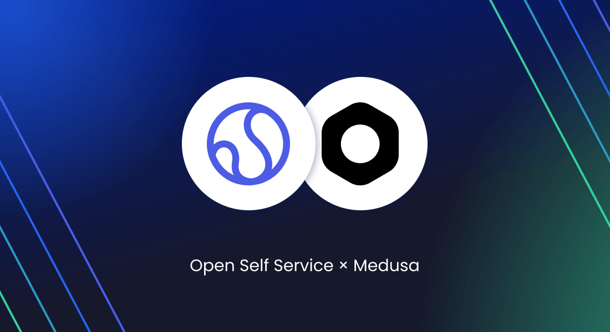
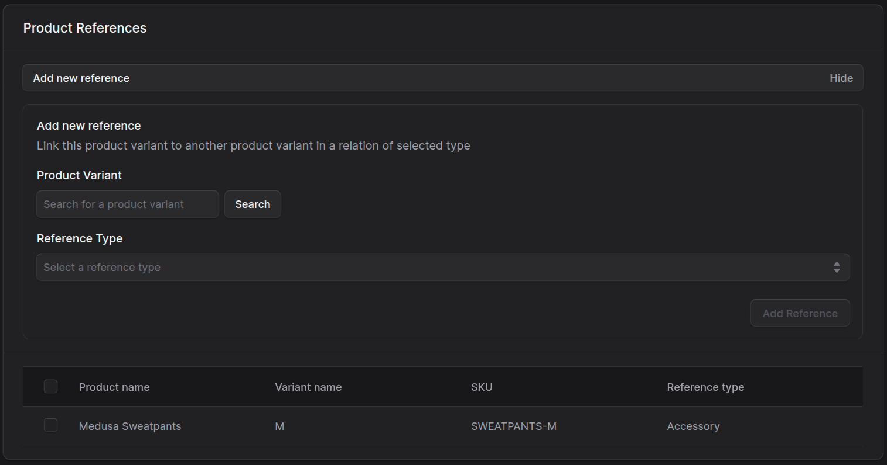
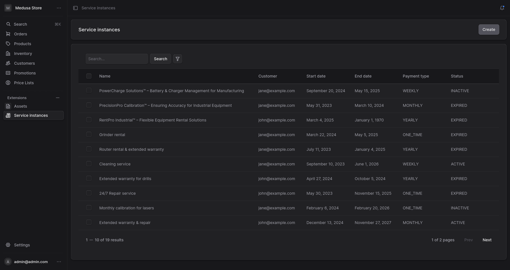
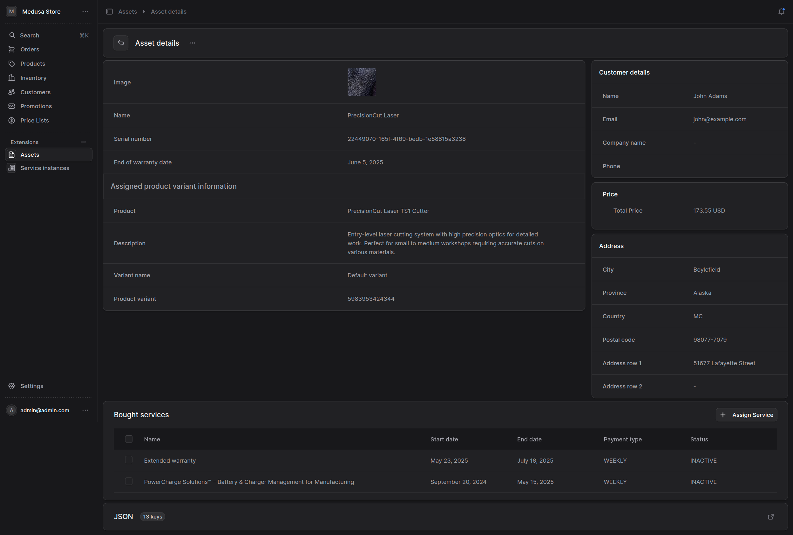
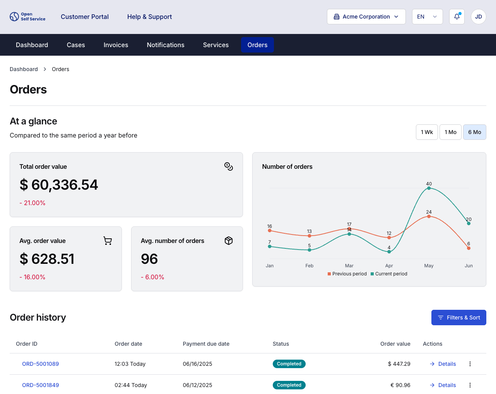

We’re excited to share the initial release of our integration between **Open Self Service** and [Medusa](https://medusajs.com/).

This integration allows developers to easily display commerce-related data such as **Orders**, **Assets**, and **Services** within customer-facing portals built with O2S.

<!--truncate-->

## Why integrate Medusa with O2S?

Open Self Service is a full-stack frontend framework for customer portals - applications designed for efficient customer support, combining data from multiple sources and offering rich self-service capabilities.
Medusa, on the other hand, is an excellent choice for headless commerce logic - fast, customizable, and open.

By combining both, you can:

- Extend Medusa with new capabilities for B2B and post-purchase scenarios,
- Use Medusa not only as a commerce engine but as part of broader, non-standard flows,
- Display customer orders and service data in a branded, decoupled UI,
- extend Open Self Service's frontend further so that it becomes a full-featured sales & customer support platform.

## What’s included in the integration?

We created a dedicated Medusa plugin:
[see medusa-plugin-assets-services on GitHub](https://github.com/o2sdev/medusa-plugin-assets-services)

This plugin adds support for two new models:

- `Asset` - represents purchased items with serial numbers or support-relevant metadata
- `ServiceInstance` - describes purchased or assigned services for the customer

Additionally, it enables creation of product references between variants with types such as spare parts, replacements, accessories, and more.

These are **fully accessible via the Medusa API** and can be queried from the frontend app using our **API Harmonization Layer**.

## What does it look like in Medusa and Open Self Service?

Once integrated, O2S provides the following out-of-the-box screens:

- **Orders page** with list, status info, and order details.
  Supports sorting, pagination, and orders summary metrics.

- **Services page** presenting customer's services. Data pulled from Medusa API (ServiceInstance model).

- **(Optional) Assets page** (currently not part of open-sourced O2S). Displays assigned/purchased devices / products.

In Medusa the plugin adds admin widgets to view and manage data, e.g.:

- **Service instances list**
  

- **Asset details**
  

In our frontend app Medusa is the data source for the Orders, Services and Assets (not open-sourced) screens:

## Technical details

The Medusa plugin was build using the standard approach outlined in [Medusa's plugin creation documentation](https://docs.medusajs.com/learn/fundamentals/plugins/create).

- Plugin is installed via npm and automatically adds `Asset` and `ServiceInstance` entities to your Medusa instance.
- These are exposed via REST API and can be used with any frontend (not only O2S).
- In O2S, you configure a Medusa integration module that maps the data to O2S’s normalized schema.

You can find both:

- the [plugin code here](https://github.com/o2sdev/medusa-plugin-assets-services)
- and the [O2S integration module here](https://github.com/o2sdev/openselfservice/tree/main/packages/integrations/medusajs)

## What’s next?

We’re planning to extend this integration further:
- Add handling of **Product** endpoints (simple product catalogue)
- Potentially, somewhere in future cover even more endpoints and add more commerce features to the frontend app so that O2S could be used like a full sales and customr support solution.

If you're working with Medusa and looking to build **something beyond a classic shop**, we’d love your feedback.

Let us know what you'd like to see next.
And if you find it useful -> give us a ⭐ on GitHub 🙌

- [github.com/o2sdev/openselfservice](https://github.com/o2sdev/openselfservice)
- [Demo](https://demo.openselfservice.com)

---

Got questions? Join our [Discord community](https://discord.gg/4R568nZgsT) and let’s talk.
