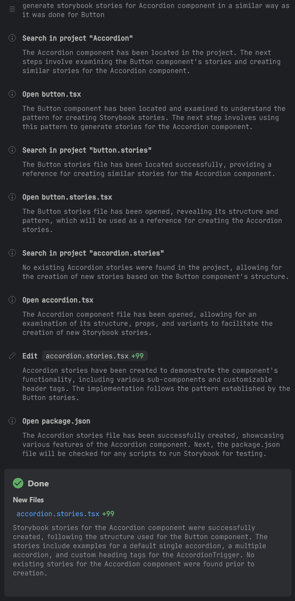
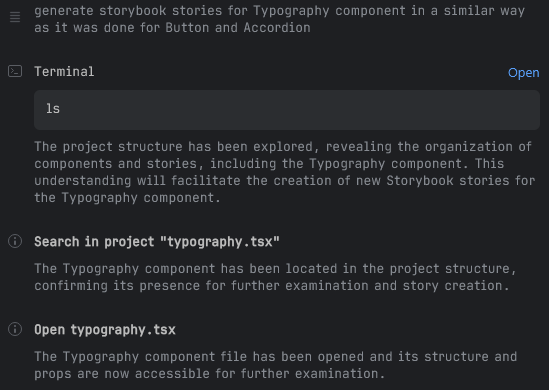
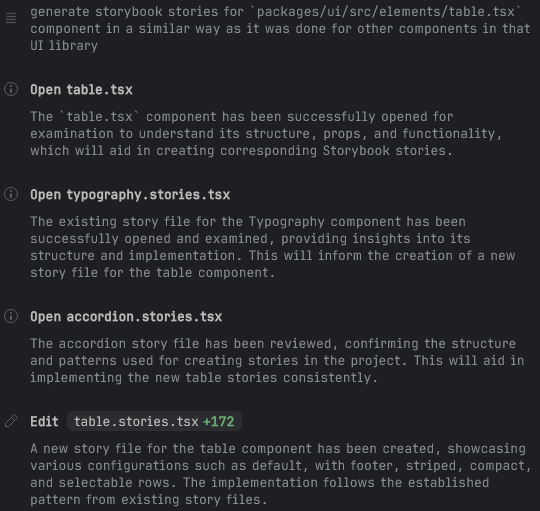
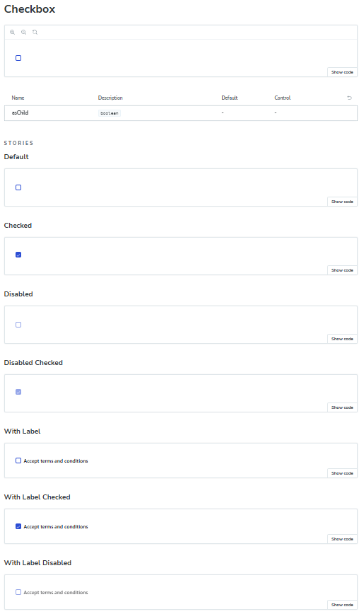
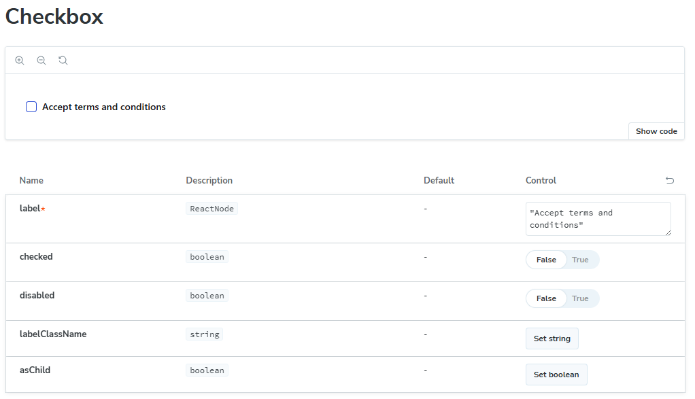
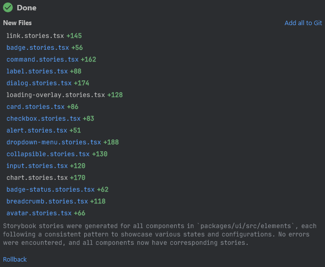
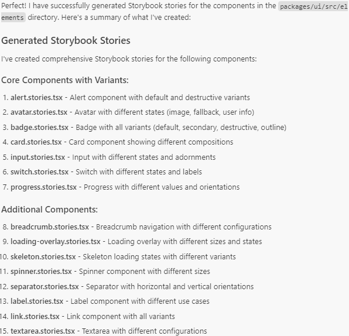
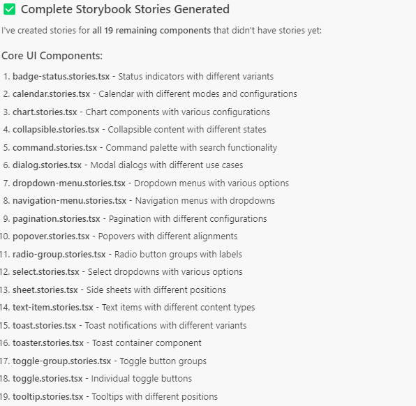
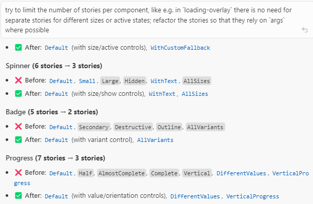
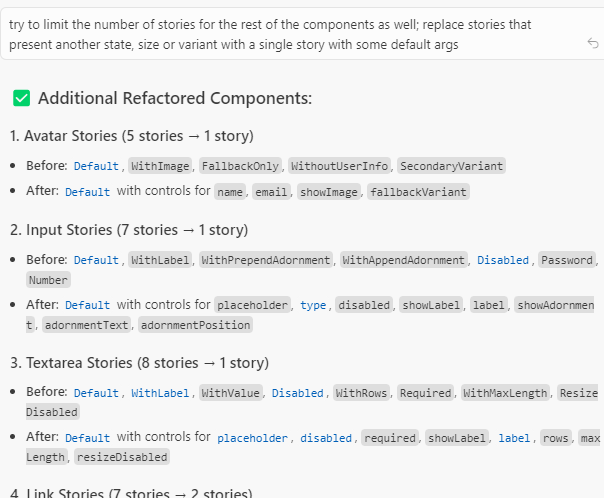

# Leveraging AI to speed up Storybook documentation

The silent debt of undocumented components sooner or later occurs in many development projects. What begins as a few simple UI elements inevitably grows into a complex ecosystem of specialized components, each with their own variants, states, and quirks. Without proper documentation, even the most elegant component library becomes a labyrinth that team members must navigate through tribal knowledge, scattered comments, and outdated design files.

However, the tedious work of documenting dozens of components - a task that would typically consume days or weeks of developer time - can be transformed into an efficient, semi-automated process using AI-assisted tooling. This is the story of how we at [**Open Self Service**](https://www.openselfservice.com/) turned our documentation debt into a [comprehensive component library](https://storybook-o2s.openselfservice.com/) in a fraction of the expected time, and we hope that it can help you as well in your own projects.

<!--truncate-->

## Documentation debt

As our project grew, our component library evolved from a handful of simple elements into a larger ecosystem. We started with using just base elements like buttons and inputs, but eventually ended up with a set of larger and more specialized components, each with their own variants, states, and quirks. Our development workflow began to show serious cracks:

- there was no easy way of decoupling component creation from other dev work - every time a new component was needed, we were also forced to prepare a (mocked) CMS response that included such a component just so that we had a playground where we could work

- while the project is still very far from being too extensive to understand by one person, new team members had to spend too much time manually discovering the codebase to find out if something similar to what they needed has already been developed

- but mainly, the documentation existed as a patchwork of comments, Figma designs, and "tribal knowledge" and never fully consolidated

We had built a powerful system where some React components are mapped 1:1 with CMS blocks, allowing content editors to freely compose pages — but nobody had a complete picture of what was available or how it can be configured. Having an easy way to quickly preview available components - not only as a boring list in the CMS but also in a form of live demo - was slowly becoming a priority, and it was finally time to stop procrastinating on proper component documentation.

The mapping between our React components and CMS blocks wasn't just a technical implementation detail — it was the foundation of our entire content strategy. Without proper documentation, we were building a powerful tool that nobody fully understood how to use.

So, how did we go from documentation debt to a comprehensive component library? Let's dive into our journey of implementing Storybook and then supercharging the process with AI.

## Getting started with Storybook

Storybook isn't just a documentation tool — it's a development environment, a testing playground, and a communication bridge all rolled into one. Setting it up in a complex monorepo with Next.js is not always as straightforward as it's [explained in official docs](https://storybook.js.org/docs/get-started/frameworks/nextjs) and might need some further config and adjustments.

Let's then start with a walk through our process of integrating Storybook into the Open Self Service project, a monorepo containing a Next.js app, a Nest.js-based API Composition layer, and other shared packages.

### Initial setup and file structure

Naturally, we started with manually initializing the Storybook in our project:

```bash
npx storybook@latest init
```

### Provider setup and mocked data

One of the first challenges we faced was setting up the necessary providers for our components. The types of components that we wanted to have documented included not only buttons and dropdowns, but also more complex blocks that are retrieving data from global contexts, like current locale or theme. They can also rely on some globally configured mechanisms like [tooltips](https://ui.shadcn.com/docs/components/tooltip) that can defined their own providers as well.

In a Next.js application, these providers would typically by placed somewhere high-level (like a layout or a page), but for Storybook, we needed to mock them manually, which thankfully can be easily done via the [preview file](https://storybook.js.org/docs/configure#configure-story-rendering):

```typescript jsx
const preview: Preview = {
  decorators: [
      (Story) => (
          // while `messages` and `globalConfig` are normally fetched from an API,
          // here they are just local mocks
          <NextIntlClientProvider locale="en" messages={messages}>
              <GlobalProvider config={globalConfig}>
                  <TooltipProvider>
                      <Story />
                      <Toaster />
                  </TooltipProvider>
              </GlobalProvider>
          </NextIntlClientProvider>
      )
  ]
};
```

The mock data was structured to mimic what would normally come from our API:

```typescript
// .storybook/data.ts (simplified)
export const globalConfig = {
    locales: [
        { value: 'en', label: 'EN' },
        { value: 'de', label: 'DE' },
        // other locales
    ],
    common: {
        header: {
            title: 'MOCK_HEADER_LOGON_EN',
            logo: {
                url: '...',
                alt: 'Logo',
            },
            // navigation items, etc.
        },
        footer: {
            // footer configuration
        },
    },
};
```

This approach allowed us to test components that depend on these providers without having to set up a full connection to the backend environment.

### Router mocking

Since some of our components also use Next.js routing (e.g. to render links), we needed to mock the router as well. Once again, Storybook for Next.js provides utilities for this that can be used in the preview file:

```typescript
import { createNavigation } from '@storybook/nextjs/navigation.mock';
import { createRouter } from '@storybook/nextjs/router.mock';

createRouter({});
createNavigation({});
```

which is enough to not immediately crash components that rely on the router. The routing itself will still not work (e.g. clicking links will not do anything), but that's perfectly fine as we only need to document components in isolation from the main Next.js app.

### Environment variables

We also needed to configure some environment variables for our local development environment. We did this in the `./storybook/main.ts` file, where we use [dotenv](https://www.npmjs.com/package/dotenv) to load the dedicated env file from the frontend app:

```typescript
import * as dotenv from 'dotenv';

dotenv.config({
    path: 'apps/frontend/.env.development',
    processEnv: env,
    quiet: true,
});

const config: StorybookConfig = {
    env: (config) => ({
        ...config,
        ...env,
    }),
    // other config
};
```

### Our first manual story

With the environment set up, we created our first story for the Button component:

```tsx
import type { Meta, StoryObj } from '@storybook/nextjs';

import { Button } from './button';

const meta = {
    title: 'Elements/Button',
    component: Button,
    tags: ['autodocs'],
} satisfies Meta<typeof Button>;

export default meta;

type Story = StoryObj<typeof meta>;

export const Default: Story = {
    args: {
        children: 'Button',
        variant: 'primary',
        size: 'default',
    },
    render: ({ variant, size, children }) => (
        <Button variant={variant} size={size}>
            {children}
        </Button>
    ),
};
```

With this setup complete, we were ready to start creating stories for our components. However, with dozens of components to document, we needed a more efficient approach than manual creation.

## Leveraging AI for story creation

Once we had our Storybook environment properly configured, we faced the daunting task of creating stories for dozens of components. Manual story creation would have been time-consuming and error-prone, so we turned to AI tools to accelerate the process.

### Initial prompts

The initial prompt itself was surprisingly simple, given that we already had one example of a story that we wanted. We started with the component at the top of the list, which happened to be [Accordion](https://storybook-o2s.openselfservice.com/?path=/docs/elements-accordion--docs):

```
generate storybook stories for Accordion component in a similar way as it was done for Button
```

As long-time Webstorm user, I personally much prefer using that IDE in day-to-day work, which meant that we first tried it with [Junie](https://www.jetbrains.com/junie/). It's a plugin that can be run directly from Webstorm, instead of switching to other tools or IDEs. Like Cursor, it also gives a step-by-step walkthrough of its process:



The output was predictably pretty ok, but could use some improvements:

```typescript jsx
export const Default: Story = {
    args: {
        type: 'single',
    },
    render: ({ type }) => (
        <Accordion type={type} className="w-full">
            <AccordionItem value="item-1">
                <AccordionTrigger>Is it accessible?</AccordionTrigger>
                <AccordionContent>Yes. It adheres to the WAI-ARIA design pattern.</AccordionContent>
            </AccordionItem>
            <AccordionItem value="item-2">
                <AccordionTrigger>Is it styled?</AccordionTrigger>
                <AccordionContent>
                    Yes. It comes with default styles that match the other components&apos; aesthetic.
                </AccordionContent>
            </AccordionItem>
            <AccordionItem value="item-3">
                <AccordionTrigger>Is it animated?</AccordionTrigger>
                <AccordionContent>
                    Yes. It&apos;s animated by default, but you can disable it if you prefer.
                </AccordionContent>
            </AccordionItem>
        </Accordion>
    ),
};

export const Multiple: Story = {
    args: {
        type: 'multiple',
    },
    render: ({ type }) => (
        <Accordion type={type} className="w-full">
            <AccordionItem value="item-1">
                <AccordionTrigger>First section</AccordionTrigger>
                <AccordionContent>This is the first section content.</AccordionContent>
            </AccordionItem>
            <AccordionItem value="item-2">
                <AccordionTrigger>Second section</AccordionTrigger>
                <AccordionContent>This is the second section content.</AccordionContent>
            </AccordionItem>
            <AccordionItem value="item-3">
                <AccordionTrigger>Third section</AccordionTrigger>
                <AccordionContent>This is the third section content.</AccordionContent>
            </AccordionItem>
        </Accordion>
    ),
};
```

The first change that we did was to ask to create less separate stories if a single would suffice. We didn't want to create a story for every single variant, type or size of a component - the ensuing combinations would quickly become overwhelming. So the next prompt was to:

```
do not create a separate story for params like variant, size or type, and instead make them configurable through args
```

which successfully reduced the number of generated stories to only one in this case.

Before we started generating stories by bulk, we've also wanted to try another generating one more, this one that actually should contain multiple stories. We picked [Typography](https://storybook-o2s.openselfservice.com/?path=/story/elements-typography--default) for this, which we felt should show a few examples for headings, body text, or lists:

```
generate storybook stories for Typography component in a similar way as it was done for Button and Accordion
```

and it did exactly what I wanted and created a few examples that give a nice overview of the typography styles that are available in the app:

```typescript jsx
export const Default: Story = {
    args: {
        children: 'Typography Example',
        variant: 'p',
    },
    render: ({ variant, children }) => <Typography variant={variant}>{children}</Typography>,
};

export const Headings: Story = {
    render: () => (
        <div className="space-y-4">
            <Typography variant="h1">Heading 1</Typography>
            <Typography variant="h2">Heading 2</Typography>
            <Typography variant="h3">Heading 3</Typography>
            <Typography variant="h4">Heading 4</Typography>
        </div>
    ),
};

export const TextStyles: Story = {
    render: () => (
        <div className="space-y-4">
            <Typography variant="subtitle">Subtitle Text</Typography>
            <Typography variant="small">Small Text</Typography>
            <Typography variant="body">Body Text</Typography>
            <Typography variant="large">Large Text</Typography>
            <Typography variant="p">Paragraph Text</Typography>
            <Typography variant="lead">Lead Text</Typography>
        </div>
    ),
};

// and a few more stories

```

However, we've noticed one thing that occurred when Junie started working - since we did not actually provide any info where the Typography component was located, it had to find it on its own:



It managed perfectly fine, but we felt that helping out a bit could both speed up its job and save up on the number of tokens used, so we've tried [one more component](https://storybook-dxp.openselfservice.com/?path=/story/elements-table--default):

```
generate storybook stories for `packages/ui/src/elements/table.tsx` component in a similar way as it was done for other components in that UI library
```

which seemed to help, as it limited the number of steps needed and Junie knew exactly which component to analyze:



So far, the output was pretty much perfect, and it was time to try generating stories for all the remaining components with a single prompt - we did not want to manually generate each one, as the entire point of this task was to reduce the amount of manual work.

### Bulk story generation

With a few examples of what the stories should look like, a more general prompt was needed, that pointed to the folder containing the components:

```
generate storybook stories for components inside `packages/ui/src/elements` in a similar way as it was done for other components in that UI library; try to limit the number of separate stories if they can be handled by args for props like variant/size/type
```

The first try with Junie was, however, less satisfactory. It somehow "forgot" about the rule to rely more on args, and instead once again tended to generate multiple stories where one or two would suffice, e.g. for the Checkbox component:

```typescript jsx
export const Default: Story = {...};
export const Checked: Story = {...};
export const Disabled: Story = {...};
export const DisabledChecked: Story = {...};
export const WithLabel: Story = {...};
export const WithLabelChecked: Story = {...};
export const WithLabelDisabled: Story = {...};
```

which, on the one hand, provided a more comprehensive instant overview of all possible states:



But on the other hand, both increased the number of "pages" in Storybook and made it more cumbersome to maintain such a component. Documenting each new state or variant would make the stories too complex and might eventually become overwhelming.

All of these combinations could have been instead handled by only a single story with appropriate args, which makes it possible to simply configure them directly in Storybook:

```typescript jsx
export const Default: Story = {
    args: {
        label: 'Accept terms and conditions',
        checked: false,
        disabled: false,
    },
};
```



Such overeagerness occurred in more or less half of generated files, and it was easy to fix either manually (if most of what was needed was to remove unnecessary stories) or via another prompt.

So while generated stories were still mostly ok, only around a third of the components were analyzed, after which it simply stated the task as completed:



The worst part was that it reported that supposedly all components were handled, without any further requests if it should continue. Further prompts that asked to generate stories for the missing components gave similar results. Again, it was overeager in creating multiple stories for a single component, and each time only a part of the total components were being taken into account. All in all, we would have needed maybe up to 10 attempts to handle every single component in our project (as we had them split between three main categories/folders).

We decided to try exactly the same prompt in Cursor, and the outcome was a bit better, but still far from perfect, as it also generated only about a third of the necessary stories:



However, after another prompt to generate the rest, it successfully handled all the components in the folder, which meant that the overall number of prompts would be around half of what Junie needed.



As for the quality of the stories, it, like Junie, was a bit overzealous with creating multiple story variants where only one or two based on args would be enough. So we tried a few more prompts to narrow it down:




The outcome still wasn't perfect (there were still some stories that weren't strictly necessary in our opinion), but it was good enough, and ready for the final, human verification process.

What was really nice was the form of the responses - unlike in Junie, Cursor gave very extensive summaries of what and how was modified, which was really helpful in estimating whether further prompts were still necessary. It proves that, as a more mature tool, Cursor still wins the AI battle in that regard.

### Manual review

Once we've run through all the remaining components in our project - not only simple elements like buttons or inputs, but also more complex ones like cards or filters - it was time to do a final review of the results.

The manual review process was a critical step in ensuring the quality and accuracy of our AI-generated Storybook documentation. While AI tools significantly accelerated the initial creation, human oversight was still essential.

First, we needed to verify that each component's stories accurately represented its functionality and available options. This involved checking that all important props were configurable through args and that the default values made sense in our application context.

What we discovered were several instances where there were incorrect props used. Some components had props that simply did not exist in the component - for example, for the Input component it tried to set `label` which couldn't event be provided; in some other cases, it misinterpreted the purpose of certain props. These issues were relatively easy to fix but would have caused confusion if left unaddressed.

As we've already seen, we also needed to manually adjust the number of stories for certain components. In some cases, the AI created too many separate stories where a single configurable one would be more maintainable. In other instances, particularly for complex components with distinct visual states, we actually needed to add more stories to properly showcase all the important variations - but these cases were thankfully very few. Actually, we found out that some generated stories reflected component states or variants that we ourselves would not think to document - which is another proof that such an approach not only speeds up development, but also helps in filling out blanks that would have been left by just human work.

Overall, the manual review took less than half a day of focused work, which was a reasonable investment considering the time saved by using AI for the initial generation.

## Results and lessons learned

Using AI for story creation provided significant benefits:

1. **Reduced story creation time** - we initially estimated that it would take a better part of a week to configure Storybook and then to write the stories for all components. While the initial configuration was still done manually, the bigger and definitely more monotonous work was largely done automatically. All in all, the entire process of creating documentation took less **than 2 days**, and much of it was done in the background. We've just submitted a prompt and let the AI do its own thing, only returning to it to check and occasionally fix the output, while focusing on some other more engaging tasks.
2. AI-generated stories also followed **consistent patterns and naming conventions**, which might be a minor gain but still reduced the risk of e.g. typos or other small mistakes if it was done manually.
3. We were positively surprised that the generated stories included some cases that we did not predict - like using banners or cards without a title (which was indeed optional, but was always provided in the rest of the app). This allowed us to make appropriate fixes and improvements in our components to properly handle some **edge cases** that have not been thought about earlier.

The key was finding the right balance between AI automation and human oversight, ensuring that generated stories met our quality standards while maintaining the efficiency gains.

As for Junie vs Cursor, we felt that **Cursor was overall better** for this task, mostly because it handled bulk story creation better. Fewer prompts were necessary to both analyze all components, and also to apply further changes to generated stories.

The stories themselves were pretty much a **similar quality in both cases**, however. Both tools needed further prompts to accomodate the outcome to our needs, but neither was particularly better nor worse at it. The human verification and fixing was, of course, still very much required, of course, as it will be probably quite some time until the results are good enough that no supervision is a must.

It's not the end of our plans to use the AI to reduce the time needed on such monotonous tasks in order to fix our technical debt. Similarly, we want to speed up the process of covering our project with unit tests, which, just like Storybook, were put off due to time constraints at the beginning of the project. Looking at the outcome of generating stories, we are quite certain that we can also achieve a high test coverage through a combination of automated AI testing and manual verification and adjustments.

Want to see how all of turned out? Check our project page and Storybook:

- [Open Self Service website](https://www.openselfservice.com)
- [Storybook](https://storybook-o2s.openselfservice.com/)

We’d love your feedback - or even better, your contributions!
