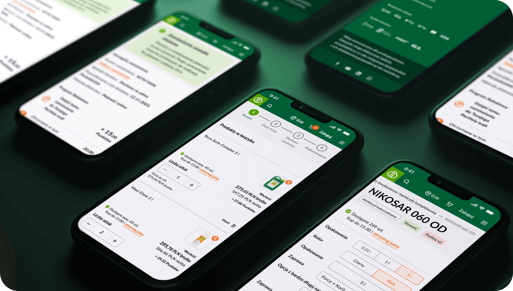
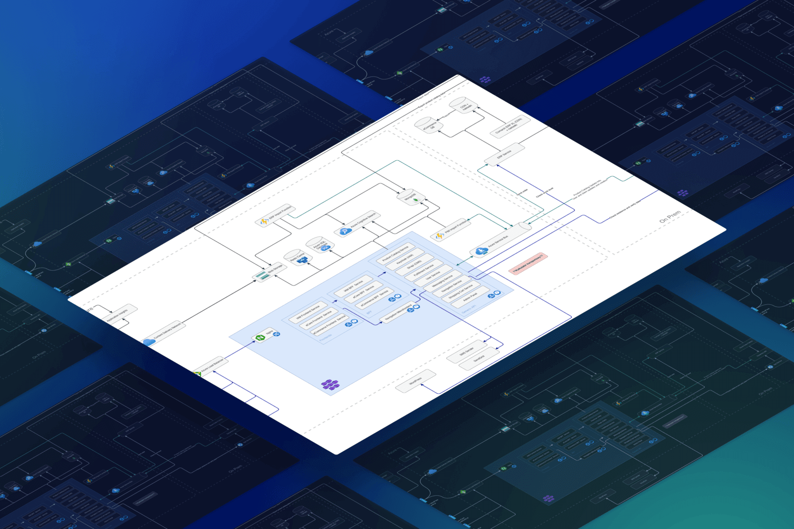
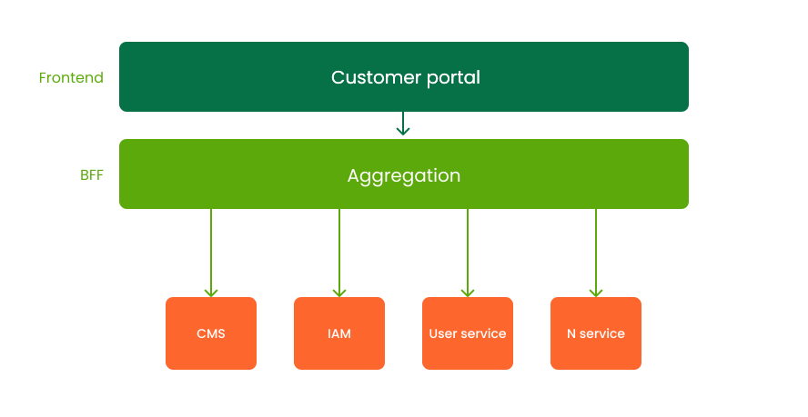
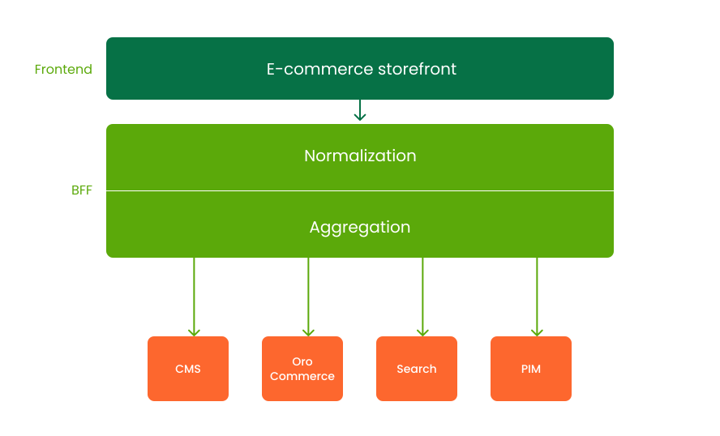
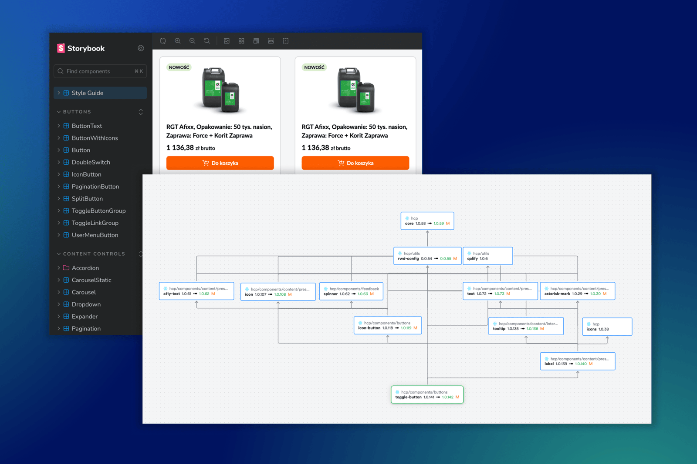
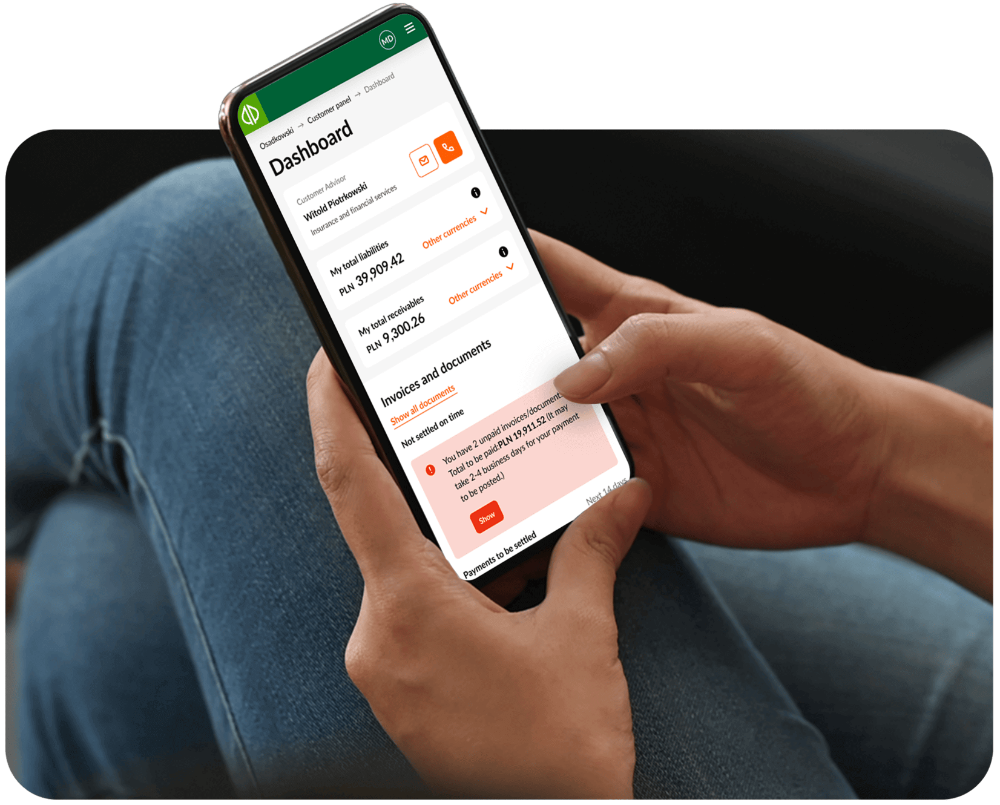

# Osadkowski’s composable B2B portal: self-service, commerce and lessons learned

Digital transformation in agriculture is rarely just about “putting a shop online”. Farms make large, time-sensitive purchases. Weather, regulations and market prices change quickly. Advisors and sales reps still play a critical role in everyday decisions.

[Osadkowski](https://osadkowski.pl/), a leading Polish agricultural supplier, decided to treat this complexity as an opportunity. Instead of adding a simple online catalog next to existing channels, the team set out to transform everything, to build a composable digital platform that would connect three key applications:

- a B2B self-service portal,
- a B2B e-commerce storefront integrated with OroCommerce,
- and a backoffice application for administrators and internal teams.

<!--truncate-->

From the beginning, the web applications were designed with future channels in mind. System's architecture was shaped so that it could later support additional ways of accessing the platform — including mobile — without duplicating business logic or rebuilding the entire stack.

The project started before [our later work with Orange Energia](../how-orange-energia-built-composable-client-portal-and-sparked-open-self-service), and the cooperation with Osadkowski continues to this day. Many of the patterns tested here later influenced how we think about composable frontends and how we designed Open Self Service as an open-source framework for this kind of solution.

This case study looks at the project as a whole: the business context, the architectural choices, the practical challenges and trade-offs we encountered, and the lessons that shaped later work — including Open Self Service. A separate, more technical deep dive will revisit these challenges in detail and illustrate the concrete conclusions we drew from them.
Not here for the business story? You can [skip directly to the technical architecture overview](#technical-architecture-overview).

## Why Osadkowski needed digital self-service and what the platform delivers

Osadkowski has been active in the agricultural market since 1990, specializing in plant protection, seeds, crops and additives. It works closely with Polish farms, building its position on trust and expert advice. Long before the e-commerce journey started, customer conversations were already pointing towards a need for better self-service and customer support: a place where clients could see their data, documents and requests without calling or emailing every time.

At the same time, existing processes and systems were fragmented. ERP and CRM handled core operations, while a separate WordPress installation powered large chunks of marketing and knowledge content. Customers did not have a single, coherent place where they could browse products, handle everyday self-service tasks, interact with support and access expert knowledge.

The new digital platform responds to these needs in several ways:

- **Agronomy-aware product discovery**: growers can filter and search assortments based on pest type, composition, soil requirements or grain category, not just by name or SKU.
- **Transparent availability and delivery information**: users see current availability and realistic delivery times, including options for next-day delivery where logistics allow it.
- **Dynamic discount and loyalty program**: order values are automatically recalculated based on current and historical purchases, rewarding long-term relationships rather than one-off transactions.
- **Unified self-service and support flows**: contracts, orders, documents and key requests are available in one place, so customers can resolve most tasks without contacting support.
- **Financial and logistics self-service**: online payments, order tracking and access to documents and invoices simplify work on the farm side.

All of this is implemented on top of a MACH-aligned architecture: microservices, API-first integration, cloud-native infrastructure and headless frontend. The frontend is built with Next.js and a component library that makes it easier to evolve the UI without rewriting core flows.

### Business outcomes and ongoing evolution

Results became visible quickly. Within less than nine months from the start of implementation, the new solution went live. After three months of operation it already **served around 90,000 B2B users and saw nearly 130% traffic growth** compared to the previous year, as [highlighted in the original Hycom case study](https://hycom.digital/insights/osadkowski-digitalization) about Osadkowski’s digitalization.

Equally important, the new platform created a foundation for gradual transformation. Instead of a one-off launch, Osadkowski and Hycom have been iterating on the system in regular sprints, introducing new capabilities and optimizations while keeping the composable architecture intact.

## Technical architecture and lessons learned

### Technical architecture overview

Currently, on the technical side, the solution is built as a composable platform rather than a single monolith. The web frontends run on Next.js, behind them sits a backend-for-frontend (BFF) layer, and behind the BFF there is a landscape of several dozen microservices and external systems such as OroCommerce and ERP.

The platform evolved in stages.

First, the team built a B2B self-service portal that introduced digital self-service and customer support flows that previously did not exist. This became the starting point for Osadkowski’s broader transformation of customer experience and service operations.

Next came the commerce application, this time with a different approach to data modeling and BFF responsibilities. A backoffice application was added to support internal users.

In a later phase, marketing content and the knowledge base were migrated from WordPress into the new stack. This consolidated all customer-facing experiences on the composable platform.

The result is a set of focused applications that share the same foundation, which we will look at in more detail in the next section.

### Three bounded contexts on the same composable stack

At its core, the solution consists of three bounded contexts that all follow the same composable shape: a React frontend, a backend-for-frontend (BFF) layer and a set of microservices and external systems behind it.
<!-- The same stack is now being extended to a hybrid mobile app that reuses the self-service and commerce frontends inside a WebView shell and talks to the BFF in exactly the same way as the browser-based clients. -->

- **Self-service portal** focuses on exposing existing data and processes from multiple backend systems (such as CRM, billing or contracts). Its BFF primarily aggregates responses from several services and exposes them through a single API, which keeps integrations manageable and helps avoid over-fetching on the frontend.
- **B2B commerce storefront** sits mainly on top of OroCommerce and Elasticsearch. Here the BFF acts as a domain layer: it normalizes API payloads into models for products, carts, orders and discounts, which later simplifies upgrades and multi-channel reuse.
- **Backoffice app** uses the same pattern for internal users. It orchestrates operational workflows and integrations, while Strapi remains the central place for content and navigation in the public-facing parts of the platform.

These three contexts share infrastructure, deployment model and integration patterns, but differ in how much domain responsibility they place into the BFF — a difference that became important in later stages of the project.

### Backend-for-frontend patterns: how normalization paid off

A key design decision in Osadkowski’s platform was how much responsibility to put into the BFF. In the first stage, the e-care BFF primarily aggregates responses from multiple backend systems and exposes them through a unified API. This aggregation-first approach simplifies integration with many backend services and reduces over-fetching on the frontend, but it also means that some domain complexity and mapping logic remain closer to the client.

As the commerce application was added, the team moved towards a stronger domain model in the BFF. Instead of only aggregating payloads from OroCommerce and other services, the commerce BFF **normalizes them into stable, domain-oriented structures for products, carts, orders and discounts**. This makes the frontend simpler, reduces coupling to any single e-commerce engine and makes it easier to reuse the same models across different channels, including the hybrid mobile app.

The practical impact of this difference became clear during real work. When the team upgraded Strapi in the e-commerce area, most changes were limited to a few adjustments in the BFF layer, because the normalized models shielded the frontend from low-level API details. In the earlier e-care implementation, a similar upgrade would have required touching many places in the frontend that were still directly aware of backend shapes.

The contrast between these two approaches became an important lesson for later projects: thin, aggregating BFFs are a good fit for early stages, but long-lived platforms and multi-channel frontends benefit from a BFF that acts as a reusable domain layer. The same principle underlies how BFFs are designed in Open Self Service.

### Shared component library and frontend reuse

From the beginning, the team wanted to reuse UI components between the self-service portal, commerce and other frontends. To achieve this, they introduced a shared component library, originally managed with [Bit](https://bit.dev) in an open-source setup. The idea was straightforward: versioned components, shared across applications, with a path towards a consistent design system.

In practice, this approach delivered clear benefits. Common building blocks for layout, navigation and domain-specific widgets could be implemented once and then consumed by multiple applications. Changes in shared components propagated in a controlled way thanks to explicit versioning, which is especially valuable in long-running projects with several frontends.

At the same time, running Bit in a self-hosted setup introduced notable friction. Bit is a powerful tool for sharing and versioning components across many applications, and in cloud-hosted scenarios it can be a good fit. In our case, however, the self-managed installation was relatively heavy: builds were slower and less predictable, and keeping the whole pipeline stable required more engineering effort than expected. It also added another tool that developers had to learn and operate, raising the onboarding threshold compared to plain npm packages. In later projects — including Open Self Service — these experiences pushed us towards simpler monorepo patterns, where classic npm packages and a standard toolchain provide similar reuse and versioning benefits with a lower operational cost.

### From WordPress to Strapi: unifying content and experience

When the project started, Osadkowski already had a significant amount of marketing and knowledge content implemented on WordPress. That content played an important role in customer education and in supporting sales teams.

As the new composable platform took shape, maintaining a separate WordPress site for extensive content became a limitation:

- the user experience was fragmented between the new portal and the old content site,
- maintaining consistent navigation and design across systems was harder,
- some content could not be easily reused where it was needed most in the self-service and e-commerce flows.

The team decided to migrate this content into the new stack and manage it through Strapi CMS. Strapi became responsible for:

- structured pages such as the “Knowledge” section,
- expert articles and educational materials,
- navigation elements that connect content with self-service and commerce journeys.

Strapi’s role goes beyond storing articles. It gives marketing and product teams a way to manage rich content, educational materials and parts of the frontend structure in one place. This makes it easier to run campaigns, introduce new sections and maintain a consistent experience across content and transactional parts of the portal, without requiring code changes for every adjustment. The same philosophy of CMS-driven structure appears in Open Self Service, which supports multiple headless CMS options behind a consistent integration layer.

This change did not just replace one CMS with another. It moved content closer to the core of the digital platform. With Strapi controlling both content and parts of the frontend configuration, it became much easier to:

- expose relevant knowledge exactly where customers make decisions,
- keep layouts and navigation consistent across applications,
- evolve the structure of the portal without changing backend code,
- serve the same content to multiple channels through APIs, without duplicating editorial work.

### Reliability, deployments and composable benefits

Composable architecture also changes how deployments and maintenance are handled. With Osadkowski’s platform, individual services and applications can be updated independently, using patterns such as rolling updates where appropriate. This makes it possible to evolve parts of the system without freezing all customer-facing functionality.

In practice, this means that selected areas of the portal can remain available even when specific components are being updated. For example, content sections and account views can stay accessible while deeper transactional capabilities are temporarily limited during planned maintenance. Having clear integration boundaries between frontend, BFF, OroCommerce and other backend systems makes these kinds of controlled changes easier to plan, communicate and execute.

The same mindset informs how Open Self Service is designed: integrations are explicit, failure modes are considered from the start, and frontends are built to degrade gracefully instead of failing completely when one dependency is being updated.

### Hybrid mobile app: extending one frontend to multiple channels

Although the primary entry point today is the web portal, Osadkowski is also planning to introduce a hybrid mobile application. Instead of building a separate native frontend, it is planned to wrap the existing Next.js application in a WebView-based shell and connect it to the BFF. This approach reuses the same UI components, routing and domain models across browser, PWA and native mobile touchpoints.

From a user’s perspective, this means consistent journeys across devices: the same account, the same self-service and commerce flows, adapted to mobile form factors.

From a delivery perspective, the hybrid model is cost-efficient. Most changes are implemented once in the web frontend and automatically propagate to mobile, while the native shell focuses on platform-specific concerns such as app store distribution, navigation behaviour, update prompts or other native capabilities.

Under the hood, the application detects when it is running in the native shell (for example, through a tailored user-agent), adapts navigation to platform conventions and ensures that session handling behaves correctly inside WebViews. These are relatively small, isolated changes compared to building and maintaining a fully separate native codebase, and they align well with the composable principle of reusing stable contracts and components across channels.

While this mobile app is still upcoming, similar hybrid patterns have already been validated in other Hycom accelerators and projects. That experience reinforces one of the assumptions behind Open Self Service: a single composable frontend should be able to power multiple channels — browser, PWA and mobile — without duplicating business logic or integration work.

## What this project contributed to Open Self Service

The Osadkowski project started before the Orange Energia client portal, but both initiatives share a similar DNA: a composable frontend sitting on top of multiple backend systems, with a CMS coordinating both content and parts of the frontend configuration.

From a product and architecture perspective, Osadkowski influenced several ideas that later became more formalized in Open Self Service:

- the distinction between BFFs that only aggregate data and BFFs that also normalize it into reusable domain models,
- the importance of treating the CMS as a central tool for managing not just content, but also page structure and rendered blocks,
- patterns for integrating complex B2B commerce engines like OroCommerce into a frontend that must remain backend-agnostic over time.

Open Self Service packages these lessons into a reusable, open-source framework for building customer and partner portals, self-service applications and B2B e-commerce frontends.

The composable patterns validated in the project help teams start with a sustainable architecture from day one, instead of recreating the same foundation from scratch on every project. They also reinforce several concrete design choices in O2S:
- domain-focused BFFs,
- a pragmatic monorepo approach to shared components,
- CMS-driven configuration of frontend structure,
- and an architecture that naturally extends to additional channels such as hybrid mobile apps.

If you want to see how these patterns look in an open-source implementation, you can explore Open Self Service — its features, architecture and code — starting from the [**website**](https://www.openselfservice.com/features), [**docs**](https://www.openselfservice.com/docs) and [**GitHub repo**](https://github.com/o2sdev/openselfservice).

