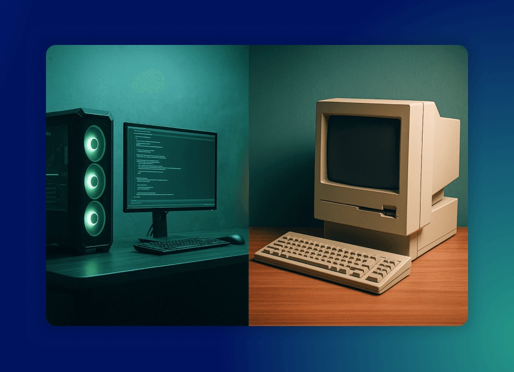

Over the past few years, we’ve worked on many large-scale solutions. E-commerce applications, customer support portals,
B2B service hubs - all combining content, integrations (PIM, search, e-commerce, ERP, IAM, custom APIs) and user-facing functionality,
where delivering strong user and customer experience has always been a key priority.

Many of those platforms were built on top of enterprise products. These provided headless backend APIs and, in some cases,
their own frontend layer as well.

Usually in practice, the frontend quality was rarely good enough.

<!--truncate-->

What we kept seeing was:

- limited modularity, leading to slower development, duplicated work, and higher maintenance effort
- outdated tech stack, making onboarding harder, limiting integration options, and increasing technical debt
- no standard way to integrate with multiple backend APIs, leading to complete vendor lock-in and solution scaling related issues
- performance bottlenecks, especially on integration-heavy pages
- no proper UI library, which made consistent design hard to achieve
- poor accessibility, often falling short of WCAG requirements

In real-world projects, the impact of these issues became even clearer. Here are a few stories from systems we took over after previous vendors.

## Real project stories

### Performance in enterprise storefronts

Recently, we conducted performance audits for headless and enterprise e-commerce frontends for two clients. In both cases,
Core Web Vitals scores were below 10/100, even though the frontend was supplied by products licensed for hundreds of thousands of Euros.

Looking at the results, was this cost justified? Could the client have chosen a better solution?

### Lack of reusable UI components

In one project we observed that the application was built without a proper set of reusable UI components. Each new feature
introduced its own styling and markup, which quickly led to inconsistencies across different areas of the interface.
Even when some components already existed, there was no documentation in a tool like Storybook. As a result, teams —
especially newly onboarded developers — often did not know where to find them, which led to further duplication.
The lack of a shared library made it hard to maintain visual consistency and slowed down development.
Small UI adjustments required repetitive work in many places, increasing the chance of introducing regressions and visual bugs.
This not only affected developer velocity but also the overall user experience.

### Coupling frontend and backend

In another project we took over from a different vendor, integrations with backend systems were implemented directly in the frontend layer.
Each frontend component communicated with APIs in its own way, without any form of backend-for-frontend or integration middleware.

As a result, every change introduced by backend teams required parallel updates in multiple frontend components.
This was time-consuming, error-prone, and caused dependency bottlenecks between teams. Instead of being able to work independently,
teams often had to wait for each other, which slowed down delivery and raised the risk of introducing breaking changes into critical user-facing flows.

### Vendor lock-in

Another client faced rising costs for a headless SaaS API they used. Due to that, they wanted to switch to an alternative.
The integration was so tightly coupled with the frontend that migrating would have been very costly and carried the risk of disrupting critical functionality.

This illustrates a broader issue: when the frontend is too tightly bound to specific backend services, the cost of change becomes overwhelming.
Instead of being able to adapt and evolve, companies find themselves locked into technology choices that no longer fit their needs.

### Clients' doubts

Faced with such complexity, many clients began asking the same question: **is migration even possible without disrupting the frontend experience?**

The answer is far from simple.

How to build something without introducing the same problems?

How do you avoid rebuilding the same UI over and over again or at least do it to a lesser extent?

How do you design something that is fully decoupled from the backend and more resilient to its changes?

We also started asking ourselves those questions project after project. And as we looked for better ways to approach frontend in composable architecture, we gradually built a solution - improving it along the way.

## Turning challenges into practical solutions

The difficulties we observed were not isolated cases. As a team working together for years at [Hycom](https://hycom.digital/),
we’ve gained extensive experience across industries, delivering and evolving large-scale customer-facing platforms.
Over time, the same patterns and pain points kept reappearing.

We’ve implemented self-service platforms for the energy sector, a digital platform combining customer support and sales features,
B2B e-commerce and self-service portals for manufacturing, as well as e-commerce and customer support solutions for telecom.
Along the way, we worked with clients such as **Orange Energia, Fortum, Dormer Pramet, T-Mobile, Osadkowski, and Salzburg AG.**

These projects gave us a unique perspective: while the use cases varied, the underlying architectural challenges were very similar.
Performance bottlenecks, lack of modularity, vendor dependencies, and integration complexity kept slowing down teams and increasing costs.

## Our open-source approach to modern composable frontends

The result of all that experience is an open-source development kit we’ve been building to support modern frontend applications.
**It focuses strongly on customer self-service and support portals.** At the same time, **it can power digital platforms that combine
multiple capabilities such as content, commerce, and customer engagement.** All of this is based on composable architecture.

We called it **Open Self Service (O2S)**. It brings together best practices around modularity, performance, and accessibility,
and introduces a consistent way to integrate with multiple backend APIs. O2S makes it easier to migrate or replace backend systems without
disrupting the frontend layer, helping teams avoid vendor lock-in and stay in control of their architecture.

### How O2S addresses the challenges

- **Performance bottlenecks** → The Next.js-based foundations are optimized for Core Web Vitals with SSR/ISR, caching and best practices that directly address performance issues seen in enterprise frontends.
- **Lack of reusable UI components** → A set of modular, CMS-driven components with Storybook documentation helps maintain consistency, speed up development and avoid duplication.
- **Coupling frontend and backend** → A backend integration layer (NestJS-based) acts as a backend-for-frontend or middleware, decoupling frontend from backend changes and reducing cross-team dependencies.
- **Vendor lock-in** → By isolating integrations behind a consistent API layer, backend services can be swapped or extended without disrupting the frontend code.
- **Accessibility issues** → UI components are designed with WCAG compliance in mind, making accessibility a core part of the architecture rather than an afterthought.

### Application starters

To make all these capabilities easier to adopt, we develop [**application starters**](https://www.openselfservice.com/docs/app-starters/overview).
This is one of the crucial parts of the project - starters are preconfigured frontend apps with ready-to-use integrations and UI components for specific use cases.
Starters cover the most basic features for each use case, so they help start your implementations faster. You can freely extend or customize them.

The first one we built was dedicated to [customer portals](https://openselfservice.com/), providing out-of-the-box features with room to expand into adjacent areas.
More recently, we introduced a [starter for content-driven digital platforms](https://openselfservice.com/dxp),
which offers a foundation for large-scale DXP setups and can be extended towards self-service or even commerce scenarios.

### Wrapping up

This is just the beginning. We continue to evolve both the framework and the starters, adding new features and integrations,
and improving documentation and developer experience along the way.

In our own projects, this approach has already made a difference. We can build faster, adapt to backend changes more easily,
and deliver better user experience.

And since the project is open-source, you can use it too.

If you’re working on digital platforms, especially those that offer customer self-service features, and wonder whether the **composable architecture**
concepts from commerce could also work in your world - maybe this is a good starting point?

---

**Customer portal starter:** [https://www.openselfservice.com/](https://www.openselfservice.com/)

**DXP frontend starter:** [https://www.openselfservice.com/dxp](https://www.openselfservice.com/dxp)

**Open Self Service Docs:** [https://www.openselfservice.com/docs](https://www.openselfservice.com/docs)
