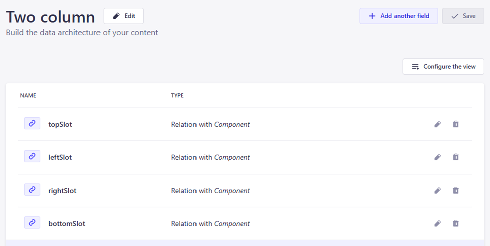
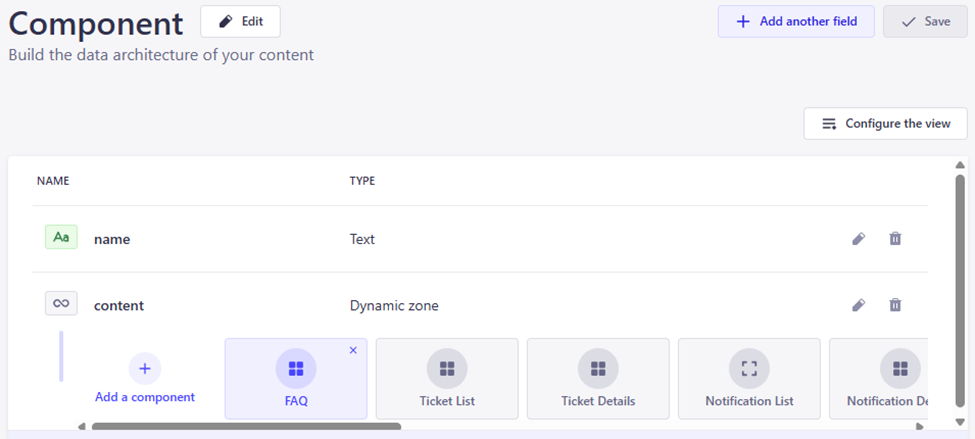
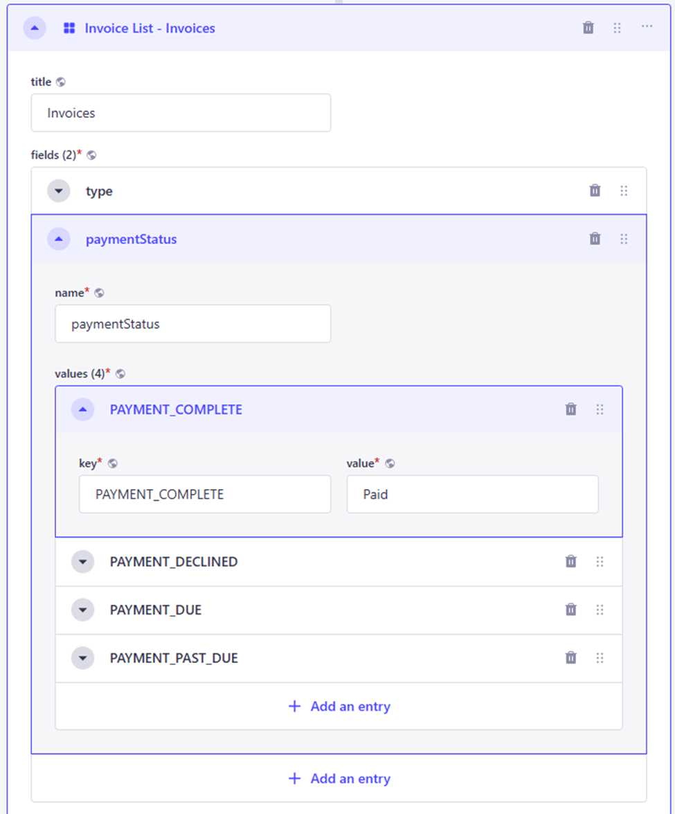

# Composable frontends with Strapi and Next.js - modeling complex frontend apps in a headless CMS

The article explores how we use Strapi CMS inside Open Self Service to model not just content, but also page structure, layout templates, and reusable UI blocks.
It’s a deep dive into how a modern CMS can support composable frontend apps and power more than just static content.

<!--truncate-->


## tl;dr – why we chose Strapi and how it works with O2S

We’re building a flexible, frontend-first framework for composable customer portals - Open Self Service (O2S).
To manage dynamic content and layout, we needed a CMS that gives full control over structure, integrates well with APIs, and is developer-friendly.

We picked Strapi, and here’s why:
* It lets us model dynamic layouts and reusable components.
* Editors can create content blocks and configure page structure - no need to code or deploy changes.
* It integrates smoothly into our API Harmonization layer, delivering both static and dynamic content in a unified response.
* The content model is clean, extensible, and easy to evolve.

In this article, we walk through in details how we set up Strapi, modeled page templates and created reusable components.

If you want a scalable way to manage your app’s content (not just for blogs or landing pages) - this might be for you.


## Introduction

Building modern frontend applications is no longer just about UI – it's about integrating APIs, delivering dynamic content, and providing a great user experience. Especially in customer-facing portals, flexibility and control over content are key to long-term maintainability and scalability. Yet in many frontend projects, layout and page structure are still hardcoded or stored in configs, limiting flexibility for business teams and creating unnecessary dependencies on developers.

With **Open Self Service (O2S)**, we’re aiming to help developers ship composable frontend solutions faster. But shipping frontend code is only part of the puzzle — content also needs to be manageable by business teams. That’s why we integrated **Strapi** into our architecture. It acts as a headless CMS not only for traditional content but also for more advanced use cases like managing layout templates, components, and reusable data blocks.

In this article, we’ll show how we modeled the content, how it fits into our frontend app, and why Strapi has become a key part of our stack.

## Web content management

Let's look at one of the pages in our application – the invoices list. It displays to the user their invoices, together with a quick summary of payment balance and history:


While we could hardcode these components on the frontend, it's of course not the most flexible solution (though it would be simple and quick). What we'd like is to give the people responsible for the content the possibility to:

1. Decide which components to add to any given page.
2. Decide how those components should be arranged in the layout.

The first requirement can be solved by modeling frontend components as content types inside Strapi, and enabling inserting them into a page. The second can be achieved by modeling templates as well, with some limited control over the page layout.

Our final result allowed us to configure each page within the app as content inside Strapi, each with a configurable template (like one- or two-column layouts, or some more complex or specific ones, like a dashboard layout). Within each template, we inserted slots for components, giving us the following result:


This page defines that:
- the top slot is currently empty - but it can be filled with e.g. some promotional banner if there is a business need for it,
- left and right slots contain payment summary and history components, but can be easily disabled, switched places, or completely replaced with other components,
- and finally, in the bottom slot we placed the list of user invoices.

## App architecture

The application is based on two main components:

- `frontend` - the **frontend app**, which is an application that provides the interactive UIs to the customers, composed of reusable components,
- `api-harmonization` - the **API Harmonization server**, where we fetch and aggregate the data from multiple API integrations to fully separate the presentation layer from backend services.


Each of these applications is semi-independent, therefore they are also built and deployed separately. This also means that the API Harmonization server can even be used without the provided frontend app – using our SDK you can leverage the normalized data model in your own applications, whether they are web- or mobile-based, or even in other backend integrations like AI assistants or chatbots.

### Data flow

1. A call to the API Harmonization server occurs for the page.
2. Firstly, a dedicated module within the `api-harmonization` app handles the request. Internal services are called to different APIs, which can range from simple parallel requests to more complex orchestration.
3. Received data is normalized and then aggregated into a single response, which usually combines static data from a CMS with dynamic data from different APIs.
4. Based on this response, shared parts of the UI are rendered (like navigation or footer), but **no other components** are rendered yet.
5. The page response includes the template that should be used to render the page, together with the IDs of components that should be fetched.
6. Inside the template rendering, each component within each slot asks the API Harmonization server for its own data. This mechanism leverages the [streaming of server components](https://nextjs.org/docs/app/building-your-application/routing/loading-ui-and-streaming#what-is-streaming) to make component loading asynchronous while still keeping API requests server-side.
7. If the API finds that component in some database (like a CMS), component rendering starts and the HTML is streamed to the browser.


## Strapi content model

Our content is largely based on three main types of content models:

- Page that represents any route within the frontend app; we do not model specific pages within the CMS, and instead allow editors to compose the pages they need out of generic types,
- Template that defines the layout of the page and can include simple one- or two-column layouts or more complex ones, and allows the editors to decide where each component should be rendered,
- Component that represents some (smaller or larger) piece of UI that can be placed anywhere in the page layout by the editors.

### Pages

A model for the page is the most important one, as it defines:

- the slug for the page, which is matched against the URL in the browser, and which is a simple localized text field (which means that the page can have different slugs in each language),
- the template for the page that stores the components’ definitions for that page, and which is a dynamic zone where any of the available templates can be picked.


### Templates

The content type for the templates is quite basic – it is based on a simple system of slots that define some predefined location within the frontend app. The available templates are highly configurable and depend on the UI needs. For simpler pages, a basic two-column layout can be sufficient, consisting of:

- a top slot (that can store e.g. some promotional banners or messages),
- left and right slots for the main content,
- and a bottom slot for some additional content (like FAQs or contact information).



Each slot is a relation field to a Component content type, where multiple instances can be placed (so, in other words, a single slot can accept multiple components):


### Blocks

Before we started modeling the content, we established a few requirements that would allow the content editors to work efficiently.

One of those was to have the possibility to reuse the same components on different pages, without having to maintain duplicates. Having to keep track of, for example, the same generic FAQ for the app that appears on most pages, without having a single instance of it, would be a nightmare – especially as the app grows and expands.

To solve this issue, we’ve introduced a Block type that represents a single instance of some piece of content. It consists of:

- a name mostly for internal use by the editors to identify each instance, e.g. “FAQ about the tickets” and “FAQ about the invoices”,
- content that’s a dynamic zone into which any of the components can be placed.



For example, the FAQ component (that uses Strapi’s component type) consists of several text fields, that represent a UI component with title, subtitle, and an accordion with answers to common questions:


While the FAQ component is quite simple and on the frontend renders only the static content from the CMS, it doesn’t mean that only such components can be defined within Strapi. Another component example is the Invoice List, which on the frontend renders a table with the user’s invoices:


This one is a bit more complex - aside from the title, it also handles:

- fields that use a generic component that allowed us to map fields in the API data model to more user-friendly labels, e.g.:

  

  where the keys exactly match the union types in the Invoice model:

    ```typescript
    export class Invoice {
        id!: string;
        type!: 'PAYMENT_COMPLETE' | 'PAYMENT_DUE' | 'PAYMENT_PAST_DUE';
        paymentStatus!: 'STANDARD' | 'PROFORMA' | 'CREDIT_NOTE' | 'DEBIT_NOTE';
        ...
    }
    ```

- a table that defines which columns should be displayed on the frontend for the invoice table:

  

## Conclusion

The integration of Strapi with Open Self Service shows that content management doesn't have to stop at landing pages or blog posts.
With the right structure, it can support complex, API-driven applications - giving both developers and content editors the tools they need to collaborate effectively.

We’ve used Strapi to:

- Model page templates and components
- Manage dynamic data presentation
- Reuse content blocks across the app
- Empower non-technical users to make changes without code

Combined with the composable architecture of O2S, this gives us a powerful foundation to build modern self-service portals that are scalable, flexible, and easy to maintain.

Want to see it in action?

- [Open Self Service website](https://www.openselfservice.com)
- [Documentation](https://www.openselfservice.com/docs)
- [GitHub repo](https://github.com/o2sdev/openselfservice)

We’d love your feedback - or even better, your contributions!
