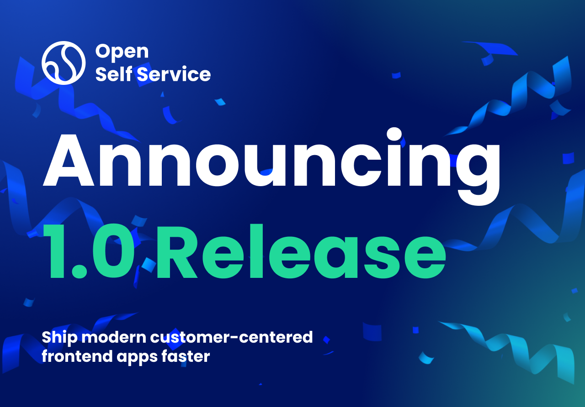
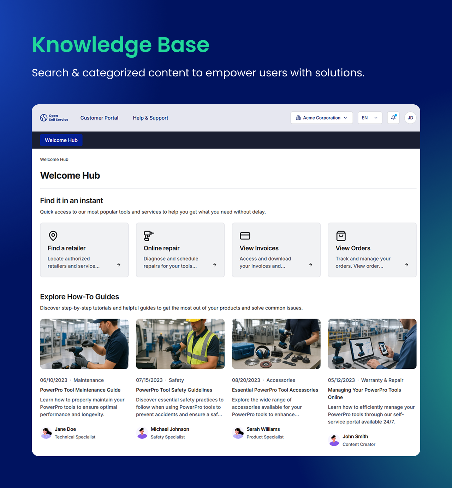
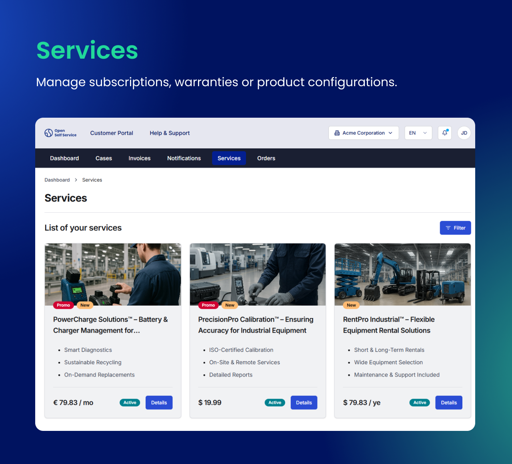
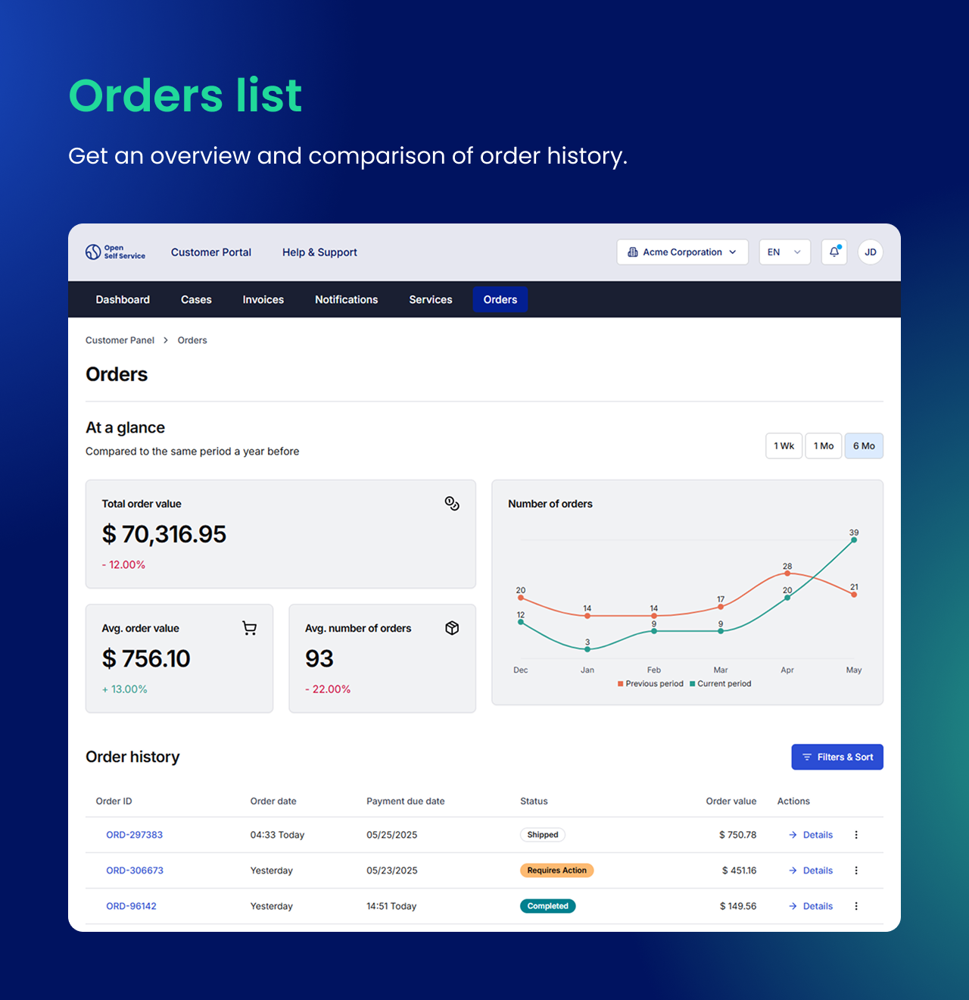
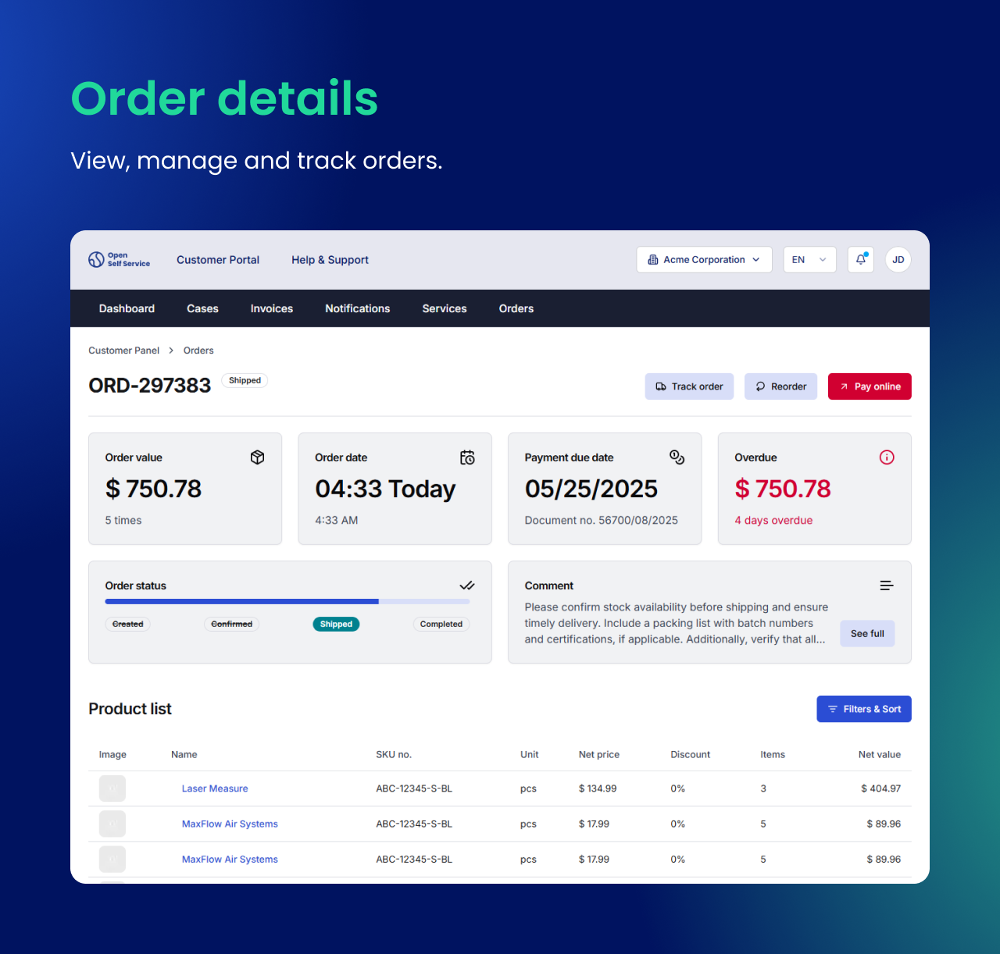
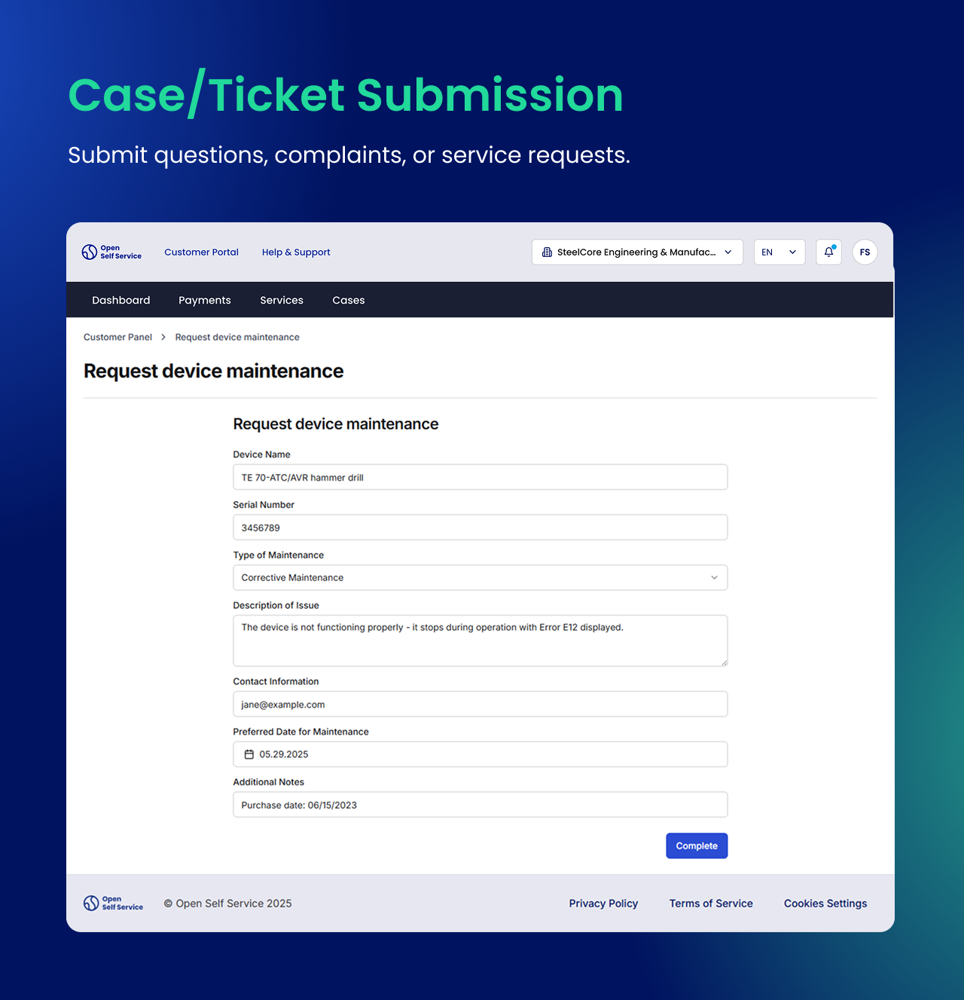
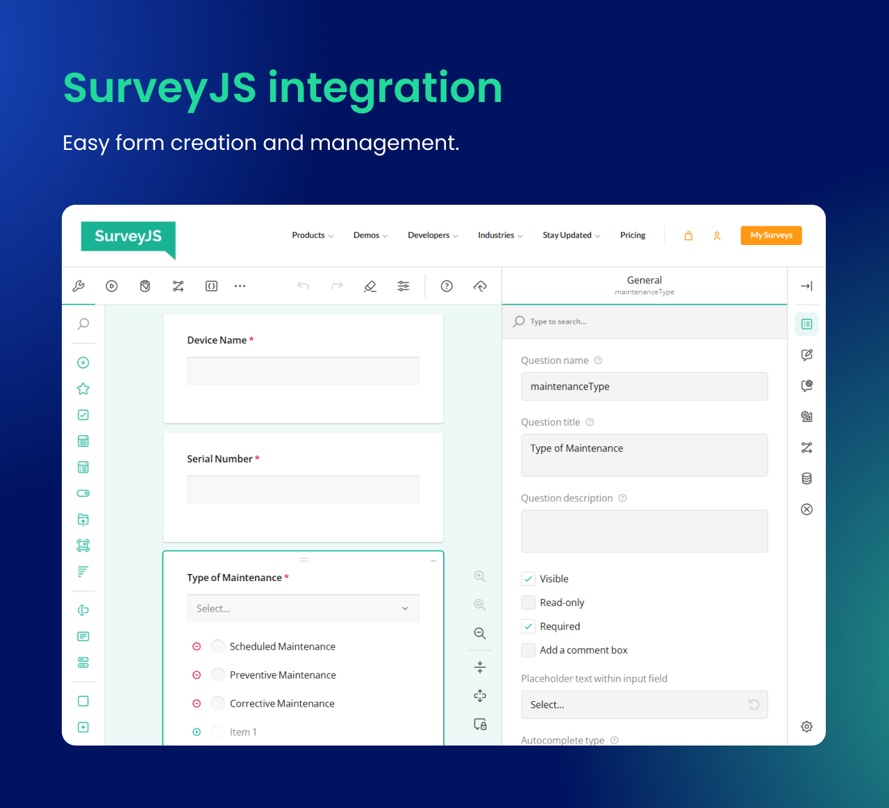
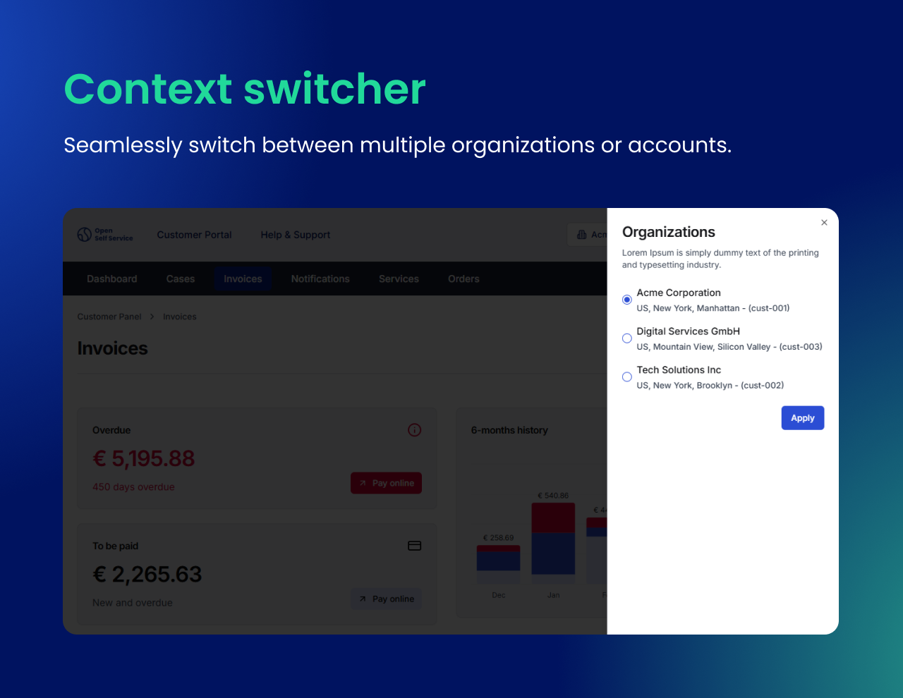

We’re thrilled to officially announce the release of **O2S 1.0**! This marks a major milestone in our journey, and we couldn’t be more excited to share it with our users.

This post provides a summary of all the new features, improvements, and changes that have been added to O2S since its initial release. From UI enhancements and feature updates to integrations and security improvements, we’ve worked hard to ensure O2S delivers the best possible experience. Read on to see what’s new!

<!--truncate-->

## New features

### Knowledge base

Knowledge Base functionality plays a critical role in enabling efficient self-service and delivering useful information to users of customer support portals.

We’ve introduced support for new areas in the app related to knowledge base functionality. This includes:

- Pages with **article-like content** (with author, publish date, and rich text content),
- Blocks that display **categories and article lists**,
- Ability to configure pages that act as hubs for such content, like help or support pages.
- **Search component** where we'll levarage Algolia integration will be added to the page in the upcoming update,
- Full **Strapi integration** for managing knowledge base within the CMS,
- The normalized data model for Services.

### Services management pages

We have added support for a new area in the app, where the user can check and, in the future, enable or disable Services.

This includes:

- **Services listing** page with filtering,
- **Service details** page with more information and additional configuration,
- The normalized data model for Services.

### Customer's orders pages

From now on, users can also see and manage their orders within the O2S.

This area includes:

- The page for **listing customers' orders**,
- Blocks that display a **quick summary** of insightful stats related to previous orders,
- The **order details** page where users can track their order, make a payment, and have an overview of what items are included in that order,
- The normalized data model for Orders and Products.

### Case/Ticket Submission

To support user interactions such as submitting questions, complaints, or service requests, we’ve added form functionality to the app, filling a key feature gap in enabling structured input.

To support this feature, we've integrated [SurveyJS](https://surveyjs.io/) to make form creation and management simple and flexible. Benefits of this approach:

- **JSON-based form definitions**. Forms are defined in JSON, including translations, validation rules & metadata
- **React integration**. Forms are rendered using the [SurveyJS React Form Library](https://www.npmjs.com/package/survey-react-ui), paired with our own UI components.
- **Flexible placement** - forms can be:
    - embedded anywhere in the app
    - triggered directly from the `Cases` page

This implementation greatly simplifies the process of configuring complex (even multistep) forms and decouples it from the frontend and a CMS, and gives a large degree of freedom.

### User's context switcher

We are enhancing the app with a **context switcher** feature that allows users to seamlessly switch between multiple organizations or accounts configured under a single user. This is especially useful in **multi-organization setups**, such as B2B scenarios, where users need to manage data for different entities.

---

## Other changes

### A new look and feel

Our UX/UI team has worked diligently to deliver a **completely redesigned frontend look and feel**. The updated interface introduces a cleaner, more modern, and professional aesthetic to ensure a better overall user experience.

This revamped design not only improves usability but also aligns the overall presentation of the app with modern industry standards, creating a look users will love and feel confident using.

### Bugfixing and security updates

We are constantly ensuring that the app remains stable and secure by implementing regular bugfixes and updating dependencies. These updates are part of our ongoing commitment to maintaining a reliable and up-to-date platform.

---

## Coming soon

### Medusa integration

We are excited to announce that work is underway to integrate **[Medusa](https://medusajs.com/)** into O2S! Medusa, a cutting-edge open-source e-commerce platform, will significantly enhance the functionality and power of the self-service area by seamlessly connecting it with a robust e-commerce system.

This integration will specifically enhance the following areas of **Orders** and **Services** that are already present. It also lays the groundwork for further expansion of the O2S ecosystem with additional Medusa-powered integrations in the future.

Stay tuned for updates as we progress towards delivering this exciting feature

### Knowledge base enhancements

We plan to introduce a **search block** that can be included within the knowledge base, enabling users to easily find articles and resources. This feature will improve usability by allowing quick access to relevant information.

Additionally, we will integrate **Algolia** into the knowledge base to power the search functionality. This integration will provide fast, accurate, and intelligent search capabilities, enhancing the overall user experience.

### Expanded Authentication and User Management

We plan to implement dedicated pages to handle critical authentication functionalities, making the self-service experience seamless and user-friendly:

- A new form-based page for **user registration**, allowing users to create accounts easily while integrating with existing authentication APIs or identity providers.
- A simplified flow for users to initiate **password recovery and reset**.

### Storybook for UI components

We’re excited to announce that we’ll soon deliver comprehensive documentation of UI components using **[Storybook](https://storybook.js.org/)**. It will act as a centralized hub for all UI components, offering interactive previews and a clear overview of their variations, usage, and behavior. Teams will benefit from improved efficiency and consistency by having a single source of truth for all components.

Beyond documentation, Storybook will serve as a developer-friendly environment for creating and testing new components in isolation. This will simplify development workflows while ensuring visual and functional consistency across our platform.

### Strapi content model and sample content

We’re actively working on exporting both the content model and example content from **Strapi**, the first headless CMS we are integrating. This will significantly simplify the process of setting up your own CMS server by providing you with a predefined structure and sample data to kickstart your project.

With this export, you’ll receive a ready-to-use content model that mirrors O2S's structure, ensuring everything is organized and optimized from the start. From there, you can fully customize both the content model and data to suit your specific needs.
