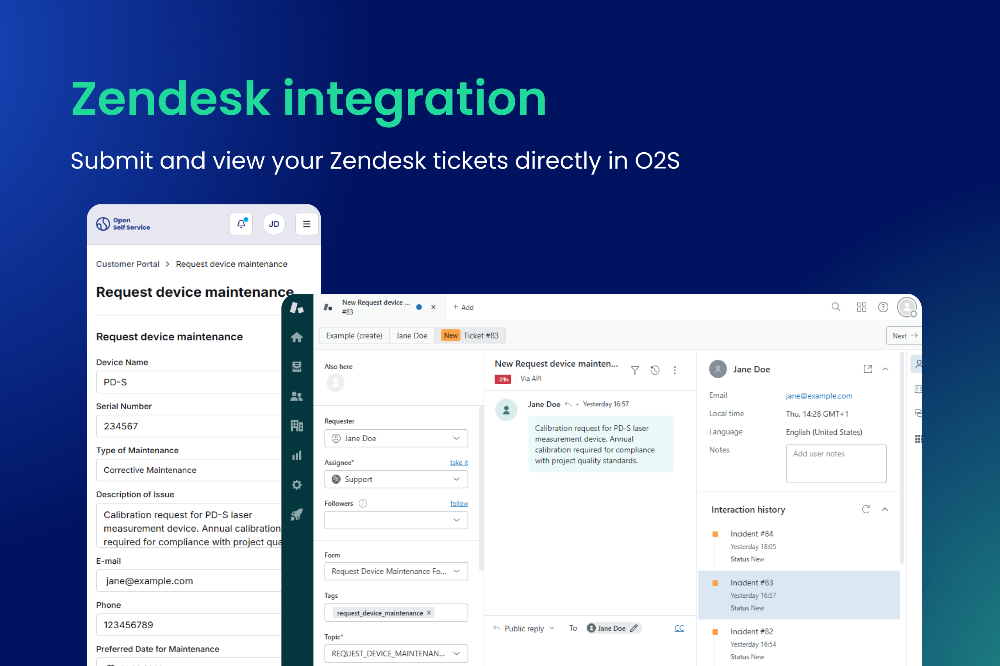

We're excited to announce Release 1.5.0 of Open Self Service! This release delivers a comprehensive **Permission-Based Access Control** system that works alongside role-based access, full **ticket creation in Zendesk** with attachments and custom fields, and also an **improved development workflow** with granular watch commands for Turborepo.

Let's dive into what's new!

<!--truncate-->

## New features

### Permission-Based Access Control

We've introduced a comprehensive Permission-Based Access Control system that works together with an already existing Role-Based Access Control. You now get a full, organization-level access control: roles and permissions are kept at the organization/customer level, so the same user can have different access when switching between organizations.

#### Framework and core

- Enhanced with abstract permission logic with methods (like `hasPermission` or `hasRole`) to check for roles and permissions. Specific integrations can now implement them on their own to provide permissions from your IAM system.
- Global `RolesGuard` and `PermissionsGuard` are now available, so all protected endpoints can enforce roles and permissions consistently.

#### Securing controllers with `@Permissions`

Use the `@Auth.Decorators.Permissions` decorator to protect block and API endpoints by resource and actions:

```typescript
import { Auth } from '@o2s/framework/modules';

@Controller(URL)
export class TicketListController {
    @Get()
    @Auth.Decorators.Permissions({ resource: 'tickets', actions: ['view'] })
    getTicketListBlock(...) {
        ...
    }
}
```

You can combine `@Auth.Decorators.Roles` and `@Auth.Decorators.Permissions` on the same handler when you need both role-based and permission-based checks.

#### Data filtering based on user roles

Mappers (e.g., `page.mapper`, header/footer navigation mappers) can filter UI elements based on user roles. Navigation items and other CMS-driven content can be restricted by role so users only see links and sections they are allowed to access.

:::tip
For organization-level access control, roles vs. permissions, and multi-organization support, see [Authentication overview](../../../docs/overview/authentication) and [API Harmonization authentication](../../../docs/main-components/harmonization-app/authentication).
:::

### Ticket creation in Zendesk integration

The [Zendesk integration](../../../docs/integrations/tickets/zendesk/overview) now supports creating tickets end-to-end, in addition to viewing and listing them.



- You can now create new tickets via the Tickets API. The Zendesk integration implements `createTicket` and forwards requests to the Zendesk API.
    - Attachments are supported when creating tickets.
    - Custom field mapping is handled by the `ZendeskFieldMapper`. Configure environment variables (e.g., `ZENDESK_DEVICE_NAME_FIELD_ID`) and add corresponding entries in your CMS mappers to display custom field labels in the UI.
- Using our [Survey.js form block](../../../docs/integrations/forms/surveyjs/overview), you can submit custom forms to Zendesk. This gives you full control over form layout (single- or multi-step, splitting fields into sections/columns, and more) independently of Zendesk configuration.

### Dev watch task improvement

The development workflow has been improved with **granular watch commands** for Turborepo:

- `watch:deps`: runs `turbo watch build` for all packages except apps. Use this to build and watch dependencies (packages, integrations, blocks) so that changes propagate to apps.
- `watch:apps`: runs `turbo run dev` for apps. Use this to run Next.js and Nest.js dev servers.

You can run `watch:deps` in one terminal and `watch:apps` in another for a more controlled dev setup. This provides better output handling than a single monorepo-wide dev command and aligns with Turborepo’s recommended patterns for large workspaces.

:::tip
Prefer `npm run watch:deps` and `npm run watch:apps` over `npm run dev` when you need fine-grained control over building dependencies versus running app dev servers.
:::

:::info
The `npm run dev` script is now **deprecated** and will be removed in future versions.
:::

## Other changes

### Dependency updates

This release includes notable dependency upgrades:

- **Next.js 16.1.6** across the frontend and relevant packages,
- **React** monorepo updates,
- **Storybook 10.2.1**,
- Other updates across the stack (e.g., recharts, swiper, next-intl) for compatibility and security.

### Documentation improvements

- Authentication and authorization docs now cover the new Permission-Based Access Control, organization-level access control, and when to use roles vs. permissions.
- Zendesk integration docs have been updated for ticket creation, custom fields, and Survey.js-driven forms.
- Various fixes and clarifications across integration and main-component documentation.

### Bugfixing and security updates

As always, we're committed to maintaining a stable and secure platform. This release includes various bug fixes and security updates, including dependency updates with security patches.
