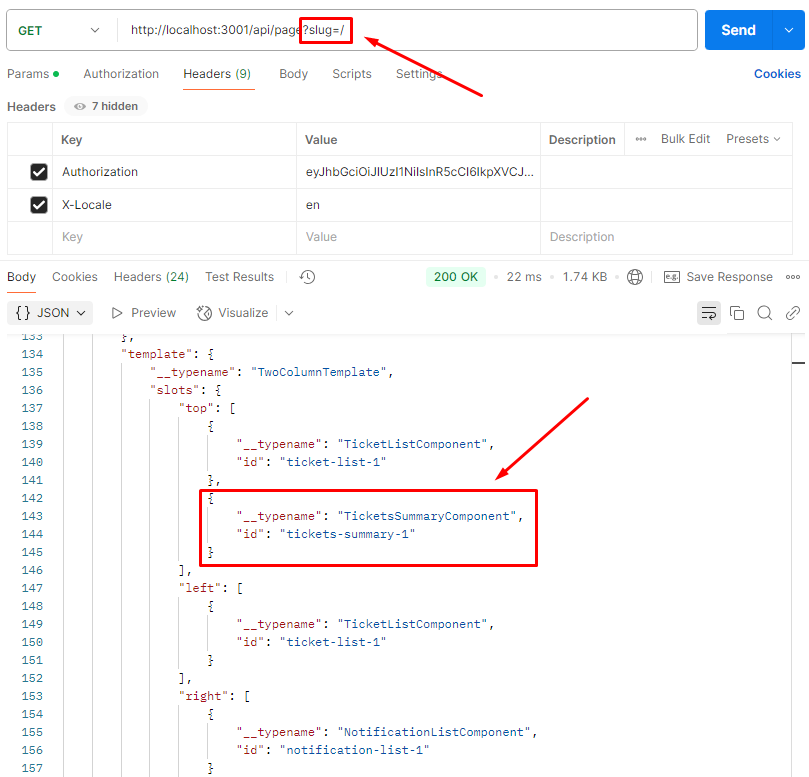

# Extending the CMS integration

Most blocks usually need some kind of static content (like titles or labels) that do not come from any kind of backend APIs. There are actually two ways of fetching that content:

1. Simply fetching it directly in the harmonizing block - which is simpler, but less generic and strongly coupled with the specific data source,
2. Or extending the CMS integration with new models and services (specific to newly created block), which makes it possible to re-use it even after switching the CMS integration to another.

In case of the `TicketSummary` block let's use the second approach and see how we can extend an existing mocked integration.

Customization of existing integrations is done by creating a new, custom integration that will add new features to the one it's extending.

## Generate the integration extension

We can start by using the [integration generator](../using-generators.md#integrations) and choosing the `cms` option when asked which modules should be included. Let's also call this integration `custom-cms`, which will create a new package in the `./packages/integrations/custom-cms` folder.

## Extend the model

Firstly, let's create the `./src/modules/cms/cms.model.ts` file where we will include the new models for our block. While we could add the models there directly, it's usually not the best way as blocks usually require several classes or types, and if, in the future, we decide on adding more blocks, all models will be mixed together.

Instead, let's place our models in the `./src/modules/cms/models/blocks/tickets-summary.model.ts`, which we can re-export inside the `cms.model.ts`:

```typescript
export * as TicketsSummaryBlock from './models/blocks/tickets-summary.model';
```

Now, let's add the normalized block model in the `tickets-summary.model.ts`:

```typescript
import { Models, Tickets } from '@o2s/framework/modules';

export class TicketsSummaryBlock extends Models.Block.Block {
    title!: string;
    labels!: {
        open: string;
        closed: string;
        latest: string;
        today: string;
        yesterday: string;
    };
    // this field stores the mapping of enums values
    // into more user-friendly labels
    // e.g. `IN_PROGRESSS: 'New response'`
    fieldMapping!: Models.Mapping.Mapping<Tickets.Model.Ticket>;
}
```

We also need to re-export the original models from the base module from the framework. Let's open the `./src/modules/cms/cms.model.ts` and, in addition to the models related to the new block, we need to also add all the others:

```typescript
import { CMS } from '@o2s/framework/modules';

export * as TicketsSummaryBlock from './models/block/tickets-summary.model';

export import Page = CMS.Model.Page;
export import LoginPage = CMS.Model.LoginPage;
export import Footer = CMS.Model.Footer;
export import Header = CMS.Model.Header;
export import FaqBlock = CMS.Model.FaqBlock;
export import TicketListBlock = CMS.Model.TicketListBlock;
export import TicketDetailsBlock = CMS.Model.TicketDetailsBlock;
export import NotificationListBlock = CMS.Model.NotificationListBlock;
export import NotificationDetailsBlock = CMS.Model.NotificationDetailsBlock;
export import InvoiceListBlock = CMS.Model.InvoiceListBlock;
export import PaymentsSummaryBlock = CMS.Model.PaymentsSummaryBlock;
export import PaymentsHistoryBlock = CMS.Model.PaymentsHistoryBlock;
export import ArticleListBlock = CMS.Model.ArticleListBlock;
export import ArticleDetailsBlock = CMS.Model.ArticleDetailsBlock;
```

:::info
We realize that having to explicitly re-export every model might be very cumbersome, especially for more complex modules like the CMS. We plan to improve this behaviour to make it more developer-friendly.
:::

The last step is to edit the main entrypoint of this package `./src/modules/cms/index.ts` and export the necessary service, model and request:

```typescript
import { CMS } from '@o2s/framework/modules';

export { CmsService as Service } from './cms.service';

export import Request = CMS.Request;

export * as Model from './cms.model';
```

## Add method to service

The auto-generated service assumes we want to implement it from scratch - but in our case, we want to extend another one. Let's firstly install that integrations as a dependency:

```shell
npm install @o2s/integrations.mocked --workspace=@o2s/integrations.custom-cms
```

Now we can edit the `cms.service.ts` file

```typescript
import { TicketsSummaryBlock } from './cms.model'

// let's mock the response
// notice that it's format is not exactly like the normalized one
const MOCK = {
    id: 'tickets-summary-1',
    title: 'Summary of your tickets',
    open: 'Open tickets',
    closed: 'Closed tickets',
    latest: 'Your latest ticket',
    today: 'Today',
    yesterday: 'Yesterday',
    fieldMapping: [
        {
            name: 'topic',
            values: [
                { key: 'TOPIC_1', value: 'Topic 1' },
                { key: 'TOPIC_2', value: 'Topic 2' }
            ]
        },
        {
            name: 'type',
            values: [
                { key: 'TYPE_1', value: 'Type 1' },
                { key: 'TYPE_2', value: 'Type 2' }
            ]
        },
        {
            name: 'status',
            values: [
                { key: 'OPEN', value: 'Under consideration' },
                { key: 'CLOSED', value: 'Resolved' },
                { key: 'IN_PROGRESS', value: 'New response' }
            ]
        },
    ],
};

@Injectable()
export class CmsService extends Integration.CMS.Service {
    getTicketsSummaryBlock(): Observable<TicketsSummaryBlock.TicketsSummaryBlock> {
        // implement your own data fetching method
        // it can be anything, http/graphql request, database connection, or read from disk
        const response = Promise.resolve(MOCK);

        return from(response).pipe(map((data) => mapTicketSummaryBlock(data)));
    }
}
```

## Normalize the response

We still need to normalize the response. To do that, let's create the `./mappers/mapTicketsSummary.ts` file:

```typescript
import { Models } from '@o2s/framework/modules';

import { TicketsSummaryBlock } from '../cms.model';
// this is temporary, ideally the typings
// should be taken from a "real" source
// like auto-generated types from e.g. OpenApi definition
import { MOCK } from '../cms.service';

export const mapTicketSummaryBlock = (data: typeof MOCK): TicketsSummaryBlock.TicketsSummaryBlock => {
    // in this case the mapping is quite simple,
    // but depending in the API it can also be more complex
    return {
        id: data.id,
        title: data.title,
        labels: {
            open: data.open,
            closed: data.closed,
            latest: data.latest,
            today: data.today,
            yesterday: data.yesterday,
        },
        // we need to transform the data that was in array format
        // into an object format
        fieldMapping: mapFields(data.fieldMapping),
    };
};

const mapFields = <T>(data: (typeof MOCK)['fieldMapping']): TicketsSummaryBlock.TicketsSummaryBlock['fieldMapping'] => {
    return data.reduce(
        (acc, field) => ({
            ...acc,
            [field.name]: field.values.reduce(
                (acc, item) => ({
                    ...acc,
                    [item.key]: item.value,
                }),
                {} as { [key: string]: string },
            ),
        }),
        {} as Models.Mapping.Mapping<T>,
    );
};
```

## Adding a new block to a page

One more thing that will be required to actually see the block on the frontend, is to add it to some page. Let's open the `cms.service.ts` file again, and override the `getPage` method:

```typescript
getPage(options: CMS.Request.GetCmsPageParams) {
    // we can use the original method to fetch page data
    return super.getPage(options).pipe(
        map((data) => {
            // let's add the new block to the page at `/` slug (e.g. the dashboard page)
            if (data?.slug === '/') {
                // deep clone of the original object
                const newData = JSON.parse(JSON.stringify(data)) as typeof data;
                switch (newData.template.__typename) {
                    // we need to check the page template
                    // to decide which slot to use
                    case 'TwoColumnTemplate':
                        // we add the block to a slot, and
                        // block definition consists of just its ID and a name
                        newData.template.slots.top.push({
                            __typename: 'TicketsSummaryBlock',
                            id: 'tickets-summary-1',
                        });
                        return newData;
                }
            }
            return data;
        }),
    );
}
```

## Switch the integration

Finally, the last thing is to switch the CMS integration in the API Harmonization server. Firstly, let's install it:

```shell
npm install @o2s/integrations.custom-cms --workspace=@o2s/api-harmonization
```

Now we can replace the package within the `apps/api-harmonization/src/models/cms.ts` file:

```typescript
import { Config, Integration } from '@o2s/integrations.mocked/integration';
```

with

```typescript
import { Config, Integration } from '@o2s/integrations.custom-cms/integration';
```

### Testing the API

Once the model, service and mapper are ready, we should make sure that it actually works. To do that let's query the API Harmonization server for this block:

- the localhost port is defined by the `PORT` env variable (default `3001`),
- there is an optional prefix that is added, defined by the `API_PREFIX` env variable (default `/api`),
- finally, the path of the block is declared in the `./index.ts` file (default `'/blocks/tickets-summary'`),

which gives a final URL of `http://localhost:3001/api/page?slug=/`.

There are also some mandatory headers that we need to add:

- `Authorization` in the format of bearer token (e.g. `Bearer eyJhbG...`),
- `X-Locale` in the format of IETF language tag (e.g. `en`).

For the sake of convenience, let's use Postman for this:


