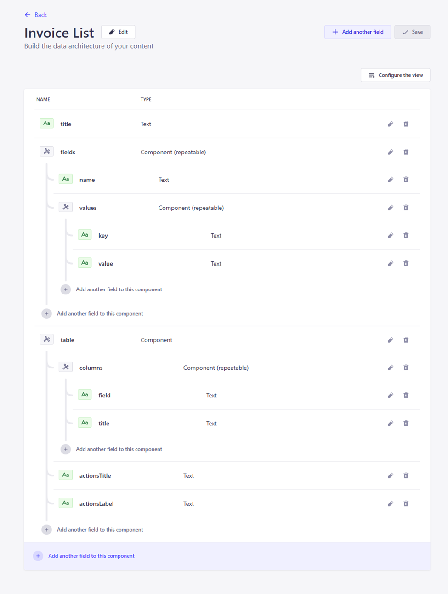

# Content model

The Strapi content model for O2S is based on three main types:

- **Page** that represents any route within the frontend app; we do not model specific pages within the CMS, and instead allow editors to compose the pages they need out of generic types,
- **Template** that defines the layout of the page and can include simple one- or two-column layouts or more complex ones, and allows the editors to decide where each component should be rendered,
- **Block** that represents some (smaller or larger) piece of UI that can be placed anywhere in the page layout by the editors.

### Pages

A model for the page is the most important one, as it defines:

- the slug for the page, which is matched against the URL in the browser, and which is a simple localized text field (which means that the page can have different slugs in each language),
- the template for the page that stores the components’ definitions for that page, and which is a dynamic zone where any of the available templates can be picked.


### Templates

The content type for the templates is quite basic – it is based on a simple system of slots that define some predefined location within the frontend app. The available templates are highly configurable and tailored to UI needs. For simpler pages, a basic two-column layout can be sufficient, consisting of:

- a top slot (that can store e.g. some promotional banners or messages),
- left and right slots for the main content,
- and a bottom slot for some additional content (like FAQs or contact information).


Each slot is a relation field to a Component content type, where multiple instances can be placed (so, in other words, a single slot can accept multiple components):


### Blocks

Before we started modeling the content, we established a few additional requirements that would allow the content editors to work efficiently.

One of those was to have the possibility to reuse the same components on different pages, without having to maintain duplicates. Having to keep track of, for example, the same generic FAQ for the app that appears on most pages,
without having a single instance of it, would be a nightmare – especially as the app grows and expands.

To solve this issue, we’ve introduced a Block type that represents a single instance of some piece of content. It consists of:

- a name mostly for internal use by the editors to identify each instance, e.g. “FAQ about the tickets” and “FAQ about the invoices”,
- content that’s a dynamic zone into which any of the components can be placed.


For example, the FAQ component (that uses Strapi’s component type) consists of several text fields, that represent a UI component with title, subtitle, and an accordion with answers to common questions:


While the FAQ component is quite simple and on the frontend renders only the static content from the CMS, it doesn’t mean that only such components can be defined within Strapi.
Another component example is the Invoice List, which on the frontend renders a table with the user’s invoices:



This one is a bit more complex - aside from the title, it also handles:

- fields that use a generic component that allowed us to map fields in the API data model to more user-friendly labels, e.g.:

  

  where the keys exactly match the union types in the Invoice model:

    ```typescript
    export class Invoice {
        id!: string;
        type!: 'PAYMENT_COMPLETE' | 'PAYMENT_DUE' | 'PAYMENT_PAST_DUE';
        paymentStatus!: 'STANDARD' | 'PROFORMA' | 'CREDIT_NOTE' | 'DEBIT_NOTE';
        ...
    }
    ```

- a table that defines which columns should be displayed on the frontend for the invoice table:

  
