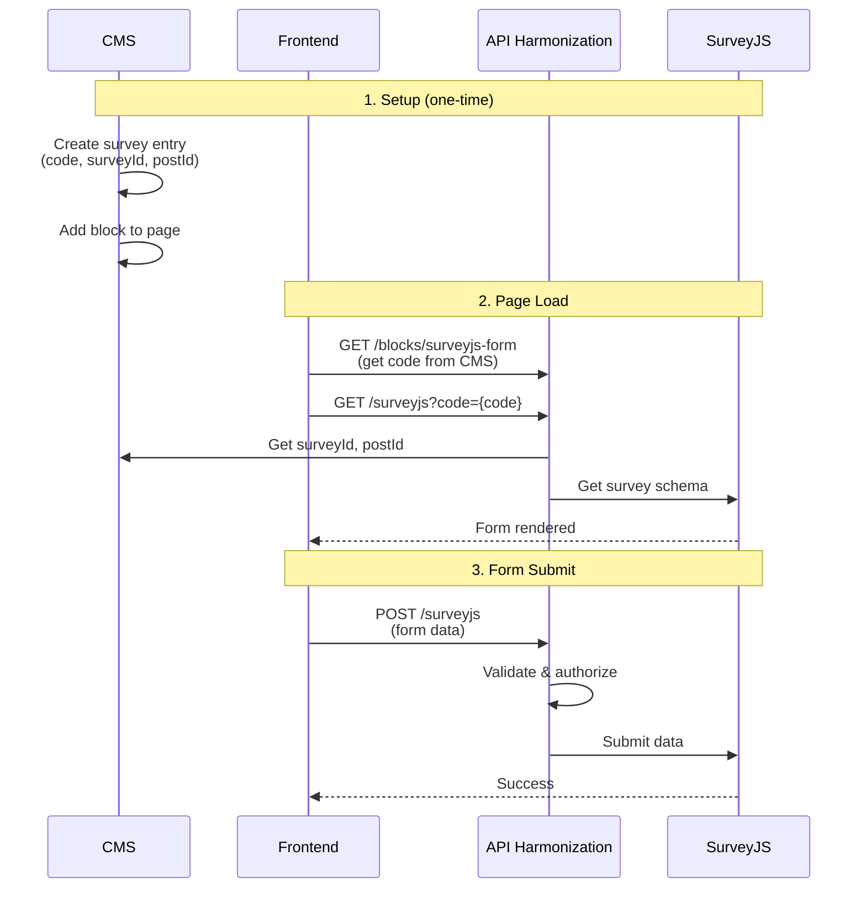

# Usage

## Typical workflow

The most common way to use SurveyJS in O2S is through the CMS block system:

1. **Configure in CMS** - Add a SurveyJS block to your CMS page with a survey code
2. **Register module** - Ensure the SurveyJS module is registered in API Harmonization
3. **Done** - The form is automatically rendered and submissions are handled automatically

No additional frontend code is required!

## Using the CMS block (recommended)

### Step 1: Register modules in API Harmonization

Register both the SurveyJS module and the surveyjs-form block in your `app.module.ts`:

```typescript
import * as SurveyJs from '@o2s/modules.surveyjs/api-harmonization';
import * as SurveyJsForm from '@o2s/blocks.surveyjs-form/api-harmonization';
import { AppConfig } from './app.config';

@Module({
  imports: [
    // ... other modules
    SurveyJs.Module.register(AppConfig),
    SurveyJsForm.Module.register(AppConfig),
  ],
})
export class AppModule {}
```

### Step 2: Create survey entry in CMS

First, create a survey entry in your CMS (e.g., Strapi) with the following required fields:

- **code** - Unique identifier (e.g., `"contact-form"`)
- **surveyId** - SurveyJS survey ID from your SurveyJS service
- **postId** - SurveyJS post ID for submissions
- **surveyType** - Type of survey (typically `"survey"`)
- **submitDestination** - Array of destinations (e.g., `["surveyjs"]`)
- **requiredRoles** - Array of required roles (can be empty `[]` for public surveys)

### Step 3: Add block to page in CMS

In your CMS (e.g., Strapi):

1. Create or edit a page
2. Add a `SurveyJsBlock` component
3. Configure the `code` field with your survey code (must match the code from Step 2)
4. Optionally add a `title` field

### Step 4: That's it!

The block automatically handles everything:
- Fetches survey metadata from CMS
- Loads the survey schema from SurveyJS service
- Renders the form with proper styling
- Handles form submission
- Displays error messages
- Supports localization

No frontend code changes are needed - the form will be automatically rendered on the page.

## Direct component usage (advanced)

If you need to use the survey component directly without the CMS block system:

```typescript
import { Survey } from '@o2s/modules.surveyjs/frontend';
import { useGlobalContext } from '@o2s/ui/providers/GlobalProvider';
import { useLocale } from 'next-intl';

function ContactForm() {
  const { labels } = useGlobalContext();
  const locale = useLocale();

  return (
    <Survey
      code="contact-form"
      labels={labels}
      locale={locale}
      accessToken="optional-access-token"
    />
  );
}
```

### Component props

- **code** (string, required) - The survey code identifier
- **labels** (object, required) - Error message labels from global context
- **locale** (string, required) - Language/locale (e.g., "en", "de")
- **accessToken** (string, optional) - Authentication token if required

The component internally uses the SDK to:
- Fetch the survey schema from `/surveyjs?code=<code>` (where `<code>` is the survey code)
- Submit form data to `/surveyjs` POST endpoint

## API Harmonization (for custom integrations)

If you need to use the service directly in your backend code:

```typescript
import { Injectable } from '@nestjs/common';
import { SurveyjsService } from '@o2s/modules.surveyjs/api-harmonization';

@Injectable()
export class MyService {
  constructor(private readonly surveyjsService: SurveyjsService) {}

  async getSurvey(surveyCode: string) {
    return this.surveyjsService
      .getSurvey({ code: surveyCode })
      .toPromise();
  }

  async submitSurvey(surveyCode: string, payload: Record<string, unknown>, token?: string) {
    return this.surveyjsService
      .submitSurvey(
        { code: surveyCode, surveyPayload: payload },
        token,
      )
      .toPromise();
  }
}
```

### API Endpoints

The module provides these HTTP endpoints (used internally by components):

- **GET /surveyjs?code=\<code\>** - Retrieves survey schema (where `<code>` is the survey code)
- **POST /surveyjs** - Submits survey data

These endpoints are typically called automatically by the frontend components - you rarely need to call them directly.

## Type definitions

For TypeScript development, here are the main types:

### SurveyJs

```typescript
class SurveyJs {
  schema: SurveyJSLibraryJsonSchema;
}
```

### SurveyJsQuery

```typescript
class SurveyJsQuery {
  code: string;
}
```

### SurveyJsSubmitPayload

```typescript
class SurveyJsSubmitPayload {
  code: string;
  surveyPayload: SurveyResult;
}
```

### SurveyResult

```typescript
class SurveyResult {
  [question: string]: unknown;
}
```

The `SurveyResult` is a key-value object where keys are question names and values are the answers.

### SurveyJSLibraryJsonSchema

The `SurveyJSLibraryJsonSchema` is a comprehensive type definition that includes all SurveyJS schema properties. See the [SurveyJS documentation](https://surveyjs.io/Documentation/Library) for details.

## Best practices

1. **Use CMS blocks**: For most use cases, use the CMS block system - it's the simplest and most maintainable approach
2. **CMS configuration**: Store survey codes in CMS rather than hardcoding them
3. **Error handling**: Components handle errors automatically via toast notifications
4. **Localization**: Locale is automatically handled when using CMS blocks
5. **Role-based access**: Configure `requiredRoles` in CMS for surveys that need authorization
6. **Validation**: Server-side validation is performed automatically - no additional code needed

## Data flow

The complete data flow from CMS configuration to form submission:



