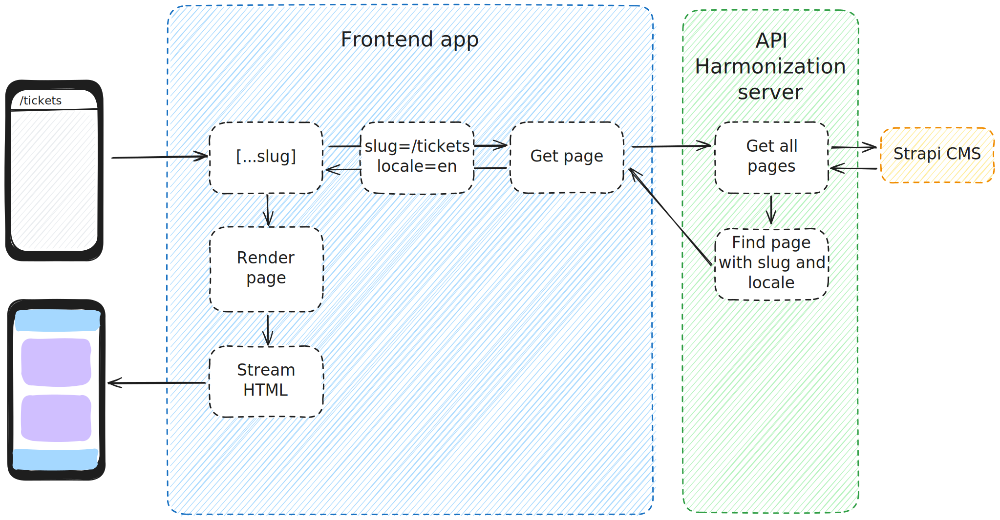

# Routing

O2S uses the [Next.js App router](https://nextjs.org/docs/app) and utilizes Server Components and streaming to provide both a good user experience while navigating between pages, and a high degree of configurability when it comes to define routes.

## Router essentials

### Segments

The most important aspect of the frontend app is that there are no pre-defined pages (with a few exceptions). Every route is [a dynamic one](https://nextjs.org/docs/app/building-your-application/routing/dynamic-routes) which means that there is only one [catch all segment](https://nextjs.org/docs/app/building-your-application/routing/dynamic-routes#optional-catch-all-segments)

```
[locale]/[[...slug]]/page.tsx
```

that handles every route.

This translates to URLs that look like

```
/en
/en/cases
/en/cases/12345
```

where the first segment always designates the current locale, and all the following segments can be anything you want.

:::tip
Check the [Internationalization chapter](./internationalization.md) to find out how localization is handled.
:::

This allows for a near-total control over what is rendered under any route - you can easily define the routes' configuration e.g. in a CMS without having to modify the frontend app at all (e.g. when you want to add a new page or modify content on an existing one).

### Data fetching

The routing flow looks like this:



This is handled using the `[locale]/[[...slug]]/page.tsx` segment where:

1. We retrieve dynamic route parameters:
    - `locale` which designates which language should the page be displayed in (e.g. `en`),
    - `slug` which is used to define which page should be rendered (e.g. `/cases/12345`).
2. Based on those, an API request is made for the current page,
    - the response includes which template should be used for rendering.
3. If a page was found, the actual rendering is the delegated to a dedicated component.

Simplified, this process looks like this:

```typescript jsx
export default async function Page({ params }: Props) {
    const { locale, slug } = await params;

    const { data } = await sdk.modules.getPage({ slug, locale });

    if (!data) {
        return notFound();
    }

    return <PageTemplate slug={slug} data={data} />;
}
```

:::tip
Check the [Component structure chapter](./component-structure.md) to learn more about rendering dynamic content.
:::

Therefore, adding a new page to the frontend app only requires to add a new page in the data source (like the CMS) that will be then mapped to the `slug` param for the current locale.

For example, in the Strapi CMS this mapping can look like this:

where you may notice that some slugs contain Regex - this is to allow "dynamic" pages (like case details `/cases/12345`) to still be represented as a single page with the CMS. The resolution of a slug to the page is in this case handled within the [Strapi CMS integration](../../integrations/cms/strapi/overview.md).

### Authentication

There is currently one exception to the above statement about there not being any pre-defined routes - the login page.

The sign-in and sign-up processes are often handled in a very custom way (depending on which IAM provider you use), so we have decided to make this area bit dynamic when it comes to rendering, instead allowing for more customization with the code itself.

To achieve that, we utilize [Next.js Route Groups](https://nextjs.org/docs/app/building-your-application/routing/route-groups) to separate the `auth` segment:

```
[locale]/(auth)/login/page.tsx
```

which allows for:

- more control over the layout for the auth pages, as this group has its own `layout.tsx` file,
- easier integration with [Auth.js](https://authjs.dev/),
- and more customization options in general when it comes to rendering and using Next.js features (e.g. like [Server Actions](https://nextjs.org/docs/app/building-your-application/data-fetching/server-actions-and-mutations))

while still allowing to fetch page content dynamically from the API using a dedicated SDK method:

```typescript jsx
export default async function LoginPage({ params }: Readonly<Props>) {
    const { locale, callbackUrl } = await params;

    const { data } = await sdk.modules.getLoginPage({ locale, });

    return (
        <AuthLayout>
            <SignInForm data={data} />
        </AuthLayout>
    )
}
```

:::tip

- Check the [Authentication chapter](./authentication.md) for more information about the authentication flow within the application
- Check the [Internationalization chapter](./internationalization.md) to find out how to translate auth pages slug to different languages
  :::

## Navigation

When it comes to navigation between pages, the Next.js mechanisms for [Link component](https://nextjs.org/docs/app/api-reference/components/link) and [useRouter hook](https://nextjs.org/docs/pages/api-reference/functions/use-router) are used.

```typescript jsx title="using Link component to navigate to another page in the same locale"
import { Link } from '@/i18n';

...

<NextLink href={url}>
    {linkLabel}
</NextLink>
```

```typescript jsx title="using router.push method to navigate to the same page in a different locale"
import { usePathname, useRouter } from '@/i18n';

...

const router = useRouter();
const pathname = usePathname();
const currentLocale = useLocale();

...

router.push({ pathname }, { locale });
```

:::tip
Check the [Internationalization chapter](./internationalization.md) to for more information about how routing integrates with different locales.
:::
