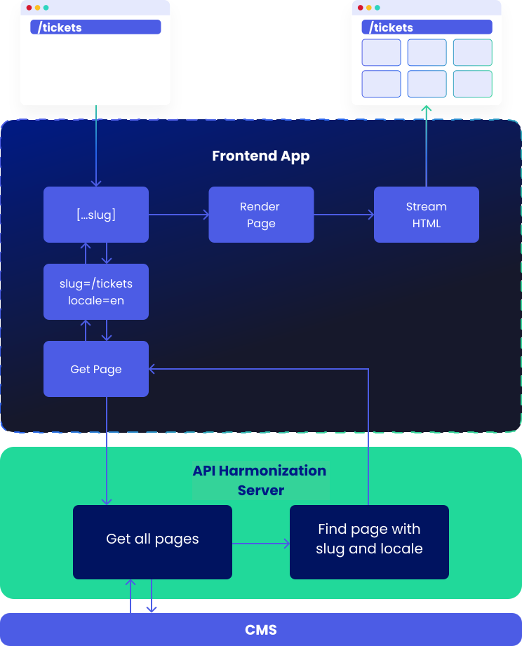
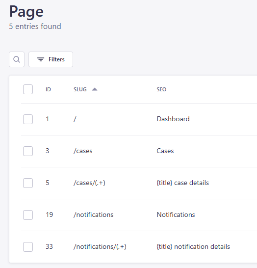

# Routing

O2S uses the [Next.js App router](https://nextjs.org/docs/app) and utilizes Server Components and streaming to provide both a good user experience while navigating between pages, and a high degree of configurability when it comes to define routes.

## Router essentials

### Segments

The most important aspect of the frontend app is that there are no pre-defined pages (with a few exceptions). Every route is [a dynamic one](https://nextjs.org/docs/app/building-your-application/routing/dynamic-routes) which means that there is only one [catch all segment](https://nextjs.org/docs/app/building-your-application/routing/dynamic-routes#optional-catch-all-segments)

```
[locale]/[[...slug]]/page.tsx
```

that handles every route.

This translates to URLs that look like

```
/en
/en/cases
/en/cases/12345
```

where the first segment always designates the current locale, and all the following segments can be anything you want.

:::tip
Check the [Internationalization chapter](./internationalization.md) to find out how localization is handled.
:::

This allows for a near-total control over what is rendered under any route - you can easily define the routes' configuration e.g. in a CMS without having to modify the frontend app at all (e.g. when you want to add a new page or modify content on an existing one).

### Data fetching

The routing flow looks like this:



This is handled using the `[locale]/[[...slug]]/page.tsx` segment where:

1. We retrieve dynamic route parameters:
    - `locale` which designates which language should the page be displayed in (e.g. `en`),
    - `slug` which is used to define which page should be rendered (e.g. `/cases/12345`).
2. Based on those, an API request is made for the current page,
    - the response includes which template should be used for rendering.
3. If a page was found, the actual rendering is the delegated to a dedicated component.

Simplified, this process looks like this:

```typescript jsx
export default async function Page({ params }: Props) {
    const { locale, slug } = await params;

    const { data } = await sdk.modules.getPage({ slug, locale });

    if (!data) {
        return notFound();
    }

    return <PageTemplate slug={slug} data={data} />;
}
```

:::tip
Check the [Component structure chapter](./component-structure.md) to learn more about rendering dynamic content.
:::

Therefore, adding a new page to the frontend app only requires to add a new page in the data source (like the CMS) that will be then mapped to the `slug` param for the current locale.

For example, in the Strapi CMS this mapping can look like this:

where you may notice that some slugs contain Regex - this is to allow "dynamic" pages (like case details `/cases/12345`) to still be represented as a single page with the CMS. The resolution of a slug to the page is in this case handled within the [Strapi CMS integration](../../integrations/cms/strapi/overview.md).

### Authentication

There is currently one exception to the above statement about there not being any pre-defined routes - the login page.

The sign-in and sign-up processes are often handled in a very custom way (depending on which IAM provider you use), so we have decided to make this area bit dynamic when it comes to rendering, instead allowing for more customization with the code itself.

To achieve that, we utilize [Next.js Route Groups](https://nextjs.org/docs/app/building-your-application/routing/route-groups) to separate the `auth` segment:

```
[locale]/(auth)/login/page.tsx
```

which allows for:

- more control over the layout for the auth pages, as this group has its own `layout.tsx` file,
- easier integration with [Auth.js](https://authjs.dev/),
- and more customization options in general when it comes to rendering and using Next.js features (e.g. like [Server Actions](https://nextjs.org/docs/app/building-your-application/data-fetching/server-actions-and-mutations))

while still allowing to fetch page content dynamically from the API using a dedicated SDK method:

```typescript jsx
export default async function LoginPage({ params }: Readonly<Props>) {
    const { locale, callbackUrl } = await params;

    const { data } = await sdk.modules.getLoginPage({ locale, });

    return (
        <AuthLayout>
            <SignInForm data={data} />
        </AuthLayout>
    )
}
```

:::tip

- Check the [Authentication chapter](./authentication.md) for more information about the authentication flow within the application
- Check the [Internationalization chapter](./internationalization.md) to find out how to translate auth pages slug to different languages
  :::

## Navigation

When it comes to navigation between pages, the Next.js mechanisms for [Link component](https://nextjs.org/docs/app/api-reference/components/link) and [useRouter hook](https://nextjs.org/docs/pages/api-reference/functions/use-router) are used.

```typescript jsx title="using Link component to navigate to another page in the same locale"
import { Link } from '@/i18n';

...

<NextLink href={url}>
    {linkLabel}
</NextLink>
```

```typescript jsx title="using router.push method to navigate to the same page in a different locale"
import { usePathname, useRouter } from '@/i18n';

...

const router = useRouter();
const pathname = usePathname();
const currentLocale = useLocale();

...

router.push({ pathname }, { locale });
```

:::tip
Check the [Internationalization chapter](./internationalization.md) to for more information about how routing integrates with different locales.
:::

## Query params and list filters

List blocks keep their filter state in the URL, so a filtered view can be shared, bookmarked and
linked to. The URL is handled at both ends of the render, and the two ends do different things:

- the first response is rendered on the server from the params in the request, so a filtered link
  returns the filtered list (see [Server rendering](#server-rendering-and-seo) below);
- every later change is handled entirely on the client: the block fetches its own data through the
  SDK and the `useUrlFilters` hook in `@o2s/ui` writes the new query string into the address bar with
  the History API, so the address bar keeps up with the filters live and nothing is re-rendered on the
  server for a filter click.

The hook reads the query string once, when the block mounts, and is the only writer afterwards. That is
why a block is keyed on the params it was rendered for (`searchParamsKey`): arriving at a _different_
filtered URL (a facet link, browser history, a link from elsewhere in the app) has to rebuild it from
the server data for those params instead of leaving the client on the result set it mounted with.

Two param conventions exist, and a block picks one:

```text
?ticket_status=OPEN&ticket_page=2   // namespaced: several list blocks can share a page
?category=TOOLS&page=2              // plain: linkable and indexable, one such list per page
```

A namespaced block passes `namespace`, a plain one passes `filterKeys` instead (the CMS-driven filter
ids), because without a prefix that list is the only way to tell the block's params from anything else
already in the query string. In both cases pagination is a 1-based `page`, the view mode is `view`, and
only values differing from the block defaults are written, so URLs stay short.

### Browser history

Filter changes are written with `replaceState`, so they do not add history entries: pressing Back
after narrowing a list leaves the list instead of undoing the last filter. Going Forward again returns
to the filtered URL, which the server then renders filtered.

Links do add entries, and that includes the facet links the product list renders. Moving Back and
Forward across them works as a visitor expects: each entry is a real URL, the server renders the list
for it, and the block is rebuilt from that response.

Undo-per-filter in history is deliberately not offered: a list where every toggle stacks a history
entry makes Back unusable for leaving the page.

### Server rendering and SEO

Filter params reach the page as `searchParams` and are passed down to the blocks through
`renderBlocks`. A block that opts in resolves them into its own query before fetching, so the first
response already carries the filtered list: the product, ticket, order, invoice and notification lists
all do. Anyone opening a shared link, a crawler included, gets the filtered page straight away, and
the block no longer has to refetch on mount to correct what was rendered.

Pagination is the one param a block cannot resolve on its own: `page` is passed to the API, which turns
it into an `offset` using the page size from the CMS block config. Only the API knows that number.

Because filtering can produce endless near-duplicate URLs, `generateSeo` decides what may be indexed:

| URL                                        | Canonical                  | Robots            |
| ------------------------------------------ | -------------------------- | ----------------- |
| `/products`                                | `/products`                | `index, follow`   |
| `/products?category=TOOLS`                 | `/products?category=TOOLS` | `index, follow`   |
| `/products?category=TOOLS&utm_source=mail` | `/products?category=TOOLS` | `index, follow`   |
| `/products?category=TOOLS&page=3`          | `/products?category=TOOLS` | `noindex, follow` |
| `/products?sort=price_asc`                 | `/products`                | `noindex, follow` |
| `/products?category=TOOLS&category=CLOUD`  | `/products`                | `noindex, follow` |
| `/cases` (any page gated by roles)         | `/cases`                   | `noindex, follow` |

Two lists in `@o2s/utils.frontend` drive this, and the product list block renders its facet links from
the same ones, so the links and the canonical URLs cannot drift apart:

- `Utils.Seo.INDEXABLE_FILTERS`: one value of one of these still describes a page worth indexing;
- `Utils.Seo.LISTING_PARAMS`: these change what the list shows without deserving an entry of their
  own, so they canonicalise back to the facet and are kept out of the index.

Anything else a link carries (`utm_*`, `gclid`, a tab) is ignored by both decisions. A campaign link
to a category therefore keeps its canonical and stays indexable, which is why the decision keys off an
allowlist rather than off "the query string is not empty".

Pages behind a login are never indexable, whatever their CMS entry says: the API sets `noIndex` for any
page that declares `roles`, since only it knows the gate exists. An anonymous request to such a page is
redirected to sign-in anyway, so this is the second lock rather than the first.

Facet values are rendered as real links by the list block, since a crawler follows `<a href>` but never
operates a select.
