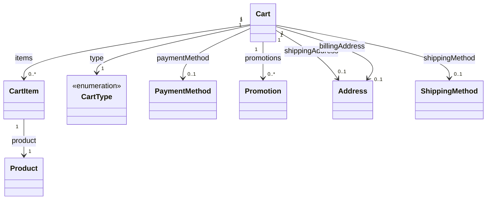

# Carts

The carts model represents shopping cart data, including line items, addresses, shipping methods, promotions, and payment methods. It enables cart management for e-commerce checkout flows, supporting both guest and authenticated users.

## Cart Service

The `CartService` provides methods to interact with cart data.

### getCart

Retrieves a specific cart by ID.

```typescript
getCart(
    params: GetCartParams,
    authorization?: string
): Observable<Carts.Model.Cart | undefined>
```

#### Parameters

| Parameter     | Type          | Description                       |
| ------------- | ------------- | --------------------------------- |
| params        | GetCartParams | Parameters containing the cart ID |
| authorization | string        | Optional authorization header     |

#### Returns

An Observable that emits the requested cart or undefined if not found.

### getCartList

Retrieves a paginated list of carts with optional filtering (authenticated users).

```typescript
getCartList(
    query: GetCartListQuery,
    authorization?: string
): Observable<Carts.Model.Carts>
```

#### Query Parameters

| Parameter  | Type     | Description                       |
| ---------- | -------- | --------------------------------- |
| customerId | string   | Filter by customer ID             |
| type       | CartType | Filter by cart type               |
| offset     | number   | Number of items to skip           |
| limit      | number   | Maximum number of items to return |
| sort       | string   | Sorting criteria                  |

### createCart

Creates a new cart.

```typescript
createCart(
    data: CreateCartBody,
    authorization?: string
): Observable<Carts.Model.Cart>
```

#### Body Parameters

| Parameter  | Type     | Description                                    |
| ---------- | -------- | ---------------------------------------------- |
| currency   | Currency | Cart currency (required)                       |
| regionId   | string   | Region ID for pricing/shipping (optional)      |
| customerId | string   | Customer ID for authenticated users (optional) |
| type       | CartType | Cart type (default: ACTIVE)                    |
| metadata   | object   | Custom metadata (optional)                     |

### addCartItem

Adds an item to a cart. If no cartId is provided, finds active cart or creates a new one.

```typescript
addCartItem(
    data: AddCartItemBody,
    authorization?: string
): Observable<Carts.Model.Cart>
```

#### Body Parameters

| Parameter | Type     | Description                                        |
| --------- | -------- | -------------------------------------------------- |
| cartId    | string   | Existing cart ID (optional)                        |
| productId | string   | Product ID (required)                              |
| variantId | string   | Variant ID (required by some backends e.g. Medusa) |
| quantity  | number   | Quantity (required)                                |
| currency  | Currency | Required when creating new cart                    |
| regionId  | string   | Required when creating new cart (e.g. Medusa)      |

### updateCartItem

Updates the quantity of a cart item.

```typescript
updateCartItem(
    params: UpdateCartItemParams,
    data: UpdateCartItemBody,
    authorization?: string
): Observable<Carts.Model.Cart>
```

### removeCartItem

Removes an item from the cart.

```typescript
removeCartItem(
    params: RemoveCartItemParams,
    authorization?: string
): Observable<Carts.Model.Cart>
```

### updateCartAddresses

Updates shipping and/or billing addresses on the cart (used during checkout).

```typescript
updateCartAddresses(
    params: UpdateCartAddressesParams,
    data: UpdateCartAddressesBody,
    authorization?: string
): Observable<Carts.Model.Cart>
```

#### Body Parameters

| Parameter         | Type    | Description                                  |
| ----------------- | ------- | -------------------------------------------- |
| shippingAddressId | string  | Use saved address (authenticated users only) |
| shippingAddress   | Address | Or provide new address inline                |
| billingAddressId  | string  | Use saved address (authenticated users only) |
| billingAddress    | Address | Or provide new address inline                |
| email             | string  | For guest checkout (optional)                |

### addShippingMethod

Adds a shipping method to the cart.

```typescript
addShippingMethod(
    params: AddShippingMethodParams,
    data: AddShippingMethodBody,
    authorization?: string
): Observable<Carts.Model.Cart>
```

#### Body Parameters

| Parameter        | Type   | Description                                           |
| ---------------- | ------ | ----------------------------------------------------- |
| shippingOptionId | string | Shipping option ID from Checkout.getShippingOptions() |

### applyPromotion / removePromotion

Applies or removes a promotion code from the cart.

```typescript
applyPromotion(params: ApplyPromotionParams, data: ApplyPromotionBody, authorization?: string): Observable<Carts.Model.Cart>
removePromotion(params: RemovePromotionParams, authorization?: string): Observable<Carts.Model.Cart>
```

### getCurrentCart / prepareCheckout

Retrieves the current active cart for the authenticated user, or prepares a cart for checkout.

```typescript
getCurrentCart(authorization?: string): Observable<Carts.Model.Cart | undefined>
prepareCheckout(params: PrepareCheckoutParams, authorization?: string): Observable<Carts.Model.Cart>
```

## Data Model Structure



The carts model supports:

1. **Cart** — Container for items, addresses, shipping, payment
2. **CartItem** — Line item with product, quantity, pricing
3. **Guest checkout** — Carts without customerId; email required for order
4. **Promotions** — Discount codes with percentage, fixed amount, or free shipping

## Types

### Cart

| Field            | Type           | Description                           |
| ---------------- | -------------- | ------------------------------------- |
| id               | string         | Unique identifier                     |
| customerId       | string         | Customer ID (optional for guests)     |
| type             | CartType       | Cart type                             |
| currency         | Currency       | Cart currency                         |
| items            | data, total    | Line items with pagination            |
| subtotal         | Price          | Subtotal before discounts (optional)  |
| discountTotal    | Price          | Total discount (optional)             |
| taxTotal         | Price          | Total tax (optional)                  |
| shippingTotal    | Price          | Shipping cost (optional)              |
| total            | Price          | Grand total                           |
| shippingAddress  | Address        | Shipping address (optional)           |
| billingAddress   | Address        | Billing address (optional)            |
| shippingMethod   | ShippingMethod | Selected shipping (optional)          |
| paymentMethod    | PaymentMethod  | Selected payment (optional)           |
| email            | string         | Guest email (optional)                |
| paymentSessionId | string         | Active payment session ref (optional) |
| createdAt        | string         | ISO 8601 timestamp                    |
| updatedAt        | string         | ISO 8601 timestamp                    |
| expiresAt        | string         | Expiration date (optional)            |

### CartItem

| Field         | Type    | Description                      |
| ------------- | ------- | -------------------------------- |
| id            | string  | Unique identifier                |
| productId     | string  | Product ID                       |
| variantId     | string  | Variant ID (optional)            |
| quantity      | number  | Quantity                         |
| price         | Price   | Unit price                       |
| subtotal      | Price   | Pre-discount subtotal (optional) |
| discountTotal | Price   | Item discount (optional)         |
| total         | Price   | Line total                       |
| product       | Product | Product details                  |

### PaymentMethod

| Field       | Type              | Description            |
| ----------- | ----------------- | ---------------------- |
| id          | string            | Unique identifier      |
| name        | string            | Display name           |
| type        | PaymentMethodType | Payment method type    |
| description | string            | Description (optional) |

### Promotion

| Field     | Type           | Description                         |
| --------- | -------------- | ----------------------------------- |
| id        | string         | Unique identifier                   |
| code      | string         | Promotion code                      |
| name      | string         | Display name                        |
| type      | PromotionType  | Percentage, fixed, or free shipping |
| value     | number         | Discount value                      |
| appliedTo | PromotionScope | CART, ITEM, or SHIPPING             |

### CartType

| Value     | Description          |
| --------- | -------------------- |
| ACTIVE    | Active shopping cart |
| SAVED     | Saved for later      |
| ABANDONED | Abandoned cart       |

### PaymentMethodType

| Value         | Description   |
| ------------- | ------------- |
| CREDIT_CARD   | Credit card   |
| PAYPAL        | PayPal        |
| BANK_TRANSFER | Bank transfer |
| OTHER         | Other methods |

### PromotionType / PromotionScope

| PromotionType | Description           |
| ------------- | --------------------- |
| PERCENTAGE    | Percentage discount   |
| FIXED_AMOUNT  | Fixed amount discount |
| FREE_SHIPPING | Free shipping         |

| PromotionScope | Description            |
| -------------- | ---------------------- |
| CART           | Applied to entire cart |
| ITEM           | Applied to item        |
| SHIPPING       | Applied to shipping    |

### Carts

Paginated list of carts.

```typescript
type Carts = Pagination.Paginated<Cart>;
```
