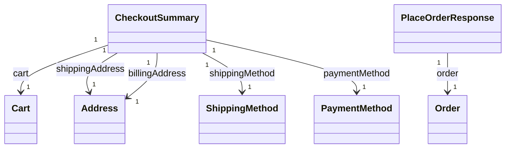

# Checkout

The checkout model orchestrates the multi-step process from cart to order: setting addresses, selecting shipping, creating payment sessions, and placing orders. The frontend controls the step flow; the API provides granular actions that can be called in any order.

## Checkout Service

The `CheckoutService` provides methods to complete checkout.

### setAddresses

Sets shipping and/or billing addresses on the cart.

```typescript
setAddresses(
    params: SetAddressesParams,
    data: SetAddressesBody,
    authorization?: string
): Observable<Carts.Model.Cart>
```

#### Body Parameters

| Parameter         | Type    | Description                                  |
| ----------------- | ------- | -------------------------------------------- |
| shippingAddressId | string  | Use saved address (authenticated users only) |
| shippingAddress   | Address | Or provide new address inline                |
| billingAddressId  | string  | Use saved address (authenticated users only) |
| billingAddress    | Address | Or provide new address inline                |
| notes             | string  | Order notes (optional)                       |
| email             | string  | Required for guest checkout                  |

### setShippingMethod

Selects a shipping option for the cart.

```typescript
setShippingMethod(
    params: SetShippingMethodParams,
    data: SetShippingMethodBody,
    authorization?: string
): Observable<Carts.Model.Cart>
```

#### Body Parameters

| Parameter        | Type   | Description                  |
| ---------------- | ------ | ---------------------------- |
| shippingOptionId | string | ID from getShippingOptions() |

### setPayment

Creates a payment session for the cart.

```typescript
setPayment(
    params: SetPaymentParams,
    data: SetPaymentBody,
    authorization?: string
): Observable<Payments.Model.PaymentSession>
```

#### Body Parameters

| Parameter  | Type   | Description                       |
| ---------- | ------ | --------------------------------- |
| providerId | string | Payment provider ID (required)    |
| metadata   | object | Provider-specific data (optional) |

#### Returns

PaymentSession with redirectUrl (for redirect-based providers) or clientSecret (for embedded payments).

### getShippingOptions

Retrieves available shipping options for the cart.

```typescript
getShippingOptions(
    params: GetShippingOptionsParams,
    authorization?: string
): Observable<Checkout.Model.ShippingOptions>
```

#### Parameters

| Parameter | Type   | Description                           |
| --------- | ------ | ------------------------------------- |
| cartId    | string | Cart ID (required)                    |
| locale    | string | For localized option names (optional) |

### getCheckoutSummary

Retrieves the full checkout summary (cart with addresses, shipping, payment, totals).

```typescript
getCheckoutSummary(
    params: GetCheckoutSummaryParams,
    authorization?: string
): Observable<Checkout.Model.CheckoutSummary>
```

### placeOrder

Creates an order from the cart. Validates that addresses, shipping method, and payment session are present.

```typescript
placeOrder(
    params: PlaceOrderParams,
    data?: PlaceOrderBody,
    authorization?: string
): Observable<Checkout.Model.PlaceOrderResponse>
```

#### Body Parameters

| Parameter | Type   | Description                                         |
| --------- | ------ | --------------------------------------------------- |
| email     | string | Required for guest checkout if not set in addresses |

### completeCheckout

One-shot flow: sets addresses, shipping, payment, and places the order in a single call.

```typescript
completeCheckout(
    params: CompleteCheckoutParams,
    data: CompleteCheckoutBody,
    authorization?: string
): Observable<Checkout.Model.PlaceOrderResponse>
```

#### Body Parameters

| Parameter         | Type    | Description                          |
| ----------------- | ------- | ------------------------------------ |
| shippingAddressId | string  | Use saved address (authenticated)    |
| shippingAddress   | Address | Or provide new (required for guests) |
| billingAddressId  | string  | Use saved address (authenticated)    |
| billingAddress    | Address | Or provide new (required for guests) |
| shippingMethodId  | string  | Shipping option ID                   |
| paymentProviderId | string  | Payment provider ID (required)       |
| email             | string  | Required for guest checkout          |
| notes             | string  | Order notes (optional)               |

## Data Model Structure



The checkout flow:

1. **setAddresses** — Cart must have items first; delegates to Carts.updateCartAddresses
2. **setShippingMethod** — Delegates to Carts.addShippingMethod
3. **setPayment** — Creates payment session; cart stores paymentSessionId
4. **placeOrder** — Validates required data; creates order from cart
5. **completeCheckout** — Orchestrates all steps in one call

## Types

### CheckoutSummary

| Field           | Type           | Description                              |
| --------------- | -------------- | ---------------------------------------- |
| cart            | Cart           | Cart with items and metadata             |
| shippingAddress | Address        | Shipping address                         |
| billingAddress  | Address        | Billing address                          |
| shippingMethod  | ShippingMethod | Selected shipping option                 |
| paymentMethod   | PaymentMethod  | Selected payment method                  |
| totals          | object         | subtotal, shipping, tax, discount, total |
| notes           | string         | Order notes (optional)                   |
| email           | string         | Guest email (optional)                   |

### ShippingOptions

| Field | Type             | Description                |
| ----- | ---------------- | -------------------------- |
| data  | ShippingMethod[] | Available shipping options |
| total | number           | Total number of options    |

### PlaceOrderResponse

| Field              | Type   | Description                         |
| ------------------ | ------ | ----------------------------------- |
| order              | Order  | Created order                       |
| paymentRedirectUrl | string | Redirect URL for payment (optional) |
