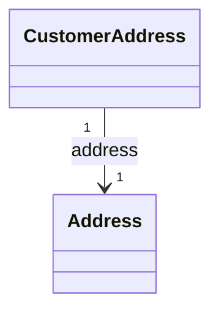

# Customers

The customers model manages saved addresses for authenticated users. Customer addresses can be used during checkout (via shippingAddressId / billingAddressId) instead of entering inline addresses each time.

:::info Authentication Required
All CustomerService methods require authentication. Guest users must provide addresses inline during checkout.
:::

## Customer Service

The `CustomerService` provides methods to manage customer addresses.

### getAddresses

Retrieves all saved addresses for the authenticated customer.

```typescript
getAddresses(authorization?: string): Observable<Customers.Model.CustomerAddresses>
```

#### Returns

Paginated list of CustomerAddress.

### getAddress

Retrieves a specific address by ID.

```typescript
getAddress(
    params: GetAddressParams,
    authorization?: string
): Observable<Customers.Model.CustomerAddress | undefined>
```

#### Parameters

| Parameter | Type   | Description           |
| --------- | ------ | --------------------- |
| params.id | string | Address ID (required) |

### createAddress

Creates a new saved address.

```typescript
createAddress(
    data: CreateAddressBody,
    authorization?: string
): Observable<Customers.Model.CustomerAddress>
```

#### Body Parameters

| Parameter | Type    | Description                          |
| --------- | ------- | ------------------------------------ |
| label     | string  | Label e.g. "Home", "Work" (optional) |
| isDefault | boolean | Set as default address (optional)    |
| address   | Address | Address data (required)              |

### updateAddress

Updates an existing address.

```typescript
updateAddress(
    params: UpdateAddressParams,
    data: UpdateAddressBody,
    authorization?: string
): Observable<Customers.Model.CustomerAddress>
```

### deleteAddress

Deletes a saved address.

```typescript
deleteAddress(
    params: DeleteAddressParams,
    authorization?: string
): Observable<void>
```

### setDefaultAddress

Sets an address as the default for the customer.

```typescript
setDefaultAddress(
    params: SetDefaultAddressParams,
    authorization?: string
): Observable<Customers.Model.CustomerAddress>
```

## Data Model Structure



Saved addresses are used during checkout when the customer selects a previously saved address instead of entering a new one.

## Types

### CustomerAddress

| Field      | Type    | Description                          |
| ---------- | ------- | ------------------------------------ |
| id         | string  | Unique identifier                    |
| customerId | string  | Customer ID                          |
| label      | string  | Label e.g. "Home", "Work" (optional) |
| isDefault  | boolean | Is default address (optional)        |
| address    | Address | Address data                         |
| createdAt  | string  | ISO 8601 timestamp                   |
| updatedAt  | string  | ISO 8601 timestamp                   |

### Address

Shared address type used in carts, checkout, orders, and customer addresses.

| Field        | Type   | Description              |
| ------------ | ------ | ------------------------ |
| firstName    | string | First name (optional)    |
| lastName     | string | Last name (optional)     |
| country      | string | Country code (required)  |
| district     | string | District (optional)      |
| region       | string | Region (optional)        |
| streetName   | string | Street name (required)   |
| streetNumber | string | Street number (optional) |
| apartment    | string | Apartment (optional)     |
| city         | string | City (required)          |
| postalCode   | string | Postal code (required)   |
| email        | string | Email (optional)         |
| phone        | string | Phone (optional)         |

### CustomerAddresses

Paginated list of customer addresses.

```typescript
type CustomerAddresses = Pagination.Paginated<CustomerAddress>;
```
