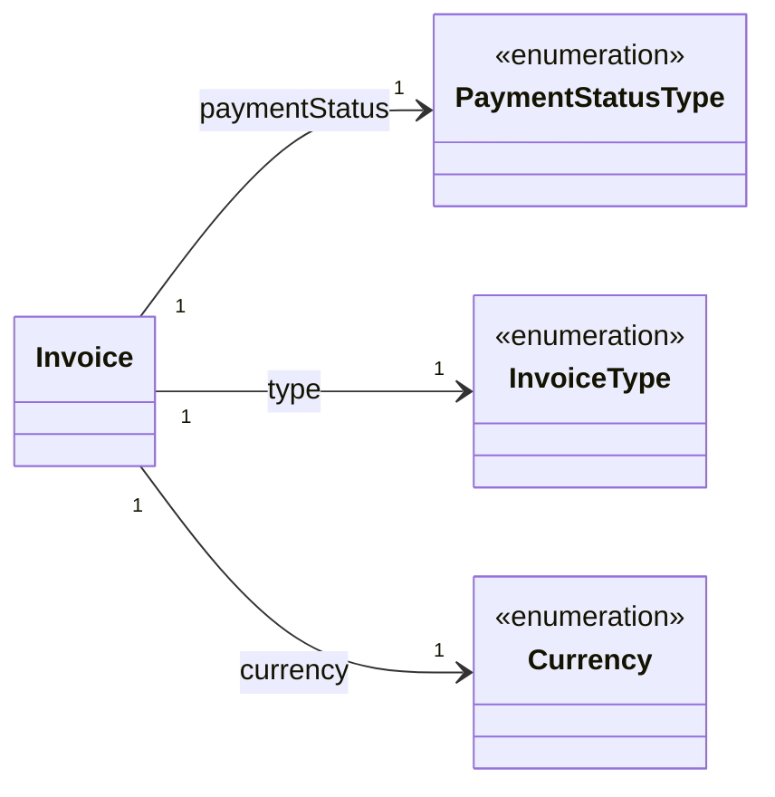

# Financial

The financial model represents the structure of invoices, billing accounts, and payment information in the system. This model enables tracking of financial transactions and customer billing.

## Invoice Service

The `InvoiceService` provides methods to interact with invoice data.

### getInvoiceList

Retrieves a paginated list of invoices with optional filtering.

```typescript
getInvoiceList(
    query: GetInvoiceListQuery
): Observable<Invoices.Model.Invoices>
```

#### Parameters

| Parameter | Type                | Description                                   |
| --------- | ------------------- | --------------------------------------------- |
| query     | GetInvoiceListQuery | Query parameters for filtering and pagination |

#### Query Parameters

| Parameter     | Type              | Description                       |
| ------------- | ----------------- | --------------------------------- |
| offset        | number            | Number of items to skip           |
| limit         | number            | Maximum number of items to return |
| paymentStatus | PaymentStatusType | Filter by payment status          |
| type          | InvoiceType       | Filter by invoice type            |
| dateFrom      | Date              | Filter by issued date (from)      |
| dateTo        | Date              | Filter by issued date (to)        |
| sort          | string            | Sorting criteria                  |

#### Returns

An Observable that emits a paginated list of invoices.

#### Usage Example

```typescript
invoiceService
    .getInvoiceList({
        offset: 0,
        limit: 10,
        paymentStatus: 'PAYMENT_DUE',
        dateFrom: new Date('2023-01-01'),
        dateTo: new Date('2023-12-31'),
        sort: 'issuedDate:desc',
    })
    .subscribe((invoices) => {
        console.log(`Found ${invoices.total} invoices`);
        console.log(`Showing ${invoices.data.length} invoices`);
        invoices.data.forEach((invoice) => console.log(invoice.id));
    });
```

### getInvoice

Retrieves a specific invoice by ID.

```typescript
getInvoice(
    params: GetInvoiceParams
): Observable<Invoices.Model.Invoice>
```

#### Parameters

| Parameter | Type             | Description                          |
| --------- | ---------------- | ------------------------------------ |
| params    | GetInvoiceParams | Parameters containing the invoice ID |

#### Returns

An Observable that emits the requested invoice.

#### Usage Example

```typescript
invoiceService
    .getInvoice({
        id: 'inv-123',
    })
    .subscribe((invoice) => {
        console.log(`Invoice ID: ${invoice.id}`);
        console.log(`Status: ${invoice.paymentStatus}`);
        console.log(`Amount Due: ${invoice.totalAmountDue.value} ${invoice.currency}`);
        console.log(`Due Date: ${invoice.paymentDueDate}`);
    });
```

### getInvoicePdf

Retrieves a PDF document for a specific invoice.

```typescript
getInvoicePdf(
    params: GetInvoiceParams
): Observable<Buffer>
```

#### Parameters

| Parameter | Type             | Description                          |
| --------- | ---------------- | ------------------------------------ |
| params    | GetInvoiceParams | Parameters containing the invoice ID |

#### Returns

An Observable that emits a Buffer containing the PDF document.

#### Usage Example

```typescript
invoiceService
    .getInvoicePdf({
        id: 'inv-123',
    })
    .subscribe((pdfBuffer) => {
        // Handle the PDF buffer
        // For example, in a controller:
        res.setHeader('Content-Type', 'application/pdf');
        res.setHeader('Content-Disposition', `attachment; filename="invoice-${params.id}.pdf"`);
        res.setHeader('Content-Length', pdfBuffer.byteLength);
        res.end(pdfBuffer);
    });
```

## Data Model Structure



The financial model is designed to support invoice management and billing:

1. **Invoices** are associated with billing accounts
2. **Invoices** have different types and payment statuses
3. **Invoices** contain monetary values in specific currencies

This structure allows for:

- Tracking invoice payment status
- Supporting different types of financial documents
- Managing billing accounts for customers
- Handling multiple currencies and monetary values

The pagination utility allows for efficient retrieval of large collections of invoices, supporting standard pagination parameters like offset and limit, as well as filtering by date range, payment status, and invoice type.

## Types

### Invoice

Represents a financial document issued to a customer.

| Field             | Type              | Description                      |
| ----------------- | ----------------- | -------------------------------- |
| id                | string            | Unique identifier                |
| externalId        | string            | External system identifier       |
| billingAccountId  | string            | Associated billing account ID    |
| billingPeriod     | string            | Period covered by the invoice    |
| paymentMethodId   | string            | Payment method identifier        |
| type              | InvoiceType       | Type of invoice document         |
| paymentStatus     | PaymentStatusType | Current payment status           |
| issuedDate        | string            | Date when invoice was issued     |
| paymentDueDate    | string            | Date when payment is due         |
| currency          | Currency          | Currency used for the invoice    |
| totalAmountDue    | Money             | Total amount due including taxes |
| totalNetAmountDue | Money             | Net amount due excluding taxes   |
| totalAmountPaid   | Money             | Amount already paid              |
| totalToBePaid     | Money             | Remaining amount to be paid      |

### InvoiceType

Enumeration of invoice document types.

| Value       | Description                              |
| ----------- | ---------------------------------------- |
| STANDARD    | Regular invoice                          |
| PROFORMA    | Preliminary invoice before final billing |
| CREDIT_NOTE | Document for refunds or reductions       |
| DEBIT_NOTE  | Document for additional charges          |

### PaymentStatusType

Enumeration of payment status values.

| Value            | Description                     |
| ---------------- | ------------------------------- |
| PAYMENT_COMPLETE | Payment has been completed      |
| PAYMENT_DECLINED | Payment was declined            |
| PAYMENT_DUE      | Payment is due but not yet late |
| PAYMENT_PAST_DUE | Payment is overdue              |

### Money

Represents a monetary value.

| Field | Type   | Description                 |
| ----- | ------ | --------------------------- |
| value | number | Numeric value of the amount |

### Currency

Enumeration of supported currencies.

| Value | Description          |
| ----- | -------------------- |
| USD   | United States Dollar |
| EUR   | Euro                 |
| GBP   | British Pound        |
| PLN   | Polish Złoty         |

### Invoices

Paginated list of invoices.

```typescript
type Invoices = Pagination.Paginated<Invoice>;
```
