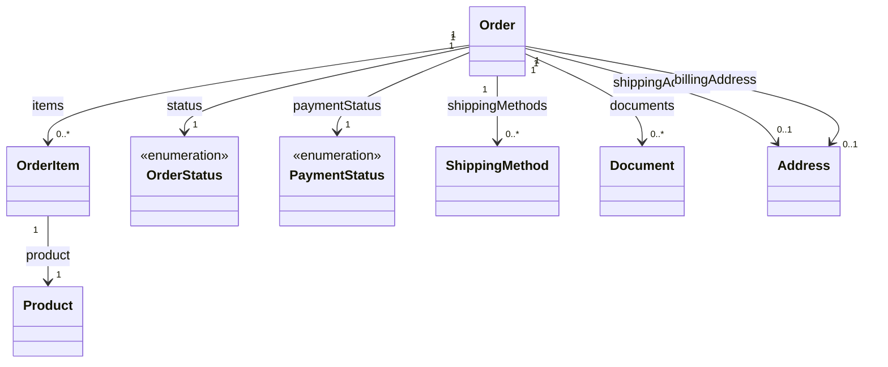

# Orders

The orders model represents completed purchases. Orders are created from carts via the checkout flow (Checkout.placeOrder or completeCheckout), not directly.

## Order Service

The `OrderService` provides methods to retrieve order data.

### getOrder

Retrieves a specific order by ID.

```typescript
getOrder(
    params: GetOrderParams,
    authorization?: string
): Observable<Orders.Model.Order | undefined>
```

#### Parameters

| Parameter     | Type           | Description                    |
| ------------- | -------------- | ------------------------------ |
| params        | GetOrderParams | Parameters containing order ID |
| authorization | string         | Optional authorization header  |

#### Params Parameters

| Parameter | Type   | Description         |
| --------- | ------ | ------------------- |
| id        | string | Order ID (required) |

#### Returns

An Observable that emits the requested order or undefined if not found.

### getOrderList

Retrieves a paginated list of orders with optional filtering.

```typescript
getOrderList(
    query: GetOrderListQuery,
    authorization?: string
): Observable<Orders.Model.Orders>
```

#### Query Parameters

| Parameter     | Type          | Description                       |
| ------------- | ------------- | --------------------------------- |
| id            | string        | Filter by order ID                |
| customerId    | string        | Filter by customer ID             |
| status        | OrderStatus   | Filter by order status            |
| paymentStatus | PaymentStatus | Filter by payment status          |
| dateFrom      | Date          | Filter by creation date (from)    |
| dateTo        | Date          | Filter by creation date (to)      |
| offset        | number        | Number of items to skip           |
| limit         | number        | Maximum number of items to return |
| sort          | string        | Sorting criteria                  |
| locale        | string        | Locale for localized content      |

#### Returns

An Observable that emits a paginated list of orders.

## Data Model Structure



Orders are created from carts via checkout. They contain:

1. **Order** — Header with totals, status, addresses, shipping methods
2. **OrderItem** — Line items with product, quantity, pricing
3. **Document** — Invoices or other documents (optional)

## Types

### Order

| Field               | Type             | Description                       |
| ------------------- | ---------------- | --------------------------------- |
| id                  | string           | Unique identifier                 |
| customerId          | string           | Customer ID (optional for guests) |
| email               | string           | Guest email (optional)            |
| status              | OrderStatus      | Order status                      |
| paymentStatus       | PaymentStatus    | Payment status                    |
| total               | Price            | Grand total                       |
| subtotal            | Price            | Subtotal (optional)               |
| shippingTotal       | Price            | Shipping cost (optional)          |
| discountTotal       | Price            | Discount (optional)               |
| tax                 | Price            | Tax (optional)                    |
| currency            | Currency         | Order currency                    |
| items               | data, total      | Line items                        |
| shippingAddress     | Address          | Shipping address (optional)       |
| billingAddress      | Address          | Billing address (optional)        |
| shippingMethods     | ShippingMethod[] | Shipping methods used             |
| documents           | Document[]       | Invoices etc. (optional)          |
| customerComment     | string           | Customer comment (optional)       |
| purchaseOrderNumber | string           | PO number (optional)              |
| createdAt           | string           | ISO 8601 timestamp                |
| updatedAt           | string           | ISO 8601 timestamp                |
| paymentDueDate      | string           | Payment due date (optional)       |

### OrderItem

| Field         | Type    | Description                      |
| ------------- | ------- | -------------------------------- |
| id            | string  | Unique identifier                |
| productId     | string  | Product ID                       |
| quantity      | number  | Quantity                         |
| price         | Price   | Unit price                       |
| total         | Price   | Line total (optional)            |
| subtotal      | Price   | Pre-discount subtotal (optional) |
| discountTotal | Price   | Item discount (optional)         |
| product       | Product | Product details                  |

### ShippingMethod

| Field       | Type   | Description              |
| ----------- | ------ | ------------------------ |
| id          | string | Unique identifier        |
| name        | string | Display name             |
| description | string | Description (optional)   |
| total       | Price  | Shipping cost (optional) |
| subtotal    | Price  | Subtotal (optional)      |

### Document

Represents an invoice or other order document.

| Field     | Type          | Description        |
| --------- | ------------- | ------------------ |
| id        | string        | Unique identifier  |
| orderId   | string        | Order ID           |
| type      | string        | Document type      |
| status    | PaymentStatus | Payment status     |
| toBePaid  | Price         | Amount to be paid  |
| total     | Price         | Total amount       |
| dueDate   | string        | Due date           |
| createdAt | string        | ISO 8601 timestamp |
| updatedAt | string        | ISO 8601 timestamp |

### OrderStatus

| Value           | Description              |
| --------------- | ------------------------ |
| PENDING         | Order pending processing |
| COMPLETED       | Order completed          |
| SHIPPED         | Order shipped            |
| CANCELLED       | Order cancelled          |
| ARCHIVED        | Order archived           |
| REQUIRES_ACTION | Requires customer action |
| UNKNOWN         | Unknown status           |

### PaymentStatus

| Value              | Description              |
| ------------------ | ------------------------ |
| PENDING            | Payment pending          |
| PAID               | Payment completed        |
| FAILED             | Payment failed           |
| REFUNDED           | Fully refunded           |
| NOT_PAID           | Not paid                 |
| CAPTURED           | Payment captured         |
| PARTIALLY_REFUNDED | Partially refunded       |
| REQUIRES_ACTION    | Requires customer action |
| UNKNOWN            | Unknown status           |

### Orders

Paginated list of orders.

```typescript
type Orders = Pagination.Paginated<Order>;
```
