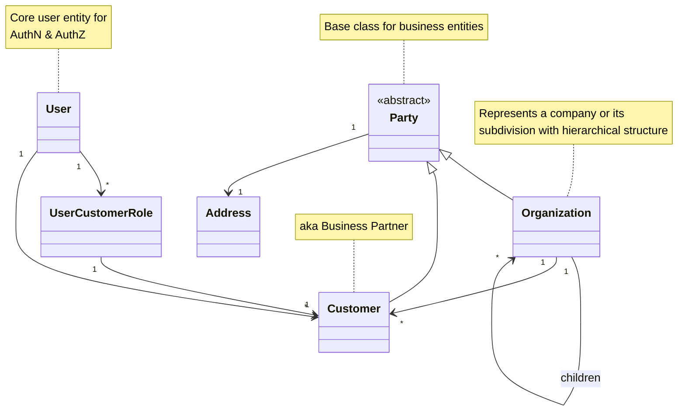

# Organization hierarchy

The organization hierarchy represents the structure of companies and their relationships with customers and users in the system. This model enables multi-tenant architecture with hierarchical organization structure.

Organization is a logical hierarchical grouping of customers, while a customer is a representation of a business partner usually managed in external systems like ERP or CRM. Multiple users can work on behalf of a given customer, and one user can act on behalf of multiple customers by changing their context.

## Organization Service

The `OrganizationService` provides methods to interact with organizations data.

### getOrganizationList

Retrieves a paginated list of organizations.

```typescript
getOrganizationList(
    options: Organizations.Request.OrganizationsListQuery
): Observable<Organizations.Model.Organizations | undefined>
```

#### Parameters

| Parameter | Type                   | Description                                   |
| --------- | ---------------------- | --------------------------------------------- |
| options   | OrganizationsListQuery | Query parameters for filtering and pagination |

#### Returns

An Observable that emits a paginated list of organizations or undefined.

#### Usage Example

```typescript
organizationService
    .getOrganizationList({
        page: 1,
        limit: 10,
    })
    .subscribe((organizations) => {
        console.log(`Found ${organizations.total} organizations`);
        console.log(`Showing page ${organizations.page} of ${organizations.pages}`);
        organizations.items.forEach((org) => console.log(org.name));
    });
```

### getOrganization

Retrieves a specific organization by ID.

```typescript
getOrganization(
    params: Organizations.Request.GetOrganizationParams
): Observable<Organizations.Model.Organization | undefined>
```

#### Parameters

| Parameter | Type                  | Description                               |
| --------- | --------------------- | ----------------------------------------- |
| params    | GetOrganizationParams | Parameters containing the organization ID |

#### Returns

An Observable that emits the requested organization or undefined if not found.

#### Usage Example

```typescript
organizationService
    .getOrganization({
        id: 'org-123',
    })
    .subscribe((organization) => {
        if (organization) {
            console.log(`Found organization: ${organization.name}`);
            console.log(`Active: ${organization.isActive}`);
            console.log(`Has ${organization.children.length} child organizations`);
            console.log(`Has ${organization.customers.length} customers`);
        } else {
            console.log('Organization not found');
        }
    });
```

## Data Model Structure



The organization hierarchy model is designed to support multi-tenant applications with complex business relationships:

1. **Organizations** can have multiple child organizations, creating a hierarchical structure
2. **Organizations** can be associated with multiple customers
3. **Users** can be associated with multiple customers
4. **Users** can have different roles for different customers

This structure allows for flexible access control and business relationship modeling, where:

- A user can work on behalf of multiple customers
- A user can have different permissions (roles) when working with different customers
- Organizations can manage multiple customers in a hierarchical structure
- Customers represent actual business partners that may be managed in external systems

The pagination utility allows for efficient retrieval of large collections of organizations, supporting standard pagination parameters like page number and items per page.

## Types

### Party

Base abstract class for business entities.

| Field   | Type    | Description                 |
| ------- | ------- | --------------------------- |
| id      | string  | Unique identifier           |
| name    | string  | Display name                |
| address | Address | Physical address (optional) |

### Organization

Represents a company or its subdivision with hierarchical structure.

| Field     | Type           | Description                                 |
| --------- | -------------- | ------------------------------------------- |
| isActive  | boolean        | Whether the organization is active          |
| children  | Organization[] | Child organizations in the hierarchy        |
| customers | Customer[]     | Customers associated with this organization |

### Customer

Represents a business partner.

Inherits all fields from Party.

### User

Core user entity for authentication and authorization.

| Field     | Type               | Description                          |
| --------- | ------------------ | ------------------------------------ |
| id        | string             | Unique identifier                    |
| email     | string             | Email address (used for login)       |
| firstName | string             | First name (optional)                |
| lastName  | string             | Last name (optional)                 |
| roles     | UserCustomerRole[] | User roles associated with customers |
| customers | Customer[]         | Customers associated with this user  |

### UserCustomerRole

Defines a role that a user has for a specific customer.

| Field    | Type     | Description                    |
| -------- | -------- | ------------------------------ |
| role     | string   | Role name/identifier           |
| customer | Customer | Associated customer (optional) |

### Organizations

Paginated list of organizations.

```typescript
type Organizations = Pagination.Paginated<Organization>;
```
