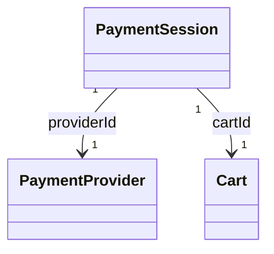

# Payments

The payments model provides payment provider management and payment session handling for checkout flows. It supports multiple payment providers (Stripe, PayPal, etc.) and manages payment sessions that link carts to payment processing.

## Payment Service

The `PaymentService` provides methods to interact with payment providers and sessions.

### getProviders

Retrieves available payment providers for a region.

```typescript
getProviders(
    params: GetProvidersParams,
    authorization?: string
): Observable<PaymentProviders>
```

#### Parameters

| Parameter | Type   | Description          |
| --------- | ------ | -------------------- |
| regionId  | string | Region ID (required) |

#### Returns

An Observable that emits a paginated list of payment providers.

### createSession

Creates a payment session for a cart.

```typescript
createSession(
    data: CreateSessionBody,
    authorization?: string
): Observable<PaymentSession>
```

#### Body Parameters

| Parameter  | Type   | Description                    |
| ---------- | ------ | ------------------------------ |
| cartId     | string | Cart ID (required)             |
| providerId | string | Payment provider ID (required) |

#### Returns

PaymentSession with redirectUrl (for redirect-based providers) or clientSecret (for embedded payments).

### getSession

Retrieves a payment session by ID.

```typescript
getSession(
    params: GetSessionParams,
    authorization?: string
): Observable<PaymentSession | undefined>
```

### updateSession

Updates a payment session (e.g., to change return URL).

```typescript
updateSession(
    params: UpdateSessionParams,
    data: UpdateSessionBody,
    authorization?: string
): Observable<PaymentSession>
```

### cancelSession

Cancels (deletes) a payment session.

```typescript
cancelSession(
    params: CancelSessionParams,
    authorization?: string
): Observable<void>
```

## Data Model Structure



The payments model supports:

1. **PaymentProvider** — Available payment providers (Stripe, PayPal, etc.)
2. **PaymentSession** — Active payment sessions linking carts to payment processing

## Types

### PaymentProvider

| Field            | Type    | Description                                                |
| ---------------- | ------- | ---------------------------------------------------------- |
| id               | string  | Unique identifier                                          |
| name             | string  | Display name                                               |
| type             | string  | Provider type (e.g., "STRIPE", "PAYPAL")                   |
| isEnabled        | boolean | Whether the provider is enabled                            |
| requiresRedirect | boolean | Whether provider requires redirect (e.g., Stripe Checkout) |
| config           | object  | Provider-specific configuration (optional)                 |

### PaymentSession

| Field        | Type                 | Description                                          |
| ------------ | -------------------- | ---------------------------------------------------- |
| id           | string               | Unique identifier                                    |
| cartId       | string               | Associated cart ID                                   |
| providerId   | string               | Payment provider ID                                  |
| status       | PaymentSessionStatus | Session status                                       |
| redirectUrl  | string               | Redirect URL for redirect-based providers (optional) |
| clientSecret | string               | Client secret for embedded payment forms (optional)  |
| expiresAt    | string               | Expiration date (optional)                           |
| metadata     | object               | Additional metadata (optional)                       |

### PaymentSessionStatus

| Value      | Description        |
| ---------- | ------------------ |
| PENDING    | Payment pending    |
| AUTHORIZED | Payment authorized |
| CAPTURED   | Payment captured   |
| FAILED     | Payment failed     |
| CANCELLED  | Payment cancelled  |

### PaymentProviders

Paginated list of payment providers.

```typescript
type PaymentProviders = Pagination.Paginated<PaymentProvider>;
```
