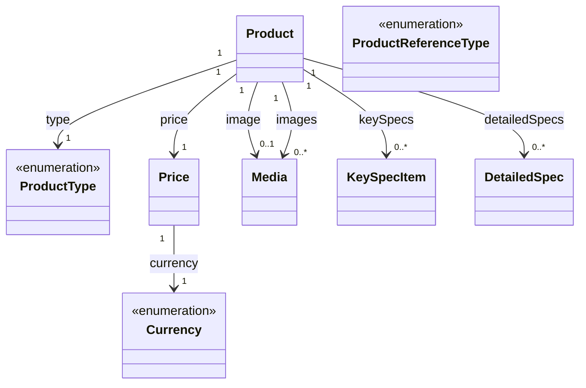

# Products

The products model represents the structure of product catalog items and their related information in the system. This model enables management of product listings, variants, specifications, and related product relationships.

## Product Service

The `ProductService` provides methods to interact with product data.

### getProduct

Retrieves a specific product by ID.

```typescript
getProduct(
    params: GetProductParams,
    authorization?: string
): Observable<Products.Model.Product>
```

#### Parameters

| Parameter     | Type             | Description                                              |
| ------------- | ---------------- | -------------------------------------------------------- |
| params        | GetProductParams | Parameters containing product ID, variant ID, and locale |
| authorization | string           | Optional authorization header                            |

#### Params Parameters

| Parameter | Type   | Description                       |
| --------- | ------ | --------------------------------- |
| id        | string | Unique identifier for the product |
| variantId | string | Optional product variant ID       |
| locale    | string | Locale for localized content      |

#### Returns

An Observable that emits the requested product.

#### Usage Example

```typescript
productService
    .getProduct({
        id: 'prod-123',
        variantId: 'var-456',
        locale: 'en-US',
    })
    .subscribe((product) => {
        console.log(`Product: ${product.name}`);
        console.log(`SKU: ${product.sku}`);
        console.log(`Price: ${product.price.value} ${product.price.currency}`);
        console.log(`Type: ${product.type}`);
        console.log(`Category: ${product.category}`);
    });
```

### getProductList

Retrieves a paginated list of products with optional filtering.

```typescript
getProductList(
    query: GetProductListQuery,
    authorization?: string
): Observable<Products.Model.Products>
```

#### Parameters

| Parameter     | Type                | Description                                   |
| ------------- | ------------------- | --------------------------------------------- |
| query         | GetProductListQuery | Query parameters for filtering and pagination |
| authorization | string              | Optional authorization header                 |

#### Query Parameters

| Parameter | Type        | Description                       |
| --------- | ----------- | --------------------------------- |
| offset    | number      | Number of items to skip           |
| limit     | number      | Maximum number of items to return |
| type      | ProductType | Filter by product type            |
| category  | string      | Filter by product category        |
| locale    | string      | Locale for localized content      |
| sort      | string      | Sorting criteria                  |

#### Returns

An Observable that emits a paginated list of products.

#### Usage Example

```typescript
productService
    .getProductList({
        offset: 0,
        limit: 10,
        type: 'PHYSICAL',
        category: 'electronics',
        locale: 'en-US',
        sort: 'name:asc',
    })
    .subscribe((products) => {
        console.log(`Found ${products.total} products`);
        console.log(`Showing ${products.data.length} products`);
        products.data.forEach((product) => console.log(product.name));
    });
```

### getRelatedProductList

Retrieves a list of related products based on a reference type (spare parts, replacements, or compatible services).

```typescript
getRelatedProductList(
    params: GetRelatedProductListParams,
    authorization?: string
): Observable<Products.Model.Products>
```

#### Parameters

| Parameter     | Type                        | Description                              |
| ------------- | --------------------------- | ---------------------------------------- |
| params        | GetRelatedProductListParams | Parameters for fetching related products |
| authorization | string                      | Optional authorization header            |

#### Params Parameters

| Parameter        | Type                 | Description                             |
| ---------------- | -------------------- | --------------------------------------- |
| type             | ProductReferenceType | Type of relationship (required)         |
| productId        | string               | ID of the base product (required)       |
| productVariantId | string               | Optional variant ID of the base product |
| locale           | string               | Locale for localized content            |
| limit            | number               | Maximum number of items to return       |
| offset           | number               | Number of items to skip                 |
| sort             | string               | Sorting criteria                        |

#### Returns

An Observable that emits a paginated list of related products.

#### Usage Example

```typescript
productService
    .getRelatedProductList({
        type: 'SPARE_PART',
        productId: 'prod-123',
        productVariantId: 'var-456',
        locale: 'en-US',
        limit: 5,
    })
    .subscribe((products) => {
        console.log(`Found ${products.total} spare parts`);
        products.data.forEach((product) => {
            console.log(`${product.name} - ${product.sku}`);
        });
    });
```

## Data Model Structure



The products model is designed to support comprehensive product catalog management:

1. **Products** can be either physical or virtual items
2. **Products** support variants for different configurations
3. **Products** can have relationships with other products (spare parts, replacements, compatible services)
4. **Products** support rich media with multiple images
5. **Products** have flexible specification systems for both quick display and detailed technical information

This structure allows for:

- Managing product catalogs with different types and categories
- Supporting product variants and configurations
- Providing rich product information with images and specifications
- Establishing relationships between related products
- Supporting multi-currency pricing
- Enabling localized product content

The pagination utility allows for efficient retrieval of large product catalogs, supporting standard pagination parameters like offset and limit, as well as filtering by type, category, and other criteria.

## Types

### Product

Represents a product in the catalog.

| Field            | Type           | Description                                        |
| ---------------- | -------------- | -------------------------------------------------- |
| id               | string         | Unique identifier                                  |
| sku              | string         | Stock keeping unit identifier                      |
| name             | string         | Product name                                       |
| description      | string         | Full product description                           |
| shortDescription | string         | Brief product description (optional)               |
| subtitle         | string         | Product subtitle or tagline (optional)             |
| variantId        | string         | Variant identifier if this is a variant (optional) |
| image            | Media          | Primary product image (optional)                   |
| images           | Media[]        | Additional product images (optional)               |
| price            | Price          | Product pricing information                        |
| link             | string         | URL to product detail page                         |
| type             | ProductType    | Type of product (physical or virtual)              |
| category         | string         | Product category                                   |
| tags             | Tag[]          | Product tags with display variants                 |
| keySpecs         | KeySpecItem[]  | Key specifications for quick display (optional)    |
| detailedSpecs    | DetailedSpec[] | Detailed specifications (optional)                 |
| location         | string         | Product location or availability region (optional) |

### ProductType

Enumeration of product types.

| Value    | Description                                 |
| -------- | ------------------------------------------- |
| PHYSICAL | Physical product that requires shipping     |
| VIRTUAL  | Digital or virtual product (e.g., software) |

### ProductReferenceType

Enumeration of product relationship types.

| Value              | Description                                        |
| ------------------ | -------------------------------------------------- |
| SPARE_PART         | Replacement parts for the product                  |
| REPLACEMENT        | Alternative products that can replace this product |
| COMPATIBLE_SERVICE | Services that are compatible with this product     |

### KeySpecItem

Represents a key specification for quick display.

| Field | Type   | Description                                   |
| ----- | ------ | --------------------------------------------- |
| value | string | Specification value (optional)                |
| icon  | string | Icon identifier for visual display (optional) |

### DetailedSpec

Represents a detailed specification with categorization.

| Field    | Type   | Description                               |
| -------- | ------ | ----------------------------------------- |
| label    | string | Specification label or name               |
| value    | string | Specification value                       |
| category | string | Category grouping for the spec (optional) |

### Price

Represents pricing information.

| Field    | Type     | Description                                    |
| -------- | -------- | ---------------------------------------------- |
| value    | number   | Numeric price value                            |
| currency | Currency | Currency code                                  |
| period   | string   | Billing period for recurring prices (optional) |

### Currency

Enumeration of supported currencies.

| Value | Description          |
| ----- | -------------------- |
| USD   | United States Dollar |
| EUR   | Euro                 |
| GBP   | British Pound        |
| PLN   | Polish Złoty         |

### Media

Represents media assets (images, videos).

| Field    | Type    | Description                        |
| -------- | ------- | ---------------------------------- |
| url      | string  | URL to the media asset             |
| alt      | string  | Alternative text for accessibility |
| width    | number  | Media width in pixels (optional)   |
| height   | number  | Media height in pixels (optional)  |
| priority | boolean | Priority loading flag (optional)   |

### Tag

Represents a product tag with styling variant.

| Field   | Type   | Description                    |
| ------- | ------ | ------------------------------ |
| label   | string | Tag label text                 |
| variant | string | Visual variant for tag display |

### Products

Paginated list of products.

```typescript
type Products = Pagination.Paginated<Product>;
```
