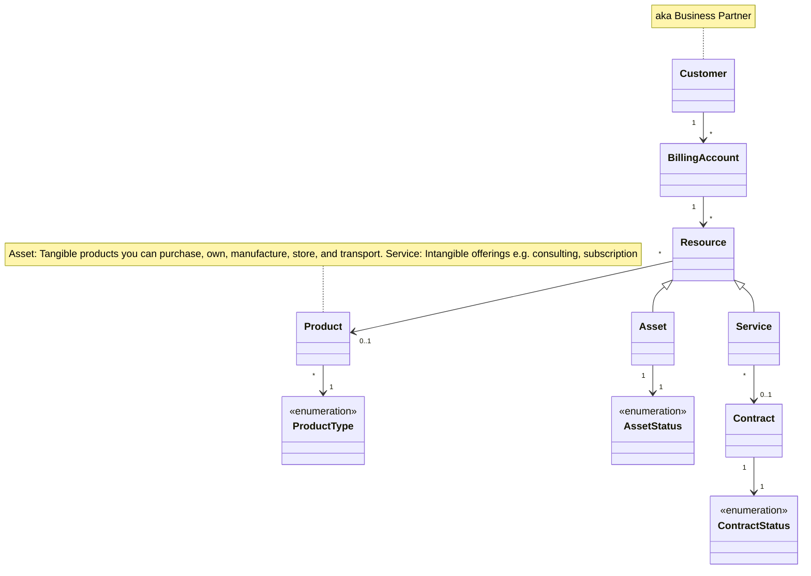

# Resources (Assets & Services)

The resources model represents customer-owned assets (tangible equipment) and service subscriptions. Assets can have warranty tracking and compatible services; Services have contracts with payment periods. This module supports after-sales scenarios like equipment management and subscription renewal.

:::info Plugin Required
The Resources module requires the [medusa-plugin-assets-services](https://github.com/o2sdev/medusa-plugin-assets-services) plugin when using the Medusa.js integration.
:::

## Resource Service

The `ResourceService` provides methods to interact with assets and services.

### getServiceList

Retrieves a paginated list of service subscriptions for the authenticated customer.

```typescript
getServiceList(
    query: GetServiceListQuery,
    authorization: string
): Observable<Services>
```

#### Query Parameters

| Parameter        | Type           | Description                       |
| ---------------- | -------------- | --------------------------------- |
| status           | ContractStatus | Filter by contract status         |
| type             | ProductType    | Filter by product type            |
| category         | string         | Filter by category                |
| billingAccountId | string         | Filter by billing account         |
| dateFrom         | string         | Filter by start date              |
| dateTo           | string         | Filter by end date                |
| offset           | number         | Number of items to skip           |
| limit            | number         | Maximum number of items to return |
| sort             | string         | Sorting criteria                  |
| locale           | string         | Locale for localized content      |

### getService

Retrieves a specific service by ID.

```typescript
getService(
    params: GetServiceParams,
    authorization?: string
): Observable<Service>
```

### getAssetList

Retrieves a paginated list of assets (customer equipment) for the authenticated customer.

```typescript
getAssetList(
    query: GetAssetListQuery,
    authorization: string
): Observable<Assets>
```

#### Query Parameters

| Parameter        | Type        | Description                       |
| ---------------- | ----------- | --------------------------------- |
| status           | string      | Filter by asset status            |
| type             | ProductType | Filter by product type            |
| billingAccountId | string      | Filter by billing account         |
| dateFrom         | string      | Filter by date                    |
| dateTo           | string      | Filter by date                    |
| offset           | number      | Number of items to skip           |
| limit            | number      | Maximum number of items to return |
| sort             | string      | Sorting criteria                  |
| locale           | string      | Locale for localized content      |

### getAsset

Retrieves a specific asset by ID.

```typescript
getAsset(
    params: GetAssetParams,
    authorization?: string
): Observable<Asset>
```

### getCompatibleServiceList

Retrieves services that can be purchased for a specific asset (upsell/cross-sell).

```typescript
getCompatibleServiceList(params: GetAssetParams): Observable<Products.Model.Products>
```

### getFeaturedServiceList

Retrieves featured or promoted services.

```typescript
getFeaturedServiceList(): Observable<Products.Model.Products>
```

### purchaseOrActivateResource / purchaseOrActivateService

Initiates purchase or activation of a resource or service. Not fully implemented in all integrations.

```typescript
purchaseOrActivateResource(params: GetResourceParams, authorization?: string): Observable<void>
purchaseOrActivateService(params: GetServiceParams, authorization?: string): Observable<void>
```

## Data Model Structure



- **Resource** — Base for Asset and Service; links to Product and BillingAccount
- **Asset** — Customer-owned equipment (serial no, warranty, compatible services)
- **Service** — Subscription with Contract (start/end date, payment period)

## Types

### Resource

Base type for assets and services.

| Field            | Type    | Description        |
| ---------------- | ------- | ------------------ |
| id               | string  | Unique identifier  |
| product          | Product | Associated product |
| billingAccountId | string  | Billing account ID |

### Asset

Customer-owned tangible equipment. Extends Resource.

| Field              | Type        | Description                               |
| ------------------ | ----------- | ----------------------------------------- |
| manufacturer       | string      | Manufacturer (optional)                   |
| model              | string      | Model name                                |
| serialNo           | string      | Serial number                             |
| description        | string      | Description                               |
| status             | AssetStatus | Asset status (optional)                   |
| address            | Address     | Installation/location (optional)          |
| endOfWarranty      | string      | Warranty end date (optional)              |
| compatibleServices | Products    | Services that can be purchased (optional) |

### Service

Service subscription. Extends Resource.

| Field    | Type     | Description              |
| -------- | -------- | ------------------------ |
| contract | Contract | Contract details         |
| assets   | Asset[]  | Linked assets (optional) |

### Contract

| Field         | Type           | Description                  |
| ------------- | -------------- | ---------------------------- |
| id            | string         | Unique identifier            |
| type          | string         | Contract type (optional)     |
| status        | ContractStatus | Contract status              |
| startDate     | string         | Start date                   |
| endDate       | string         | End date                     |
| paymentPeriod | PaymentPeriod  | Billing frequency (optional) |
| price         | Price          | Contract price               |

### AssetStatus

| Value    | Description  |
| -------- | ------------ |
| ACTIVE   | Active asset |
| INACTIVE | Inactive     |
| RETIRED  | Retired      |

### ContractStatus

| Value    | Description     |
| -------- | --------------- |
| ACTIVE   | Active contract |
| EXPIRED  | Expired         |
| INACTIVE | Inactive        |

### PaymentPeriod

| Value    | Description |
| -------- | ----------- |
| ONE_TIME | One-time    |
| MONTHLY  | Monthly     |
| YEARLY   | Yearly      |
| WEEKLY   | Weekly      |

### Services / Assets

Paginated lists.

```typescript
type Services = Pagination.Paginated<Service>;
type Assets = Pagination.Paginated<Asset>;
```
