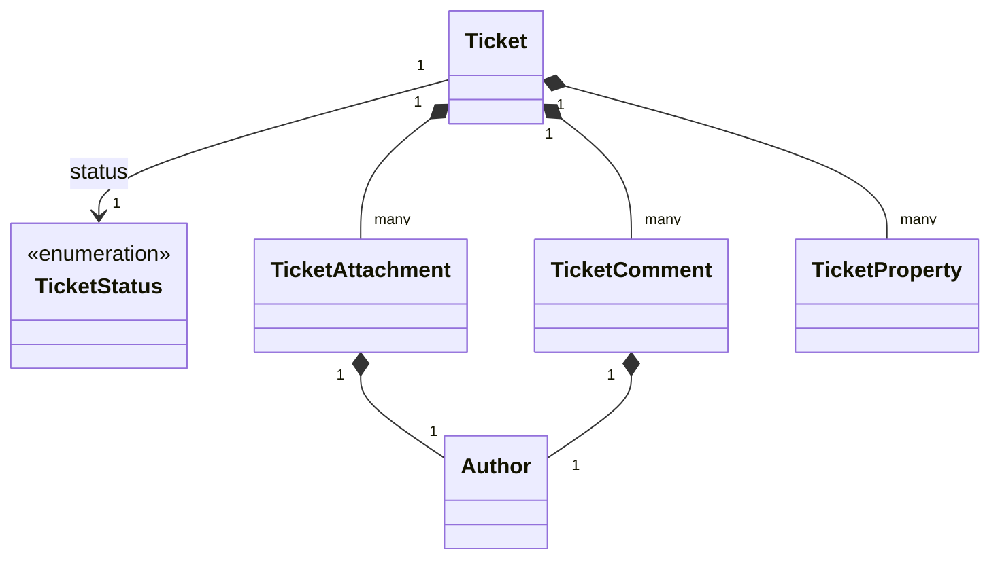

# Tickets

The tickets model represents the structure of customer support tickets and their related entities in the system. This model enables tracking and management of customer inquiries and support requests.

## Ticket Service

The `TicketService` provides methods to interact with ticket data.

### getTicket

Retrieves a specific ticket by its ID.

```typescript
getTicket(
    params: GetTicketParams
): Observable<Tickets.Model.Ticket | undefined>
```

#### Parameters

| Parameter | Type            | Description                         |
| --------- | --------------- | ----------------------------------- |
| params    | GetTicketParams | Parameters containing the ticket ID |

#### Returns

An Observable that emits the requested ticket or undefined if not found.

#### Usage Example

```typescript
ticketService
    .getTicket({
        id: 'ticket-123',
    })
    .subscribe((ticket) => {
        if (ticket) {
            console.log(`Ticket ID: ${ticket.id}`);
            console.log(`Status: ${ticket.status}`);
            console.log(`Topic: ${ticket.topic}`);
            console.log(`Created: ${ticket.createdAt}`);
        } else {
            console.log('Ticket not found');
        }
    });
```

### getTicketList

Retrieves a paginated list of tickets with optional filtering and sorting.

```typescript
getTicketList(
    query: GetTicketListQuery
): Observable<Tickets.Model.Tickets>
```

#### Parameters

| Parameter | Type               | Description                                   |
| --------- | ------------------ | --------------------------------------------- |
| query     | GetTicketListQuery | Query parameters for filtering and pagination |

#### Query Parameters

| Parameter | Type         | Description                       |
| --------- | ------------ | --------------------------------- |
| offset    | number       | Number of items to skip           |
| limit     | number       | Maximum number of items to return |
| topic     | string       | Filter by ticket topic            |
| status    | TicketStatus | Filter by ticket status           |
| dateFrom  | Date         | Filter by creation date (from)    |
| dateTo    | Date         | Filter by creation date (to)      |
| sort      | string       | Sorting criteria                  |

#### Returns

An Observable that emits a paginated list of tickets.

#### Usage Example

```typescript
ticketService
    .getTicketList({
        offset: 0,
        limit: 10,
        status: 'OPEN',
        sort: 'createdAt',
    })
    .subscribe((tickets) => {
        console.log(`Found ${tickets.total} tickets`);
        console.log(`Showing ${tickets.data.length} tickets`);
        tickets.data.forEach((ticket) => console.log(ticket.id));
    });
```

### createTicket

Creates a new ticket.

```typescript
createTicket(
    body: PostTicketBody
): Observable<Tickets.Model.Ticket>
```

#### Parameters

| Parameter | Type           | Description          |
| --------- | -------------- | -------------------- |
| body      | PostTicketBody | Ticket creation data |

#### Body Parameters

| Parameter   | Type                    | Required | Description                                                  |
| ----------- | ----------------------- | -------- | ------------------------------------------------------------ |
| title       | string                  | No       | Title or subject of the ticket                               |
| description | string                  | No       | Detailed description of the issue                            |
| type        | number                  | No       | Ticket type identifier (e.g., form ID in ticket systems)     |
| attachments | TicketAttachmentInput[] | No       | Array of file attachments                                    |
| fields      | object                  | No       | Additional custom fields specific to the integration         |

> **Note**: While `description` and `type` are marked as optional in the core model, certain integrations require these fields:
> - **Zendesk**: Requires both `description` (string) and `type` (number, ticket form ID)
> - **SurveyJS**: Requires `description` (string) and `ticketFormId` (number, mapped to `type`)
>
> Implementers should check the specific integration documentation for required fields before implementing ticket creation.

#### Returns

An Observable that emits the created ticket.

#### Usage Example

```typescript
ticketService
    .createTicket({
        title: 'New Feature Request',
        description: 'Please add dark mode to the application',
    })
    .subscribe((ticket) => {
        console.log(`Created ticket with ID: ${ticket.id}`);
        console.log(`Status: ${ticket.status}`);
    });
```

## Data Model Structure



The tickets model is designed to support customer support operations:

1. **Tickets** are the central entity representing customer inquiries
2. **Tickets** have a status that changes as they progress through the support workflow
3. **Tickets** can have attachments and comments for communication
4. **Tickets** can have custom properties for additional metadata

This structure allows for:

- Tracking the status of customer inquiries
- Supporting communication through comments
- Attaching relevant files to tickets
- Adding custom metadata through properties

The pagination utility allows for efficient retrieval of large collections of tickets, supporting standard pagination parameters like offset and limit, as well as filtering by various criteria including date range, status, and type.

## Types

### Ticket

Represents a support ticket created by a customer or agent.

| Field       | Type               | Description                                                 |
| ----------- | ------------------ | ----------------------------------------------------------- |
| id          | string             | Unique identifier for the ticket                            |
| createdAt   | string             | ISO timestamp when the ticket was created                   |
| updatedAt   | string             | ISO timestamp when the ticket was last updated              |
| topic       | string             | Subject or title of the ticket                              |
| type        | string             | Category or type of the ticket (e.g., "support", "feature") |
| status      | TicketStatus       | Current status of the ticket                                |
| properties  | TicketProperty[]   | Additional custom properties for the ticket                 |
| attachments | TicketAttachment[] | Files attached to the ticket (optional)                     |
| comments    | TicketComment[]    | Comments or messages on the ticket (optional)               |

### TicketStatus

Enumeration of possible ticket statuses.

| Value       | Description                        |
| ----------- | ---------------------------------- |
| OPEN        | Ticket is new or awaiting response |
| IN_PROGRESS | Ticket is being worked on          |
| CLOSED      | Ticket has been resolved           |

### TicketAttachment

Represents a file attached to a ticket.

| Field     | Type   | Description                                 |
| --------- | ------ | ------------------------------------------- |
| name      | string | Filename of the attachment                  |
| url       | string | URL to access the attachment                |
| size      | number | File size in bytes                          |
| author    | Author | Person who uploaded the attachment          |
| date      | string | ISO timestamp when the attachment was added |
| ariaLabel | string | Accessibility label for the attachment      |

### TicketComment

Represents a message or comment on a ticket.

| Field   | Type   | Description                               |
| ------- | ------ | ----------------------------------------- |
| author  | Author | Person who wrote the comment              |
| date    | string | ISO timestamp when the comment was posted |
| content | string | Text content of the comment               |

### Author

Represents a person interacting with a ticket.

| Field  | Type   | Description                       |
| ------ | ------ | --------------------------------- |
| name   | string | Full name of the person           |
| email  | string | Email address (optional)          |
| avatar | string | URL to profile picture (optional) |

### TicketProperty

Represents a custom property or metadata for a ticket.

| Field | Type   | Description                            |
| ----- | ------ | -------------------------------------- |
| id    | string | Property identifier (e.g., "priority") |
| value | string | Property value (e.g., "high")          |

### Tickets

Paginated list of tickets.

```typescript
type Tickets = Pagination.Paginated<Ticket>;
```
